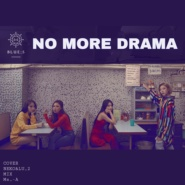

NO MORE DRAMA
============================

|  |  |
| :--: | :-- |
| [ NO MORE DRAMA](https://emumo.xiami.com/album/2104385400) | **艺人**: [NEKO](../index.md) **语种**: 韩语 **唱片公司**:  **发行时间**: 2018年12月17日 **专辑类别**: 录音室专辑 **专辑风格**: 流行 Pop, 韩国流行 K-Pop, 女子团体 Girl Group **播放数**: 186570 **收藏数**: 17 **评论数**: 9  |

## 简介

又和噜噜一起合作了哈哈哈哈哈哈  
这首一出来简直一拍即合就说要翻 希望你们喜欢！！ 

## 曲目

## 评论

|  |  |  |  |
| :-- | :-- | :-- | :-- |
|  [虾米用户](https://emumo.xiami.com/u/214337068) CZY CHEN 加油！ 2019-07-23 18:37 赞(0) 踩(0) | 
爱啦
 |
|  [虾米用户](https://emumo.xiami.com/u/214337068) CZY CHEN 加油！ 2019-07-23 18:37 赞(0) 踩(0) | 
爱了   爱了
 |
|  [虾米用户](https://emumo.xiami.com/u/276038858)  2019-06-06 00:33 赞(1) 踩(0) | 
好听，甜甜的嗓音
 |
|  [虾米用户](https://emumo.xiami.com/u/44580200)  2018-12-31 01:35 赞(0) 踩(0) | 
姐姐考完试了么 是不是要放寒假了
 |
|  [虾米用户](https://emumo.xiami.com/u/44580200)  2018-12-31 01:34 赞(1) 踩(0) | 
妈妈木的 好棒啊
 |
|  [虾米用户](https://emumo.xiami.com/u/58623382) come 2018-12-22 15:09 赞(1) 踩(0) | 
喜欢声音就是爱
 |
|  [虾米用户](https://emumo.xiami.com/u/218734304) 学习是经验的积累，才能是... 2018-12-17 13:34 赞(1) 踩(0) | 
先给个赞
 |
|  [虾米用户](https://emumo.xiami.com/u/47262914) 我舍不得。 2018-12-17 02:21 赞(0) 踩(0) | 
❤
 |
| ⇒ |  [虾米用户](https://emumo.xiami.com/u/39174694) 一切郑因为你的清秀容妍～ 2018-12-17 09:18 赞(0) 踩(0) | 
❤️❤️
 |
