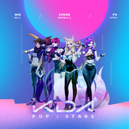

POPSTARS
============================

|  |  |
| :--: | :-- |
| [ POPSTARS](https://emumo.xiami.com/album/2104481798) | **艺人**: [NEKO](../index.md) **语种**: 英语 **唱片公司**:  **发行时间**: 2019年01月14日 **专辑类别**: 录音室专辑 **专辑风格**: 流行 Pop, 韩国流行 K-Pop, 欧美流行 Western Pop **播放数**: 112974 **收藏数**: 16 **评论数**: 9  |

## 简介

这首歌真的很带感捏哈哈哈哈哈哈哈

## 曲目

## 评论

|  |  |  |  |
| :-- | :-- | :-- | :-- |
|  [虾米用户](https://emumo.xiami.com/u/38246651)   2019-02-22 00:31 赞(2) 踩(0) | 
...如果不是翻歌手资料还不清楚是国人翻唱的....得很棒惹！c位出道吧 
 |
|  [虾米用户](https://emumo.xiami.com/u/214326136) 佛系少女 2019-01-17 15:24 赞(1) 踩(0) | 
超酷的啊
 |
| ⇒ |  [虾米用户](https://emumo.xiami.com/u/39174694) 一切郑因为你的清秀容妍～ 2019-01-19 21:00 赞(0) 踩(0) | 
❤️❤️
 |
|  [虾米用户](https://emumo.xiami.com/u/202539168)  2019-01-17 11:32 赞(2) 踩(0) | 
阿里嘎多！美美哒！新年快乐！……加油鸭！干巴爹！
 |
|  [虾米用户](https://emumo.xiami.com/u/345099055) 我还没想好要写什么... 2019-01-16 20:19 赞(2) 踩(0) | 
我觉得好好听啊
 |
|  [虾米用户](https://emumo.xiami.com/u/41309038) call me mayb... 2019-01-15 14:01 赞(2) 踩(0) | 
是魔鬼
 |
|  [虾米用户](https://emumo.xiami.com/u/202539168)  2019-01-15 11:59 赞(1) 踩(0) | 
山寨是为了以后不山寨！
 |
|  [虾米用户](https://emumo.xiami.com/u/282111143) 我还没想好要写什么... 2019-01-15 08:00 赞(0) 踩(0) | 
unmm……
 |
|  [虾米用户](https://emumo.xiami.com/u/308859382) 斯文败类. 2019-01-15 00:09 赞(1) 踩(0) | 
霸气！
 |
