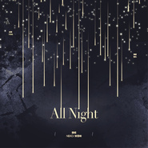

ALL NIGHT(ENG VER)
============================

|  |  |
| :--: | :-- |
| [ ALL NIGHT(ENG VER)](https://emumo.xiami.com/album/2104566026) | **艺人**: [NEKO](../index.md) **语种**: 英语 **唱片公司**:  **发行时间**: 2019年02月01日 **专辑类别**: 录音室专辑 **专辑风格**: 电音流行 Electropop, 韩国流行 K-Pop, 欧美流行 Western Pop **播放数**: 1120965 **收藏数**: 33 **评论数**: 22  |

## 简介

我忘发虾米了5555不好意思啊啊啊啊啊

## 曲目

## 评论

|  |  |  |  |
| :-- | :-- | :-- | :-- |
|  [虾米用户](https://emumo.xiami.com/u/44580200)  2021-01-17 00:43 赞(1) 踩(0) | 
虾米要关闭了一直很喜欢neko的翻唱 neko酱 qq音乐见吧
 |
|  [虾米用户](https://emumo.xiami.com/u/306839332)  2020-02-06 23:12 赞(0) 踩(0) | 
小姐姐我是你的粉丝，爱你❤＾3＾么么哒！
 |
|  [虾米用户](https://emumo.xiami.com/u/67790040)  2020-01-10 18:37 赞(0) 踩(0) | 
666
 |
|  [虾米用户](https://emumo.xiami.com/u/352474791) 朴灿烈边伯贤吴世勋//与... 2019-03-14 19:46 赞(1) 踩(0) | 
是我超级超级喜欢的歌，其实在up翻唱之前很冷门的，最开始是在q音听到的，首页推荐听到真的是缘分!真的很感谢up让更多人知道ㅠㅠthank u too muchhhhhh(*˘︶˘*).｡.:*♡
 |
| ⇒ |  [虾米用户](https://emumo.xiami.com/u/39174694) 一切郑因为你的清秀容妍～ 2019-04-16 01:50 赞(0) 踩(0) | 
❤️
 |
| ⇒ |  [虾米用户](https://emumo.xiami.com/u/215172997)  2020-02-05 13:31 赞(0) 踩(0) | 
那这首歌的原唱是谁呢
 |
|  [虾米用户](https://emumo.xiami.com/u/314772059) 最最喜欢泡菜鱼. 2019-02-25 16:23 赞(1) 踩(0) | 
敲棒！！
 |
|  [虾米用户](https://emumo.xiami.com/u/290495578)  2019-02-17 13:41 赞(1) 踩(0) | 
NEKO小姐姐太棒了！
 |
|  [虾米用户](https://emumo.xiami.com/u/187505605)  2019-02-16 00:01 赞(1) 踩(0) | 
好听啊
 |
|  [虾米用户](https://emumo.xiami.com/u/4487129)  2019-02-12 08:44 赞(1) 踩(0) | 
！！！
 |
|  [虾米用户](https://emumo.xiami.com/u/400105932)  2019-02-07 15:04 赞(1) 踩(0) | 
good
 |
|  [虾米用户](https://emumo.xiami.com/u/416812891) KEEP COOL # 2019-02-06 20:14 赞(1) 踩(0) | 
很棒很棒
 |
|  [虾米用户](https://emumo.xiami.com/u/301819918)  2019-02-06 13:23 赞(2) 踩(0) | 
表白我扣
 |
|  [虾米用户](https://emumo.xiami.com/u/301403377) 米仓本命内田心 2019-02-05 22:41 赞(0) 踩(0) | 
可以出道系列
 |
|  [虾米用户](https://emumo.xiami.com/u/175047216) Don't forget 2019-02-03 21:36 赞(1) 踩(0) | 
是我超级喜欢的歌啊！姐姐翻唱的超好听b站的视频超震撼！  姐姐最棒
 |
|  [虾米用户](https://emumo.xiami.com/u/267179102) f(x)＞Red Vel... 2019-02-03 14:36 赞(3) 踩(0) | 
今天也要为NEKO小姐姐打电话！！翻的太好了！！英文词填得也很浪漫啊
 |
|  [虾米用户](https://emumo.xiami.com/u/44580200)  2019-02-02 22:48 赞(1) 踩(0) | 
太好听了
 |
|  [虾米用户](https://emumo.xiami.com/u/274493630)  2019-02-02 17:07 赞(1) 踩(0) | 
好棒
 |
|  [虾米用户](https://emumo.xiami.com/u/50324080)  2019-02-02 15:56 赞(2) 踩(0) | 
b站过来！！！真的惊艳
 |
|  [虾米用户](https://emumo.xiami.com/u/364826552) 果粒俩娃甜蛀牙 2019-02-02 12:51 赞(1) 踩(0) | 
神仙up！！！！
 |
|  [虾米用户](https://emumo.xiami.com/u/214326136) 佛系少女 2019-02-02 09:34 赞(1) 踩(0) | 
英文填词很棒，男女声都好听。
 |
|  [虾米用户](https://emumo.xiami.com/u/272374904) 感谢陪伴，有缘再见 2019-02-01 18:35 赞(2) 踩(0) | 
都这样了NEKO姐收拾收拾出道吧真的超爱这首歌顺便表白衰雪嶂小哥哥
 |
