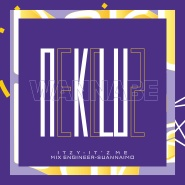

WANNA BE
============================

|  |  |
| :--: | :-- |
| [ WANNA BE](https://emumo.xiami.com/album/2108161942) | **艺人**: [NEKO](../index.md) **语种**: 韩语 **唱片公司**: 独立发行 **发行时间**: 2020年03月13日 **专辑类别**: 录音室专辑 **专辑风格**: 流行 Pop, 韩国流行 K-Pop, 女子团体 Girl Group **播放数**: 23695 **收藏数**: 5 **评论数**: 2  |

## 简介

wanna be me me me！

## 曲目

## 评论

|  |  |  |
| :-- | :-- | :-- |
|  [虾米用户](https://emumo.xiami.com/u/411470311)  2020-03-14 11:27 赞(1) 踩(0) | 
我真的越来越喜欢你们了 怎么办？是控制不住的那种 等我长大了有钱了 绝对要去听你们的演唱会  加油加油(ง •̀_•́)ง
 |
|  [虾米用户](https://emumo.xiami.com/u/202539168)  2020-03-14 10:53 赞(2) 踩(0) | 
曾经听人说，最最高级的自由其实是～自律；声色依然清脆，果然一听
 |
