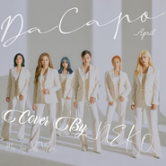

LALALILALA
============================

|  |  |
| :--: | :-- |
| [ LALALILALA](https://emumo.xiami.com/album/2108376111) | **艺人**: [NEKO](../index.md) **语种**: 韩语 **唱片公司**: 独立发行 **发行时间**: 2020年04月25日 **专辑类别**: 录音室专辑 **专辑风格**: 流行 Pop, 韩国流行 K-Pop, 女子团体 Girl Group **播放数**: 3843 **收藏数**: 6 **评论数**: 2  |

## 简介

新歌真好听!!!

## 曲目

## 评论

|  |  |  |
| :-- | :-- | :-- |
|  [虾米用户](https://emumo.xiami.com/u/202539168)  2020-04-26 15:02 赞(0) 踩(0) | 
面对团战，谁人出战？ 哼哼哈嘿，唯我亲亲， 古有关候温酒斩华雄， 今有木兰巾帼胜须眉， 爽，爽，爽！（当浮一大白）
 |
|  [虾米用户](https://emumo.xiami.com/u/335091642) 只是一个过客 2020-04-25 23:17 赞(1) 踩(0) | 
好听
 |
