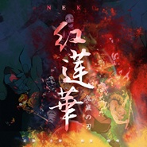

紅蓮華【鬼灭之刃op】
============================

|  |  |
| :--: | :-- |
| [ 紅蓮華【鬼灭之刃op】](https://emumo.xiami.com/album/5020781882) | **艺人**: [NEKO](../index.md) **语种**: 日语 **唱片公司**: 独立发行 **发行时间**: 2020年05月31日 **专辑类别**: 录音室专辑 **专辑风格**: 日本流行 J-Pop, 摇滚 Rock & Roll **播放数**: 86494 **收藏数**: 9 **评论数**: 8  |

## 简介

真的很喜欢鬼灭了&nbsp;完结撒花~

## 曲目

## 评论

|  |  |  |  |
| :-- | :-- | :-- | :-- |
|  [虾米用户](https://emumo.xiami.com/u/445965637)  2021-01-07 21:40 赞(0) 踩(0) | 
好听
 |
|  [虾米用户](https://emumo.xiami.com/u/307267669) 没有什么是比音乐更好的了... 2021-01-01 21:44 赞(0) 踩(0) | 
额
 |
|  [虾米用户](https://emumo.xiami.com/u/359569928) 互关 2020-11-07 17:09 赞(1) 踩(0) | 
超喜欢
 |
|  [虾米用户](https://emumo.xiami.com/u/251642154)  2020-08-19 20:52 赞(1) 踩(0) | 
这不是原唱？？
 |
|  [虾米用户](https://emumo.xiami.com/u/434715873) 如果真爱有颜色，那一定是... 2020-06-26 17:47 赞(1) 踩(0) | 
和其他的不同，干脆利落，可谓是原版的高仿
 |
|  [虾米用户](https://emumo.xiami.com/u/35285038) なるようになる 2020-06-01 04:03 赞(1) 踩(0) | 
有血有肉有灵魂的演唱
 |
|  [虾米用户](https://emumo.xiami.com/u/378744696)  2020-05-31 18:54 赞(1) 踩(0) | 
终于找到了变强的方法，终于有了变强的目标
 |
|  [虾米用户](https://emumo.xiami.com/u/202539168)  2020-05-31 16:09 赞(1) 踩(0) | 
看你努力的模样，似乎无所不能；看你坚强的模样，我确信，我坚信；让我心疼欧尼一分钟，就一分钟，但愿今生不愿醒……来世仍然护卫（姐）。
 |
