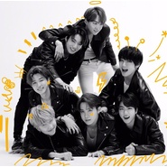
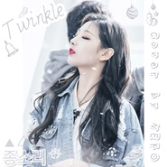
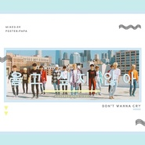

NEKO
============================

|  |  |
| :--: | :-- |
| [ NEKO](https://i.xiami.com/syneko) | **播放数**: 15820289 **粉丝数**: 5616 **评论数**: 275 **地区**: China 中国大陆 **风格**: 流行 Pop  |

## 档案

-嘻嘻嘻 这里NEKO- 
网易云音乐人：NEKO 
B站 / 微博：Sy_NEKO 
爱好广泛杂食向  业余小透明翻唱一名 
韩翻为主其他的如果是我的取向也会毫不犹豫去翻的！ 
真的很开心得到你们的喜欢T-T 
如果不喜欢我的话也没关系  只希望轻喷哇~~

## 专辑

| 名称 | 语种 | 唱片公司 | 发行时间 | 专辑类别 | 专辑风格 |
| :--: | :-- | :-- | :-- | :-- | :-- |
| [ 幻想童话환상동화 (Secret Story of the Swan）](./albums/5021153645.md) | 韩语 | 独立发行 | 2020年07月23日 | 录音室专辑 | 流行 Pop, 韩国流行 K-Pop, 日本流行 J-Pop |
| [ HOW YOU LIKE THAT](./albums/5020970366.md) | 韩语 | 独立发行 | 2020年06月27日 | 录音室专辑 | 韩国流行 K-Pop, 女子团体 Girl Group, 流行 Pop |
| [ 紅蓮華【鬼灭之刃op】](./albums/5020781882.md) | 日语 | 独立发行 | 2020年05月31日 | 录音室专辑 | 日本流行 J-Pop, 摇滚 Rock & Roll |
| [ nonstop](./albums/5020648296.md) | 韩语 | 独立发行 | 2020年05月15日 | 录音室专辑 | 流行 Pop, 韩国流行 K-Pop, 女子团体 Girl Group |
| [ 나비와 고양이（LEO）蝴蝶与猫](./albums/5020638015.md) | 韩语 | 独立发行 | 2020年05月11日 | 录音室专辑 | 流行 Pop, 韩国流行 K-Pop, 韩国抒情歌曲 Korean Ballad |
| [ Labyrinth迷宫](./albums/5020546430.md) | 韩语 | 独立发行 | 2020年05月08日 | 录音室专辑 | 流行 Pop, 韩国流行 K-Pop, 女子团体 Girl Group |
| [ Spit it out](./albums/2108423016.md) | 韩语 | 独立发行 | 2020年05月01日 | 录音室专辑 | 流行 Pop, 韩国流行 K-Pop, 女子团体 Girl Group |
| [ LALALILALA](./albums/2108376111.md) | 韩语 | 独立发行 | 2020年04月25日 | 录音室专辑 | 流行 Pop, 韩国流行 K-Pop, 女子团体 Girl Group |
| [ OH MY GOD](./albums/2108300053.md) | 韩语 | 独立发行 | 2020年04月07日 | 录音室专辑 | 流行 Pop, 韩国流行 K-Pop, 女子团体 Girl Group |
| [ Winter Flower雪中梅](./albums/2108241105.md) | 韩语 | 独立发行 | 2020年03月23日 | 录音室专辑 | 流行 Pop, 韩国流行 K-Pop, 韩国抒情歌曲 Korean Ballad |
| [ 시작 梨泰院ost Part2Bginning](./albums/2108196959.md) | 韩语 | 独立发行 | 2020年03月20日 | 录音室专辑 | 韩国流行 K-Pop, 摇滚 Rock & Roll |
| [ WANNA BE](./albums/2108165153.md) | 韩语 | 独立发行 | 2020年03月14日 | 录音室专辑 | 流行 Pop, 韩国流行 K-Pop, 女子团体 Girl Group |
| [ WANNA BE](./albums/2108161942.md) | 韩语 | 独立发行 | 2020年03月13日 | 录音室专辑 | 流行 Pop, 韩国流行 K-Pop, 女子团体 Girl Group |
| [ FIESTA](./albums/2106100655.md) | 韩语 | 独立发行 | 2020年02月24日 | 录音室专辑 | 流行 Pop, 韩国流行 K-Pop, 女子团体 Girl Group |
| [ ON](./albums/2106096639.md) | 韩语 | 独立发行 | 2020年02月23日 | 录音室专辑 | 流行 Pop, 韩国流行 K-Pop, 男孩团体 Boy Band |
| [ FROZEN 2冰雪奇缘2](./albums/2105539264.md) | 其他 |  | 2019年12月07日 | 录音室专辑 | 流行 Pop, 欧美流行 Western Pop, 电影原声 Film Score |
| [ HIP](./albums/2105467764.md) | 韩语 |  | 2019年11月21日 | 录音室专辑 | 流行 Pop, 韩国流行 K-Pop, 女子团体 Girl Group |
| [ 查缺补漏大杂烩](./albums/2105433529.md) | 韩语 |  | 2019年11月11日 | 录音室专辑 |  |
| [ ADIOS](./albums/2105202839.md) | 韩语 |  | 2019年09月01日 | 录音室专辑 | 流行 Pop, 韩国流行 K-Pop, 女子团体 Girl Group |
| [ Snapping](./albums/2105160335.md) | 韩语 |  | 2019年08月17日 | 录音室专辑 | 流行 Pop, 韩国流行 K-Pop, 流行舞曲 Dance-Pop |
| [ ICY](./albums/2105054272.md) | 韩语 |  | 2019年08月03日 | 录音室专辑 | 韩国流行 K-Pop, 女子团体 Girl Group, 流行舞曲 Dance-Pop |
| [ SSFWL](./albums/2104997006.md) | 韩语 |  | 2019年07月14日 | 录音室专辑 | 韩国流行 K-Pop, 女子团体 Girl Group, 日本流行 J-Pop |
| [ Rooftop](./albums/2104945824.md) | 韩语 |  | 2019年06月15日 | 录音室专辑 | 流行 Pop, 韩国流行 K-Pop, 男孩团体 Boy Band |
| [ Boogie Up](./albums/2104940804.md) | 韩语 |  | 2019年06月12日 | 录音室专辑 | 韩国流行 K-Pop, 女子团体 Girl Group, 氛围流行 Ambient Pop |
| [ Fancy (升调版)](./albums/2104851072.md) | 韩语 |  | 2019年05月09日 | 录音室专辑 | 韩国流行 K-Pop, 女子团体 Girl Group, 青少年流行 Teen Pop |
| [ Violeta](./albums/2104777864.md) | 韩语 |  | 2019年04月12日 | 录音室专辑 | 韩国流行 K-Pop, 女子团体 Girl Group, 日本流行 J-Pop |
| [ KILL THIS LOVE](./albums/2104748621.md) | 韩语 |  | 2019年04月06日 | 录音室专辑 | 韩国流行 K-Pop, 女子团体 Girl Group, 青少年流行 Teen Pop |
| [ WE MADE](./albums/2104649284.md) | 韩语 |  | 2019年03月03日 | 录音室专辑 | 韩国流行 K-Pop |
| [ 我的老故事](./albums/5022558993.md) | 国语 |  | 2019年02月21日 | 录音室专辑 |  |
| [ ITZY? IYZY!](./albums/2104613398.md) | 韩语 | 独立发行 | 2019年02月16日 | 录音室专辑 | 流行 Pop, 韩国流行 K-Pop, 女子团体 Girl Group |
| [ ALL NIGHT(ENG VER)](./albums/2104566026.md) | 英语 |  | 2019年02月01日 | 录音室专辑 | 电音流行 Electropop, 韩国流行 K-Pop, 欧美流行 Western Pop |
| [ TIME FOR USSUNRISE](./albums/2104544722.md) | 韩语 |  | 2019年01月27日 | 录音室专辑 | 韩国流行 K-Pop, 女子团体 Girl Group, 流行舞曲 Dance-Pop |
| [ RBBREALLY BAD BOY](./albums/2104526211.md) | 韩语 |  | 2019年01月24日 | 录音室专辑 | 韩国流行 K-Pop, 女子团体 Girl Group, 流行舞曲 Dance-Pop |
| [ POPSTARS](./albums/2104481798.md) | 英语 |  | 2019年01月14日 | 录音室专辑 | 流行 Pop, 韩国流行 K-Pop, 欧美流行 Western Pop |
| [ SO HOT](./albums/2104410253.md) | 韩语 |  | 2018年12月24日 | 录音室专辑 | 流行 Pop, 韩国流行 K-Pop, 女子团体 Girl Group |
| [ NO MORE DRAMA](./albums/2104385400.md) | 韩语 |  | 2018年12月17日 | 录音室专辑 | 流行 Pop, 韩国流行 K-Pop, 女子团体 Girl Group |
| [ KISS N MAKEUP](./albums/2104280950.md) | 英语 |  | 2018年11月25日 | 录音室专辑 | 流行 Pop, 电音流行 Electropop, 欧美流行 Western Pop |
| [ HB TO ME❤HEAD ABOVE WATER](./albums/2104120815.md) | 英语 | 独立发行 | 2018年10月19日 | 录音室专辑 | 流行 Pop, 青少年流行 Teen Pop, 欧美流行 Western Pop |
| [ SUMMER！power up](./albums/2104082371.md) | 韩语 | 独立发行 | 2018年10月05日 | 录音室专辑 | 流行 Pop, 韩国流行 K-Pop, 女子团体 Girl Group |
| [ RUMOR](./albums/2103938358.md) | 韩语 | 独立发行 | 2018年08月21日 | 录音室专辑 | 电音流行 Electropop, 韩国流行 K-Pop, 女子团体 Girl Group |
| [ Square triple](./albums/2103920037.md) | 韩语 | 独立发行 | 2018年08月13日 | 录音室专辑 | 韩国流行 K-Pop, 女子团体 Girl Group, 欧美流行 Western Pop |
| [ SUMMER !](./albums/2103920043.md) | 韩语 | 独立发行 | 2018年08月13日 | 录音室专辑 | 流行 Pop, 韩国流行 K-Pop, 女子团体 Girl Group |
| [ BAAM!!](./albums/2103770769.md) | 韩语 | 独立发行 | 2018年06月30日 | 录音室专辑 | 韩国流行 K-Pop, 女子团体 Girl Group, 电音流行 Electropop |
| [ I AM](./albums/2103707646.md) | 韩语 | 独立发行 | 2018年05月13日 | 录音室专辑 | 流行 Pop, 韩国流行 K-Pop, 女子团体 Girl Group |
| [ DDD](./albums/2103700986.md) | 韩语 | 独立发行 | 2018年05月03日 | 录音室专辑 | 流行 Pop, 韩国流行 K-Pop, 女子团体 Girl Group |
| [ THE PERFECT RED COVER](./albums/2103698225.md) | 韩语 | 独立发行 | 2018年04月28日 | 录音室专辑 | 韩国流行 K-Pop, 女子团体 Girl Group, 流行舞曲 Dance-Pop |
| [ BLACK DRESS](./albums/2103617500.md) | 韩语 | 独立发行 | 2018年03月18日 | 录音室专辑 | 韩国流行 K-Pop, 女子团体 Girl Group, 流行 Pop |
| [ LOVE SCENARIO](./albums/2103591268.md) | 韩语 | 独立发行 | 2018年03月07日 | 录音室专辑 | 韩国流行 K-Pop, 男孩团体 Boy Band, 青少年流行 Teen Pop |
| [ 礼物—花游记OST背影中文填词](./albums/2103584539.md) | 国语 | 独立发行 | 2018年03月06日 | 录音室专辑 | 韩国流行 K-Pop, 国语流行 Mandarin Pop, 流行 Pop |
| [ GREAT!BBOOM BBOOM](./albums/2103537695.md) | 韩语 | 独立发行 | 2018年02月17日 | 录音室专辑 | 韩国流行 K-Pop, 女子团体 Girl Group, 电音流行 Electropop |
| [ 清醒梦 Lucid Dream当你沉睡时ost](./albums/2103498075.md) | 韩语 | 独立发行 | 2018年01月22日 | 录音室专辑 | 韩国流行 K-Pop, 成人时代 Adult Contemporary, 流行 Pop |
| [ Fly High날아올라](./albums/2103489167.md) | 韩语 | 独立发行 | 2018年01月13日 | 录音室专辑 | 韩国流行 K-Pop, 女子团体 Girl Group, 流行舞曲 Dance-Pop |
| [ 종소리twinkle](./albums/2103468120.md) | 韩语 | 独立发行 | 2018年01月05日 | 录音室专辑 | 韩国流行 K-Pop, 女子团体 Girl Group, 流行 Pop |
| [ NEKOtagram](./albums/2102976043.md) | 韩语 | 独立发行 | 2017年12月18日 | 录音室专辑 | 韩国流行 K-Pop, 女子团体 Girl Group, 青少年流行 Teen Pop |
| [ Don't Wanna Cry](./albums/2102974555.md) | 韩语 | 独立发行 | 2017年12月15日 | 录音室专辑 | 韩国流行 K-Pop, 青少年流行 Teen Pop, 男孩团体 Boy Band |
| [ I GOT LOVE附双声道ver](./albums/2102905279.md) | 韩语 | 独立发行 | 2017年11月03日 | 录音室专辑 | 流行 Pop, 韩国流行 K-Pop, 女子团体 Girl Group |
| [ DNA原唱：BTS](./albums/2102895468.md) | 韩语 | 独立发行 | 2017年10月31日 | 录音室专辑 | 韩国流行 K-Pop, 男孩团体 Boy Band, 欧美流行 Western Pop |
| [ GASHINANEKO庆生曲](./albums/2102877081.md) | 韩语 | 独立发行 | 2017年10月19日 | EP, 单曲 | 韩国流行 K-Pop, 女子团体 Girl Group |
| [ Summer Storm](./albums/2102865347.md) | 韩语 | 独立发行 | 2017年09月28日 | 录音室专辑 | 流行 Pop, 韩国流行 K-Pop, 女子团体 Girl Group |
| [ 和我交往吗？ft.晚安](./albums/2102858941.md) | 韩语 | 独立发行 | 2017年09月18日 | 录音室专辑 | 韩国流行 K-Pop, 女子团体 Girl Group, 青少年流行 Teen Pop |
| [ 1 X 1 = 1 （TO BE ONE）](./albums/2102812122.md) | 韩语 | 独立发行 | 2017年08月07日 | 录音室专辑 | 流行 Pop, 韩国流行 K-Pop, 男孩团体 Boy Band |
| [ ALL NIGHTcover 少女时代（十周年快乐!!）](./albums/2102809477.md) | 韩语 | 独立发行 | 2017年08月05日 | 录音室专辑 | 流行 Pop, 韩国流行 K-Pop, 女子团体 Girl Group |
| [ It's Holiday！人生初次这么快的速翻](./albums/2102809397.md) | 韩语 | 独立发行 | 2017年08月05日 | 录音室专辑 | 韩国流行 K-Pop, 女子团体 Girl Group, 流行 Pop |
| [ As if it's your last - BLACKPINK](./albums/2102808235.md) | 韩语 | 独立发行 | 2017年08月01日 | 录音室专辑 | 韩国流行 K-Pop, 欧美流行 Western Pop, 女子团体 Girl Group |
| [ Gfriend - FINGERTIP](./albums/2102808244.md) | 韩语 | 独立发行 | 2017年07月31日 | 录音室专辑 | 韩国流行 K-Pop, 女子团体 Girl Group, 流行 Pop |
| [ K.A.R.D - Don't Recall](./albums/2102775146.md) | 韩语 | 独立发行 | 2017年06月30日 | 录音室专辑 | 韩国流行 K-Pop, 青少年流行 Teen Pop, 欧美流行 Western Pop |
| [ 白艺潾 cover.0626艺潾日快乐❤](./albums/2102775157.md) | 韩语 | 独立发行 | 2017年06月26日 | 录音室专辑 | 韩国流行 K-Pop, 流行 Pop, 女子团体 Girl Group |
| [ BTS - 피 땀 눈물 血汗泪](./albums/2102762084.md) | 韩语 | 独立发行 | 2017年06月08日 | 录音室专辑 | 韩国流行 K-Pop, 流行 Pop |
| [ Gfriend - 너 그리고 나Navillera 你还有我NEKO ( ft.CinDy cosang 阿慈 )](./albums/2102762068.md) | 韩语 | 独立发行 | 2017年06月08日 | 录音室专辑 | 韩国流行 K-Pop, 流行 Pop |
| [ Red Velevt - Rookie](./albums/2102762091.md) | 韩语 | 独立发行 | 2017年06月08日 | 录音室专辑 | 韩国流行 K-Pop, 流行 Pop, 女子团体 Girl Group |
| [ Gu9udan - A Girl Like Meft. 荔子](./albums/2102762097.md) | 韩语 | 独立发行 | 2017年06月08日 | 录音室专辑 | 韩国流行 K-Pop, 女子团体 Girl Group, 流行 Pop |

## 评论

|  |  |  |  |
| :-- | :-- | :-- | :-- |
|  [虾米用户](https://emumo.xiami.com/u/357258951)  2021-01-05 22:41 赞(4) 踩(0) | 
虾米就要休息了，neko姐姐今后也要继续加油阿，翻唱真的超好听! 
 |
| ⇒ |  [虾米用户](https://emumo.xiami.com/u/39174694) 一切郑因为你的清秀容妍～ 2021-01-06 19:03 赞(0) 踩(0) | 
谢谢 
 |
|  [虾米用户](https://emumo.xiami.com/u/336098000)  2021-01-05 10:50 赞(2) 踩(0) | 
蝦米就要關閉了，Neko小姐姐以後會在哪裡發歌的呀，好喜歡你的歌希望可以有個地方一直聽下去
 |
|  [虾米用户](https://emumo.xiami.com/u/349136744)  2020-11-25 21:31 赞(2) 踩(0) | 
小姐姐秒杀不少流量明星哦(&amp;acute;-&amp;omega;-`)
 |
|  [虾米用户](https://emumo.xiami.com/u/35278495)  2020-11-25 07:37 赞(1) 踩(0) | 
这人有点略屌！
 |
|  [虾米用户](https://emumo.xiami.com/u/14049756) 云端上的小葡萄 2020-10-13 11:05 赞(0) 踩(0) | 
小姐姐能不能唱国语呀！
 |
|  [虾米用户](https://emumo.xiami.com/u/14049756) 云端上的小葡萄 2020-10-13 11:03 赞(1) 踩(0) | 
小姐姐好厉害啊
 |
|  [虾米用户](https://emumo.xiami.com/u/352797247) 是要陪你一起的。 2020-08-21 17:33 赞(1) 踩(0) | 
喜欢你
 |
|  [虾米用户](https://emumo.xiami.com/u/42886028) 我要 我瘋 我要 我愛 ... 2020-06-07 14:33 赞(2) 踩(0) | 
强
 |
|  [虾米用户](https://emumo.xiami.com/u/433898734)  2020-04-26 18:20 赞(2) 踩(0) | 
太厉害
 |
|  [虾米用户](https://emumo.xiami.com/u/1125942) 给您拜早年了。₍₍ (ง... 2020-04-21 08:03 赞(3) 踩(0) | 
牛
 |
|  [虾米用户](https://emumo.xiami.com/u/45247205)  2020-04-18 13:57 赞(1) 踩(0) | 
小姐姐好厉害！出道吧
 |
|  [虾米用户](https://emumo.xiami.com/u/426536608)  2020-03-27 17:37 赞(1) 踩(0) | 
好&amp;hellip;好听
 |
|  [虾米用户](https://emumo.xiami.com/u/324823390)  2020-03-22 16:01 赞(1) 踩(0) | 
你们可以给广东歌何人活动火热好的火热？何人好的恢复本土交费
 |
|  [虾米用户](https://emumo.xiami.com/u/324823390)  2020-03-22 16:00 赞(1) 踩(0) | 
   
 |
|  [虾米用户](https://emumo.xiami.com/u/376799038) 我只想那啥和那啥 2020-03-17 22:51 赞(1) 踩(0) | 
想听 玟星的《In my room》
 |
|  [虾米用户](https://emumo.xiami.com/u/346405542)  2020-01-04 21:44 赞(0) 踩(0) | 
太厉害了
 |
|  [虾米用户](https://emumo.xiami.com/u/44785568) 不太懂 2020-01-01 08:34 赞(0) 踩(0) | 
爱了
 |
|  [虾米用户](https://emumo.xiami.com/u/16511740)  2019-12-24 01:47 赞(1) 踩(0) | 
求唱(G)i-dle的hann
 |
|  [虾米用户](https://emumo.xiami.com/u/406919322) 每一位小众音乐爱好者都是... 2019-12-08 00:21 赞(2) 踩(0) | 
你的bye bye my blue是我听过最绝的版本。
 |
|  [虾米用户](https://emumo.xiami.com/u/344457856) 我爱你 2019-11-21 13:45 赞(1) 踩(0) | 
你唱歌很好听
 |
|  [虾米用户](https://emumo.xiami.com/u/428873933) 우리는 EXO 거 야. 2019-09-13 18:22 赞(1) 踩(0) | 
加油啊！
 |
|  [虾米用户](https://emumo.xiami.com/u/424037079) 全世界最好的虾米♥️TY... 2019-09-12 16:23 赞(3) 踩(0) | 
简直就是原唱啊，太赞啦，我的宝藏啊相见恨晚
 |
|  [虾米用户](https://emumo.xiami.com/u/424037079) 全世界最好的虾米♥️TY... 2019-09-12 16:19 赞(1) 踩(0) | 
小姐姐我好像爱上你了 被的天籁之声啊爱了爱了
 |
|  [虾米用户](https://emumo.xiami.com/u/428352659)  2019-09-12 08:07 赞(2) 踩(0) | 
我的天 我以为是原唱！！我丢！！
 |
|  [虾米用户](https://emumo.xiami.com/u/247570761) SuJu 13年，不改初... 2019-09-09 22:24 赞(0) 踩(0) | 
求小姐姐翻唱BTOB－《没有你不行》
 |
|  [虾米用户](https://emumo.xiami.com/u/9808473) 这家伙很聪明什么也没留下... 2019-07-27 11:04 赞(2) 踩(0) | 
我的天，还以为都是原唱，太好听了吧！！！比心
 |
|  [虾米用户](https://emumo.xiami.com/u/403111563)  2019-07-23 18:17 赞(3) 踩(0) | 
多多爱你 ☺
 |
|  [虾米用户](https://emumo.xiami.com/u/11865653) 要成为理想世界的缔造者和... 2019-06-27 19:21 赞(2) 踩(0) | 
水平惊人啊…………无意听到一首还以为韩国本土翻唱
 |
|  [虾米用户](https://emumo.xiami.com/u/307758246) 专注更新橙光歌单，有喜欢... 2019-05-28 23:01 赞(1) 踩(0) | 
女神！翻唱脸红的思春期嘛~~~~BLUE超好听的！
 |
|  [虾米用户](https://emumo.xiami.com/u/317791478) “芬芳的玫瑰带着星系的浪... 2019-05-20 18:37 赞(1) 踩(0) | 

 |
|  [虾米用户](https://emumo.xiami.com/u/209887485)  2019-05-15 22:45 赞(1) 踩(0) | 
好好听啊，哈哈哈～
 |
|  [虾米用户](https://emumo.xiami.com/u/419855265) 边伯贤是宝藏 2019-05-02 19:07 赞(2) 踩(0) | 
想听姐姐翻唱BTS新歌
 |
|  [虾米用户](https://emumo.xiami.com/u/403678669)  2019-04-14 11:21 赞(1) 踩(0) | 
Bp的歌唱得太好了吧
 |
|  [虾米用户](https://emumo.xiami.com/u/169206086) Well begun i... 2019-04-07 01:48 赞(2) 踩(0) | 
小姐姐可以翻唱脸红的思春期的歌吗？ 
 |
|  [虾米用户](https://emumo.xiami.com/u/352745917) 好人有好报 2019-04-06 13:31 赞(0) 踩(0) | 
美妙的歌声，超喜欢
 |
|  [虾米用户](https://emumo.xiami.com/u/352745917) 好人有好报 2019-04-03 06:18 赞(2) 踩(0) | 
하늘의 소리여, 그대를 지지하소서.
 |
|  [虾米用户](https://emumo.xiami.com/u/419855265) 边伯贤是宝藏 2019-03-23 19:06 赞(2) 踩(0) | 
想跟小姐姐扩列咋办
 |
|  [虾米用户](https://emumo.xiami.com/u/352745917) 好人有好报 2019-03-21 13:57 赞(2) 踩(0) | 
好听好听棒棒哒
 |
|  [虾米用户](https://emumo.xiami.com/u/9902531) 浪漫指南 2019-03-17 10:13 赞(2) 踩(0) | 
唱歌真好听 ！
 |
|  [虾米用户](https://emumo.xiami.com/u/311924420) 努力才是生存之道 2019-03-08 23:09 赞(2) 踩(0) | 
小姐姐唱歌特别特别好听，非常喜欢!
 |
|  [虾米用户](https://emumo.xiami.com/u/420323095)  2019-03-04 23:16 赞(2) 踩(0) | 
哇哇哇 韩国语发音非常好听 
 |
|  [虾米用户](https://emumo.xiami.com/u/295390554) 少时SeventeenE... 2019-03-03 02:06 赞(1) 踩(0) | 
真的唱的好听   
 |
|  [虾米用户](https://emumo.xiami.com/u/415694842) 颖火虫 2019-03-02 15:52 赞(3) 踩(0) | 
超级好听。觉得好听的人点个赞。 
 |
|  [虾米用户](https://emumo.xiami.com/u/235716646) 旁的任何都不及你 2019-02-17 01:03 赞(3) 踩(0) | 
小姐姐声音太好听啦!!!
 |
|  [虾米用户](https://emumo.xiami.com/u/52351140) 麻烦司马给我头像安排一张... 2019-02-14 21:39 赞(3) 踩(0) | 
出道吧  南宁老乡路过
 |
|  [虾米用户](https://emumo.xiami.com/u/4487129)  2019-02-12 08:42 赞(2) 踩(0) | 
！！！
 |
|  [虾米用户](https://emumo.xiami.com/u/402246451) 想要个宠我的哥哥吖 2019-02-07 13:03 赞(1) 踩(0) | 
唱的比阿米丢丢好听多了 
 |
|  [虾米用户](https://emumo.xiami.com/u/344029533) My Dream sho... 2019-02-02 20:52 赞(3) 踩(0) | 
太好听了金度妍那首太棒了
 |
|  [虾米用户](https://emumo.xiami.com/u/279639884) Sone#Meu 2019-02-02 18:36 赞(2) 踩(0) | 
小姐姐是韩国人吗
 |
| ⇒ |  [虾米用户](https://emumo.xiami.com/u/39174694) 一切郑因为你的清秀容妍～ 2019-03-03 23:22 赞(0) 踩(0) | 
不是噢！
 |
|  [虾米用户](https://emumo.xiami.com/u/3386225) 感谢用心用情做软件的工作... 2019-01-28 20:41 赞(1) 踩(0) | 
我天！我以为是韩国正式出道的歌唱组合 
 |
|  [虾米用户](https://emumo.xiami.com/u/194221360) 不要忘了想我  算了不要... 2019-01-26 16:10 赞(2) 踩(0) | 
留名！
 |
| ⇒ |  [虾米用户](https://emumo.xiami.com/u/39174694) 一切郑因为你的清秀容妍～ 2019-01-27 12:19 赞(0) 踩(0) | 
嘿嘿
 |
|  [虾米用户](https://emumo.xiami.com/u/404575014)  2019-01-22 08:18 赞(2) 踩(0) | 
小姐姐声音好听到惊人……
 |
|  [虾米用户](https://emumo.xiami.com/u/376313717) BLACKPINK  2019-01-20 17:58 赞(2) 踩(0) | 
谢谢你哦……我找了这些歌，找了好久，就只有你的不用VIP
 |
|  [虾米用户](https://emumo.xiami.com/u/222707954)  2019-01-13 13:25 赞(1) 踩(0) | 
小姐姐唱歌真的好听
 |
| ⇒ |  [虾米用户](https://emumo.xiami.com/u/39174694) 一切郑因为你的清秀容妍～ 2019-01-15 00:04 赞(0) 踩(0) | 
谢谢!
 |
|  [虾米用户](https://emumo.xiami.com/u/41309038) call me mayb... 2019-01-10 00:53 赞(1) 踩(0) | 
真的怪物
 |
|  [虾米用户](https://emumo.xiami.com/u/411820578)  2019-01-05 23:06 赞(3) 踩(0) | 
想听你多唱exid和tara，非常喜欢这两个组合。更喜欢你的声音
 |
|  [虾米用户](https://emumo.xiami.com/u/355565082) 优秀 2018-12-30 07:53 赞(2) 踩(0) | 
优秀
 |
|  [虾米用户](https://emumo.xiami.com/u/187751396) 好久不见，我回来啦 2018-12-13 20:21 赞(2) 踩(0) | 
心动的感觉
 |
|  [虾米用户](https://emumo.xiami.com/u/187751396) 好久不见，我回来啦 2018-12-13 20:20 赞(2) 踩(0) | 
姐姐你唱歌太好听了啊 
 |
| ⇒ |  [虾米用户](https://emumo.xiami.com/u/39174694) 一切郑因为你的清秀容妍～ 2018-12-17 00:05 赞(0) 踩(0) | 
谢谢❤️
 |
|  [虾米用户](https://emumo.xiami.com/u/402942994)  2018-12-06 21:54 赞(3) 踩(0) | 
小姐姐唱solo
 |
|  [虾米用户](https://emumo.xiami.com/u/353458882)  2018-11-27 00:11 赞(2) 踩(0) | 
韩语说的好好好听
 |
|  [虾米用户](https://emumo.xiami.com/u/268251387) 人美心善 2018-11-17 10:37 赞(3) 踩(0) | 
姐姐，你太厉害了，是我有史以来听过最好听的翻唱了作为Golden star我自愧不如。
 |
| ⇒ |  [虾米用户](https://emumo.xiami.com/u/39174694) 一切郑因为你的清秀容妍～ 2018-11-19 12:51 赞(0) 踩(0) | 
谢谢喜欢
 |
|  [虾米用户](https://emumo.xiami.com/u/405268928) 这么可爱又有仙气，一个是... 2018-11-10 22:06 赞(3) 踩(0) | 
小姐姐声音不错  ，为什么我有心动的感觉   
 |
|  [虾米用户](https://emumo.xiami.com/u/32088228) 你⊙∀⊙？ 2018-11-03 14:21 赞(1) 踩(0) | 
秒杀专业歌手
 |
|  [虾米用户](https://emumo.xiami.com/u/32088228) 你⊙∀⊙？ 2018-11-03 14:21 赞(1) 踩(0) | 
声音真好听。。。。
 |
| ⇒ |  [虾米用户](https://emumo.xiami.com/u/39174694) 一切郑因为你的清秀容妍～ 2018-11-08 15:54 赞(0) 踩(0) | 
谢谢
 |
|  [虾米用户](https://emumo.xiami.com/u/353677447) 立场边伯贤 2018-11-01 20:33 赞(3) 踩(0) | 
小姐姐可以唱下EXO的歌嘛，你唱歌真的炒鸡好听的！
 |
| ⇒ |  [虾米用户](https://emumo.xiami.com/u/39174694) 一切郑因为你的清秀容妍～ 2018-11-02 11:42 赞(0) 踩(0) | 
嗯嗯
 |
|  [虾米用户](https://emumo.xiami.com/u/245388767)  2018-10-27 15:24 赞(2) 踩(0) | 
哈哈哈 小姐姐 好想和你一起去ktv唱歌
 |
| ⇒ |  [虾米用户](https://emumo.xiami.com/u/39174694) 一切郑因为你的清秀容妍～ 2018-11-02 11:44 赞(0) 踩(0) | 
哈哈哈哈
 |
|  [虾米用户](https://emumo.xiami.com/u/354213971)  2018-10-17 09:17 赞(0) 踩(0) | 
少女时代？
 |
|  [虾米用户](https://emumo.xiami.com/u/354213971)  2018-10-17 09:16 赞(2) 踩(0) | 
唱一首小天的呗哈哈哈哈
 |
|  [虾米用户](https://emumo.xiami.com/u/330790324)  2018-10-15 19:01 赞(2) 踩(0) | 
小姐姐唱歌好好听，能点一首produce 48的再次相遇吗？感觉你应该很适合
 |
|  [虾米用户](https://emumo.xiami.com/u/272049410) 10+7+7 +∞ =2... 2018-10-06 20:01 赞(2) 踩(0) | 
姐姐不考虑翻唱一下PD48的主题曲吗？内搞呀真的很好听 
 |
| ⇒ |  [虾米用户](https://emumo.xiami.com/u/272049410) 10+7+7 +∞ =2... 2018-10-06 21:14 赞(0) 踩(0) | 
分享  PRODUCE 48 的歌曲《내꺼야 (是我的) (PIC...》<a href="https://www.xiami.com/song/1803037147" target="_blank" rel="nofollow noreferrer noopener">https://www.xiami.com/song/1803037147</a> (分享自@虾米音乐)
 |
|  [虾米用户](https://emumo.xiami.com/u/272049410) 10+7+7 +∞ =2... 2018-10-03 21:34 赞(2) 踩(0) | 
表白姐姐 声音可以这么好听 翻唱的真是太棒了  从今天开始变成姐姐的粉  
 |
| ⇒ |  [虾米用户](https://emumo.xiami.com/u/39174694) 一切郑因为你的清秀容妍～ 2018-10-05 19:29 赞(0) 踩(0) | 
 
 |
|  [虾米用户](https://emumo.xiami.com/u/403747439)  2018-09-17 16:05 赞(1) 踩(0) | 
小姐姐的嗓子被上帝亲过吧，这么好听。我的嗓子被猪亲过 
 |
|  [虾米用户](https://emumo.xiami.com/u/227645375) 永远exo_l，每天加油... 2018-09-14 14:10 赞(1) 踩(0) | 
开口脆啊，鸡皮疙瘩掉一地，小姐姐很厉害
 |
| ⇒ |  [虾米用户](https://emumo.xiami.com/u/39174694) 一切郑因为你的清秀容妍～ 2018-09-15 09:56 赞(0) 踩(0) | 
谢谢喜欢呀！～
 |
|  [虾米用户](https://emumo.xiami.com/u/254660182) 做梦的时候听歌 2018-09-11 12:11 赞(1) 踩(0) | 
加油
 |
| ⇒ |  [虾米用户](https://emumo.xiami.com/u/39174694) 一切郑因为你的清秀容妍～ 2018-09-11 20:55 赞(0) 踩(0) | 
好滴
 |
|  [虾米用户](https://emumo.xiami.com/u/314002582) NO EXO NO LI... 2018-08-29 00:13 赞(1) 踩(0) | 
我的天，很好奇小姐姐唱的这么好听是练习生吗？
 |
| ⇒ |  [虾米用户](https://emumo.xiami.com/u/39174694) 一切郑因为你的清秀容妍～ 2018-08-31 01:12 赞(0) 踩(0) | 
哈哈哈哈不是的！
 |
|  [虾米用户](https://emumo.xiami.com/u/358861379)  2018-08-15 17:03 赞(1) 踩(0) | 
姐姐，可不可以翻唱wanna one的beautiful啊？真的很好听的一首歌，特别是I miss you so much的部分，很期待姐姐的演绎 
 |
| ⇒ |  [虾米用户](https://emumo.xiami.com/u/39174694) 一切郑因为你的清秀容妍～ 2018-08-16 23:53 赞(0) 踩(0) | 
我试试哈哈哈
 |
| ⇒ |  [虾米用户](https://emumo.xiami.com/u/358861379)  2018-08-17 14:40 赞(0) 踩(0) | 
<q><b>NEKO说：</b></q>
 |
|  [虾米用户](https://emumo.xiami.com/u/257877336) 亲爱的苏格拉底，宁死不负... 2018-08-08 17:41 赞(3) 踩(0) | 
小姐姐多翻下少女时代的歌好吗？加油＾０＾~
 |
| ⇒ |  [虾米用户](https://emumo.xiami.com/u/39174694) 一切郑因为你的清秀容妍～ 2018-08-10 18:38 赞(0) 踩(0) | 
好滴！
 |
|  [虾米用户](https://emumo.xiami.com/u/329958414) 立刻有 2018-07-10 09:05 赞(48) 踩(0) | 
姐姐一定是被上帝选中的嗓子了！！！！！！强推LATATA！！！！！！特好听，原版了吧这是！
 |
| ⇒ |  [虾米用户](https://emumo.xiami.com/u/39174694) 一切郑因为你的清秀容妍～ 2018-07-10 20:22 赞(0) 踩(0) | 
嘿嘿～谢谢喜欢！！ 
 |
|  [虾米用户](https://emumo.xiami.com/u/210741025) 你永远不知道在你面前笑着... 2018-06-25 19:20 赞(4) 踩(0) | 
小姐姐还不出新歌吗日常磨皮擦痒了我的耳朵需要你来拯救
 |
| ⇒ |  [虾米用户](https://emumo.xiami.com/u/39174694) 一切郑因为你的清秀容妍～ 2018-06-26 17:45 赞(0) 踩(0) | 
哈哈哈好滴 我抓紧～最近有点小忙
 |
| ⇒ |  [虾米用户](https://emumo.xiami.com/u/210741025) 你永远不知道在你面前笑着... 2018-06-27 03:47 赞(0) 踩(0) | 
<q><b>NEKO说：</b></q>
 |
|  [虾米用户](https://emumo.xiami.com/u/241297135) purper water 2018-06-24 12:26 赞(2) 踩(0) | 
拜托多出脸红的歌，一首都没有
 |
| ⇒ |  [虾米用户](https://emumo.xiami.com/u/39174694) 一切郑因为你的清秀容妍～ 2018-07-24 02:37 赞(0) 踩(0) | 
嗯嗯！
 |
|  [虾米用户](https://emumo.xiami.com/u/376548242) wyyID◎plmm集邮... 2018-06-23 23:33 赞(3) 踩(0) | 
因为翻唱了毛毛的歌决定pick您 孩子们的邋遢遢也超级好听 
 |
| ⇒ |  [虾米用户](https://emumo.xiami.com/u/39174694) 一切郑因为你的清秀容妍～ 2018-07-24 02:37 赞(0) 踩(0) | 
感恩！
 |
|  [虾米用户](https://emumo.xiami.com/u/275337692)  2018-06-23 00:10 赞(5) 踩(0) | 
深夜来发不短不长的长评！第一次认识小姐姐是因为和D.Mao小姐姐的阵雨呢，当时真的马上圈饭。然后NEKO小姐姐唱的每首歌都是我的Style。好的最后说什么呢？小姐姐走花路趴kkkk   
 |
| ⇒ |  [虾米用户](https://emumo.xiami.com/u/39174694) 一切郑因为你的清秀容妍～ 2018-06-23 23:16 赞(0) 踩(0) | 
爱你❤️❤️
 |
|  [虾米用户](https://emumo.xiami.com/u/315484230) 爱好bts和欧美 2018-06-18 18:57 赞(2) 踩(0) | 
看到封面进来的  这人物。不是泰泰吗内容  翻唱？鼓励鼓励吧。
 |
| ⇒ |  [虾米用户](https://emumo.xiami.com/u/39174694) 一切郑因为你的清秀容妍～ 2018-06-20 15:19 赞(0) 踩(0) | 
哈哈哈哈哈接近了 不是泰泰是jh 
 |
|  [虾米用户](https://emumo.xiami.com/u/44268695)  2018-06-16 17:11 赞(2) 踩(0) | 
好好听\^O^/
 |
|  [虾米用户](https://emumo.xiami.com/u/375116303) 额。。。那个你就别进来看... 2018-06-09 13:16 赞(1) 踩(0) | 
呜哇小姐姐好厉害就是发音不是很好但是真的很棒哦加油哦  
 |
|  [虾米用户](https://emumo.xiami.com/u/352840510) 喜识. 2018-06-09 10:23 赞(2) 踩(0) | 
真可耐 
 |
|  [虾米用户](https://emumo.xiami.com/u/324353156) 宝贝 2018-06-03 21:29 赞(1) 踩(0) | 
想听你是我的第一次这首歌
 |
|  [虾米用户](https://emumo.xiami.com/u/299473297)  2018-05-29 23:17 赞(2) 踩(0) | 
喜欢喜欢
 |
| ⇒ |  [虾米用户](https://emumo.xiami.com/u/39174694) 一切郑因为你的清秀容妍～ 2018-06-01 09:46 赞(0) 踩(0) | 

 |
|  [虾米用户](https://emumo.xiami.com/u/313208945) 一生只爱EXO，脱粉是小... 2018-05-26 21:55 赞(3) 踩(0) | 
小姐姐，小姐姐，韩语难学吗?现在为了想做一名可以说韩语的中国爱丽，想学韩语，可素没有时间，也感觉韩语好难，现在超郁闷 
 |
| ⇒ |  [虾米用户](https://emumo.xiami.com/u/39174694) 一切郑因为你的清秀容妍～ 2018-06-01 09:46 赞(0) 踩(0) | 
韩语我觉得算学语言里面难度系数不是特别高的了，只要你有心 一定可以的！ 
 |
| ⇒ |  [虾米用户](https://emumo.xiami.com/u/313208945) 一生只爱EXO，脱粉是小... 2018-06-03 11:02 赞(0) 踩(0) | 
<q><b>NEKO说：</b></q>
 |
|  [虾米用户](https://emumo.xiami.com/u/334777501)  2018-05-24 18:22 赞(0) 踩(0) | 
小姐姐全民呐是啥 想关注嘤嘤嘤炒鸡心水你
 |
|  [虾米用户](https://emumo.xiami.com/u/236266604) WENDY & EXO ... 2018-05-20 18:03 赞(2) 踩(0) | 
小姐姐小姐姐！NEKO小姐姐！疯狂为小姐姐打call！ 
 |
|  [虾米用户](https://emumo.xiami.com/u/188216914)  2018-05-20 17:37 赞(2) 踩(0) | 
可以翻唱一下防弹的新歌Fake love吗
 |
| ⇒ |  [虾米用户](https://emumo.xiami.com/u/39174694) 一切郑因为你的清秀容妍～ 2018-05-21 14:28 赞(0) 踩(0) | 
哈哈哈好
 |
|  [虾米用户](https://emumo.xiami.com/u/334494942)  2018-05-13 13:09 赞(3) 踩(0) | 
小姐姐是学过韩文的吗 
 |
| ⇒ |  [虾米用户](https://emumo.xiami.com/u/39174694) 一切郑因为你的清秀容妍～ 2018-05-14 10:56 赞(0) 踩(0) | 
是滴！ 
 |
|  [虾米用户](https://emumo.xiami.com/u/281286463) EXO王道，十二永不变！... 2018-05-13 09:37 赞(4) 踩(0) | 
姐姐，唱一点小天的歌吧！拜托拜托！哼唧
 |
| ⇒ |  [虾米用户](https://emumo.xiami.com/u/39174694) 一切郑因为你的清秀容妍～ 2018-05-14 10:57 赞(0) 踩(0) | 

 |
|  [虾米用户](https://emumo.xiami.com/u/316957741) 老张加油，泰妍加油，我也... 2018-04-30 21:10 赞(3) 踩(0) | 
小姐姐好棒啊  可攻可温柔 都唱的好好听  
 |
| ⇒ |  [虾米用户](https://emumo.xiami.com/u/39174694) 一切郑因为你的清秀容妍～ 2018-05-13 00:44 赞(0) 踩(0) | 
爱你❤️
 |
|  [虾米用户](https://emumo.xiami.com/u/312373424) 这里的感动.绝无仅有. 2018-04-30 16:21 赞(4) 踩(0) | 
小姐姐唱歌超好听的啊
 |
| ⇒ |  [虾米用户](https://emumo.xiami.com/u/39174694) 一切郑因为你的清秀容妍～ 2018-04-30 21:14 赞(0) 踩(0) | 

 |
|  [虾米用户](https://emumo.xiami.com/u/275337692)  2018-04-30 11:16 赞(0) 踩(0) | 
最后安利一下恩地女神的歌
 |
|  [虾米用户](https://emumo.xiami.com/u/275337692)  2018-04-30 11:13 赞(1) 踩(0) | 
希望能多唱粉顺儿（apink）和防弹（bts）的歌特别喜欢小姐姐唱的阵雨！小姐姐加油！
 |
| ⇒ |  [虾米用户](https://emumo.xiami.com/u/39174694) 一切郑因为你的清秀容妍～ 2018-04-30 21:14 赞(0) 踩(0) | 
好滴！！
 |
|  [虾米用户](https://emumo.xiami.com/u/351978382)  2018-04-20 22:21 赞(1) 踩(0) | 
好听
 |
|  [虾米用户](https://emumo.xiami.com/u/339359101) 努力努力再努力X. 2018-04-19 11:55 赞(4) 踩(0) | 
姐姐姐姐唱exo的好不好嘛
 |
|  [虾米用户](https://emumo.xiami.com/u/194718654) You color me... 2018-04-15 09:05 赞(0) 踩(0) | 
好听。
 |
|  [虾米用户](https://emumo.xiami.com/u/156872178) 本质闪吹^云吹^ 2018-04-14 16:48 赞(1) 踩(0) | 
想要小姐姐唱SHINee的歌试试，哈哈
 |
|  [虾米用户](https://emumo.xiami.com/u/185838260) 罗渽民。 2018-03-21 20:00 赞(4) 踩(0) | 
可以唱唱泰妍姐姐的歌么！比如fire或者UR！fine也可以都超级好听啊
 |
| ⇒ |  [虾米用户](https://emumo.xiami.com/u/39174694) 一切郑因为你的清秀容妍～ 2018-04-01 15:45 赞(0) 踩(0) | 
嗯嗯！！
 |
|  [虾米用户](https://emumo.xiami.com/u/292521751) 一个*&*的人 2018-03-20 11:20 赞(4) 踩(0) | 
那个，过来打扰一下小姐姐~能多唱点T宝(TWICE)和EXO的歌吗？还有，希望攻气十足(来自DNA和GASHINA)的小姐姐多唱点中文歌哦！拜托啦！(人 &amp;bull;͈ᴗ&amp;bull;͈)۶♡♡比心心
 |
| ⇒ |  [虾米用户](https://emumo.xiami.com/u/39174694) 一切郑因为你的清秀容妍～ 2018-04-01 15:45 赞(0) 踩(0) | 
好滴～
 |
|  [虾米用户](https://emumo.xiami.com/u/284671822) 无无无 2018-03-16 00:27 赞(1) 踩(0) | 
加油哦！
 |
| ⇒ |  [虾米用户](https://emumo.xiami.com/u/39174694) 一切郑因为你的清秀容妍～ 2018-04-01 15:45 赞(0) 踩(0) | 
嗯嗯！ 
 |
|  [虾米用户](https://emumo.xiami.com/u/57917468) 男团EXO女团少时 2018-03-13 20:08 赞(4) 踩(0) | 
小姐姐也可以唱唱少时的歌哦 
 |
| ⇒ |  [虾米用户](https://emumo.xiami.com/u/39174694) 一切郑因为你的清秀容妍～ 2018-03-14 10:24 赞(0) 踩(0) | 
有录过～～～
 |
|  [虾米用户](https://emumo.xiami.com/u/353804896)  2018-03-09 20:19 赞(0) 踩(0) | 

 |
|  [虾米用户](https://emumo.xiami.com/u/191417053)  2018-03-02 00:16 赞(2) 踩(0) | 
想听小姐姐唱Super junior的歌 为小姐姐打call！
 |
| ⇒ |  [虾米用户](https://emumo.xiami.com/u/39174694) 一切郑因为你的清秀容妍～ 2018-03-08 07:56 赞(0) 踩(0) | 
争取争取哈哈哈～
 |
|  [虾米用户](https://emumo.xiami.com/u/212082313)  2018-02-22 11:57 赞(1) 踩(0) | 
唱歌好好听啊啊啊啊啊啊啊表白小姐姐!
 |
|  [虾米用户](https://emumo.xiami.com/u/212082313)  2018-02-22 11:57 赞(1) 踩(0) | 
爱你
 |
| ⇒ |  [虾米用户](https://emumo.xiami.com/u/39174694) 一切郑因为你的清秀容妍～ 2018-02-25 12:56 赞(0) 踩(0) | 

 |
|  [虾米用户](https://emumo.xiami.com/u/281370670) 感谢一路走了这么久你一直... 2018-02-18 21:51 赞(2) 踩(0) | 
想听宣美主人公
 |
| ⇒ |  [虾米用户](https://emumo.xiami.com/u/39174694) 一切郑因为你的清秀容妍～ 2018-02-20 09:54 赞(0) 踩(0) | 
哈哈哈哈好的自己人
 |
| ⇒ |  [虾米用户](https://emumo.xiami.com/u/281370670) 感谢一路走了这么久你一直... 2018-02-23 20:40 赞(0) 踩(0) | 
<q><b>NEKO说：</b></q>
 |
| ⇒ |  [虾米用户](https://emumo.xiami.com/u/281370670) 感谢一路走了这么久你一直... 2018-02-23 20:40 赞(0) 踩(0) | 
<q><b>NEKO说：</b></q>
 |
|  [虾米用户](https://emumo.xiami.com/u/296611567)  2018-02-18 05:33 赞(3) 踩(0) | 
给小姐姐增加评论！新年快乐~~~私心小姐姐能发几首少时的歌吗？
 |
| ⇒ |  [虾米用户](https://emumo.xiami.com/u/39174694) 一切郑因为你的清秀容妍～ 2018-02-20 09:54 赞(0) 踩(0) | 
好的～
 |
|  [虾米用户](https://emumo.xiami.com/u/318249610)  2018-02-10 09:17 赞(1) 踩(0) | 
小姐姐你的封面头像吓我一跳  愿你有更好发展  
 |
| ⇒ |  [虾米用户](https://emumo.xiami.com/u/39174694) 一切郑因为你的清秀容妍～ 2018-02-17 21:28 赞(0) 踩(0) | 
哈哈哈
 |
|  [虾米用户](https://emumo.xiami.com/u/335589325) 愿能从音乐里找到迷失的自... 2018-02-08 00:30 赞(0) 踩(0) | 
你唱的？
 |
|  [虾米用户](https://emumo.xiami.com/u/326978685)  2018-02-04 18:09 赞(1) 踩(0) | 
因为summer storm而关注的小姐姐
 |
| ⇒ |  [虾米用户](https://emumo.xiami.com/u/39174694) 一切郑因为你的清秀容妍～ 2018-02-09 09:31 赞(0) 踩(0) | 
  
 |
|  [虾米用户](https://emumo.xiami.com/u/284892465) EXO老子爱您！！！ 2018-02-01 19:55 赞(3) 踩(0) | 
想走红毛结果不知怎么的蹦出NEKO唱的rookie手残点进去没想到还挺好听的
 |
|  [虾米用户](https://emumo.xiami.com/u/100721288) 越是得不到的东西越是让人... 2018-01-23 18:26 赞(4) 踩(0) | 
是小太阳NEKO!!
 |
| ⇒ |  [虾米用户](https://emumo.xiami.com/u/39174694) 一切郑因为你的清秀容妍～ 2018-01-23 20:28 赞(0) 踩(0) | 
你也是小太阳呀  
 |
|  [虾米用户](https://emumo.xiami.com/u/324959564)  2018-01-13 16:55 赞(91) 踩(0) | 
小姐姐能多唱唱exo的歌吗
 |
| ⇒ |  [虾米用户](https://emumo.xiami.com/u/39174694) 一切郑因为你的清秀容妍～ 2018-01-13 21:59 赞(0) 踩(0) | 
嗯嗯！
 |
| ⇒ |  [虾米用户](https://emumo.xiami.com/u/329958414) 立刻有 2018-07-10 09:04 赞(0) 踩(0) | 
<q><b>NEKO说：</b></q>
 |
|  [虾米用户](https://emumo.xiami.com/u/175047216) Don't forget 2018-01-06 21:47 赞(4) 踩(0) | 
姐姐好暖啊~每条评论都回
 |
| ⇒ |  [虾米用户](https://emumo.xiami.com/u/284892465) EXO老子爱您！！！ 2018-02-13 13:40 赞(0) 踩(0) | 
她没回我的
 |
| ⇒ |  [虾米用户](https://emumo.xiami.com/u/175047216) Don't forget 2018-02-13 17:05 赞(0) 踩(0) | 
<q><b>我们鹅王说：</b></q>
 |
| ⇒ |  [虾米用户](https://emumo.xiami.com/u/284892465) EXO老子爱您！！！ 2018-02-15 11:59 赞(0) 踩(0) | 
<q><b>f(x) forever说：</b></q>
 |
|  [虾米用户](https://emumo.xiami.com/u/175047216) Don't forget 2018-01-06 21:45 赞(36) 踩(0) | 
姐姐的声音是宝物啊
 |
| ⇒ |  [虾米用户](https://emumo.xiami.com/u/39174694) 一切郑因为你的清秀容妍～ 2018-01-09 13:24 赞(0) 踩(0) | 
 
 |
|  [虾米用户](https://emumo.xiami.com/u/175047216) Don't forget 2018-01-06 21:44 赞(4) 踩(0) | 
姐姐可以录函数的歌试试嘛~
 |
| ⇒ |  [虾米用户](https://emumo.xiami.com/u/39174694) 一切郑因为你的清秀容妍～ 2018-01-09 13:24 赞(0) 踩(0) | 
好滴！
 |
|  [虾米用户](https://emumo.xiami.com/u/194718654) You color me... 2017-12-30 18:54 赞(4) 踩(0) | 
小姐姐能出道当iDOL吗？   
 |
| ⇒ |  [虾米用户](https://emumo.xiami.com/u/185838260) 罗渽民。 2018-03-21 20:01 赞(0) 踩(0) | 
我怎么哪哪都能看见你哈哈哈好多次了
 |
| ⇒ |  [虾米用户](https://emumo.xiami.com/u/194718654) You color me... 2018-03-21 21:52 赞(0) 踩(0) | 
<q><b>V.Jeno说：</b></q>
 |
|  [虾米用户](https://emumo.xiami.com/u/194718654) You color me... 2017-12-30 18:53 赞(3) 踩(0) | 
  
 |
|  [虾米用户](https://emumo.xiami.com/u/339291482) 白啊白 2017-12-29 12:09 赞(4) 踩(0) | 
哈哈哈炒鸡好听的Jessica的歌
 |
|  [虾米用户](https://emumo.xiami.com/u/187451793) 我还没想好要写什么... 2017-12-23 09:10 赞(1) 踩(0) | 
猜猜我是谁
 |
| ⇒ |  [虾米用户](https://emumo.xiami.com/u/39174694) 一切郑因为你的清秀容妍～ 2017-12-23 19:11 赞(0) 踩(0) | 
哈哈哈哈哈哈我知道
 |
| ⇒ |  [虾米用户](https://emumo.xiami.com/u/39174694) 一切郑因为你的清秀容妍～ 2017-12-23 19:11 赞(0) 踩(0) | 
cjl对不对哈哈哈哈哈
 |
| ⇒ |  [虾米用户](https://emumo.xiami.com/u/187451793) 我还没想好要写什么... 2018-05-13 17:18 赞(0) 踩(0) | 
<q><b>NEKO说：</b></q>
 |
|  [虾米用户](https://emumo.xiami.com/u/193740515)  2017-12-21 13:50 赞(4) 踩(0) | 
好喜欢你啊小姐姐！声音棒棒～
 |
| ⇒ |  [虾米用户](https://emumo.xiami.com/u/39174694) 一切郑因为你的清秀容妍～ 2017-12-22 18:02 赞(0) 踩(0) | 
谢谢！  
 |
|  [虾米用户](https://emumo.xiami.com/u/275745803) 不一样的人生，就是要付出... 2017-12-16 18:51 赞(34) 踩(0) | 
可以多唱唱司马家的歌咩？很喜欢小姐姐的声音啦，简直是从天而降哦。对你比个大大的心 ，加油
 |
| ⇒ |  [虾米用户](https://emumo.xiami.com/u/39174694) 一切郑因为你的清秀容妍～ 2017-12-19 23:47 赞(0) 踩(0) | 
司马家哈哈哈哈哈 好的好的我会的～
 |
|  [虾米用户](https://emumo.xiami.com/u/321272061) 黄土白骨，深情如斯。 2017-12-09 15:40 赞(1) 踩(0) | 
很好听，我觉得小姐姐唱脸红小姐姐的歌一定很好听
 |
| ⇒ |  [虾米用户](https://emumo.xiami.com/u/39174694) 一切郑因为你的清秀容妍～ 2017-12-13 11:29 赞(0) 踩(0) | 
好滴！我会录录看的 
 |
|  [虾米用户](https://emumo.xiami.com/u/169211632)  2017-12-09 12:32 赞(2) 踩(0) | 
很好听啊♡
 |
| ⇒ |  [虾米用户](https://emumo.xiami.com/u/39174694) 一切郑因为你的清秀容妍～ 2017-12-13 11:29 赞(0) 踩(0) | 

 |
|  [虾米用户](https://emumo.xiami.com/u/122420272) hi 2017-12-07 18:36 赞(3) 踩(0) | 
小姐姐超级喜欢你诶 网易云追过来的 那里就关注你了 笔芯 
 |
| ⇒ |  [虾米用户](https://emumo.xiami.com/u/39174694) 一切郑因为你的清秀容妍～ 2017-12-12 12:19 赞(0) 踩(0) | 
哇！感恩！！  
 |
|  [虾米用户](https://emumo.xiami.com/u/226839350) 学生  痴呆男  韩语 2017-12-03 00:45 赞(1) 踩(0) | 
不错诶
 |
| ⇒ |  [虾米用户](https://emumo.xiami.com/u/39174694) 一切郑因为你的清秀容妍～ 2017-12-04 22:36 赞(0) 踩(0) | 
谢谢！ 
 |
|  [虾米用户](https://emumo.xiami.com/u/256005979) 。 2017-11-29 00:25 赞(1) 踩(0) | 
给你个❤️
 |
| ⇒ |  [虾米用户](https://emumo.xiami.com/u/39174694) 一切郑因为你的清秀容妍～ 2017-12-04 22:36 赞(0) 踩(0) | 
 
 |
|  [虾米用户](https://emumo.xiami.com/u/336181026)  2017-11-22 18:51 赞(1) 踩(0) | 
心空！
 |
| ⇒ |  [虾米用户](https://emumo.xiami.com/u/39174694) 一切郑因为你的清秀容妍～ 2017-11-22 23:48 赞(0) 踩(0) | 
mua！！ 
 |
|  [虾米用户](https://emumo.xiami.com/u/243005113) 我还没想好要写什么... 2017-11-21 17:38 赞(4) 踩(0) | 
声音很好听 可以唱exo的歌嘛
 |
| ⇒ |  [虾米用户](https://emumo.xiami.com/u/39174694) 一切郑因为你的清秀容妍～ 2017-11-22 23:47 赞(0) 踩(0) | 
好滴！
 |
|  [虾米用户](https://emumo.xiami.com/u/251394310) 我还没想好要写什么... 2017-11-18 22:46 赞(3) 踩(0) | 
小姐姐的嗓音超好聽的！！！為小姐姐打call!!!
 |
| ⇒ |  [虾米用户](https://emumo.xiami.com/u/39174694) 一切郑因为你的清秀容妍～ 2017-11-20 00:48 赞(0) 踩(0) | 
比心！！ 
 |
|  [虾米用户](https://emumo.xiami.com/u/204200671) 在我心里收藏 2017-11-11 11:00 赞(32) 踩(0) | 
小姐姐是仙女吧 超好听
 |
| ⇒ |  [虾米用户](https://emumo.xiami.com/u/39174694) 一切郑因为你的清秀容妍～ 2017-11-13 01:19 赞(0) 踩(0) | 
害羞
 |
|  [虾米用户](https://emumo.xiami.com/u/264528032) 我还没想好要写什么... 2017-11-11 07:48 赞(4) 踩(0) | 
唱的很好了希望小姐姐多多唱少女时代的歌曲！！！
 |
| ⇒ |  [虾米用户](https://emumo.xiami.com/u/39174694) 一切郑因为你的清秀容妍～ 2017-11-13 01:19 赞(0) 踩(0) | 
好的！！！
 |
|  [虾米用户](https://emumo.xiami.com/u/175047216) Don't forget 2017-11-10 22:11 赞(3) 踩(0) | 
小姐姐唱的好好听啊你怕是个小仙女吧
 |
| ⇒ |  [虾米用户](https://emumo.xiami.com/u/39174694) 一切郑因为你的清秀容妍～ 2017-11-13 01:18 赞(0) 踩(0) | 
你说是就是吧❤️❤️
 |
|  [虾米用户](https://emumo.xiami.com/u/221088001) 一颗红心向茶蛋，永不脱粉 2017-11-09 23:54 赞(0) 踩(0) | 
我终于找到你了
 |
|  [虾米用户](https://emumo.xiami.com/u/221088001) 一颗红心向茶蛋，永不脱粉 2017-11-09 23:54 赞(0) 踩(0) | 
小姐姐就是韩魔的NEKO吧
 |
| ⇒ |  [虾米用户](https://emumo.xiami.com/u/39174694) 一切郑因为你的清秀容妍～ 2017-11-10 00:15 赞(0) 踩(0) | 
哈哈哈哈是的
 |
|  [虾米用户](https://emumo.xiami.com/u/165626954)  2017-11-08 16:54 赞(10) 踩(0) | 
想听再次重逢的世界。。
 |
| ⇒ |  [虾米用户](https://emumo.xiami.com/u/39174694) 一切郑因为你的清秀容妍～ 2017-11-10 00:16 赞(0) 踩(0) | 
争取录！！不过每次唱都超想哭噢 不一定录得出
 |
| ⇒ |  [虾米用户](https://emumo.xiami.com/u/185838260) 罗渽民。 2018-03-21 20:02 赞(0) 踩(0) | 
<q><b>NEKO说：</b></q>
 |
|  [虾米用户](https://emumo.xiami.com/u/267132825) 我还没想好要写什么... 2017-11-06 04:02 赞(2) 踩(0) | 
小姐姐好！歌唱得好好听呢，加油加油加油！！！ 
 |
| ⇒ |  [虾米用户](https://emumo.xiami.com/u/39174694) 一切郑因为你的清秀容妍～ 2017-11-06 20:27 赞(0) 踩(0) | 
好滴好滴好滴！！！ 
 |
|  [虾米用户](https://emumo.xiami.com/u/317312199)  2017-11-04 11:24 赞(1) 踩(0) | 
姐姐好腻害 
 |
| ⇒ |  [虾米用户](https://emumo.xiami.com/u/39174694) 一切郑因为你的清秀容妍～ 2017-11-05 16:03 赞(0) 踩(0) | 
谢谢～
 |
| ⇒ |  [虾米用户](https://emumo.xiami.com/u/317312199)  2017-11-11 08:07 赞(0) 踩(0) | 
<q><b>NEKO说：</b></q>
 |
|  [虾米用户](https://emumo.xiami.com/u/221160044) 退网 2017-11-01 20:57 赞(2) 踩(0) | 
NEKO可以翻唱些NCT的歌曲吗？（炒鸡喜欢你翻唱的DNA的！）  
 |
| ⇒ |  [虾米用户](https://emumo.xiami.com/u/39174694) 一切郑因为你的清秀容妍～ 2017-11-02 10:49 赞(0) 踩(0) | 
好呀! 有空就录_(:з」∠)_ 谢谢喜欢 
 |
| ⇒ |  [虾米用户](https://emumo.xiami.com/u/221160044) 退网 2017-11-02 17:07 赞(0) 踩(0) | 
<q><b>NEKO说：</b></q>
 |
|  [虾米用户](https://emumo.xiami.com/u/329093618)  我喜欢NEKO、我是她... 2017-10-30 20:45 赞(0) 踩(0) | 
我好喜欢你噢 
 |
| ⇒ |  [虾米用户](https://emumo.xiami.com/u/39174694) 一切郑因为你的清秀容妍～ 2017-10-31 01:43 赞(0) 踩(0) | 
嘻嘻
 |
|  [虾米用户](https://emumo.xiami.com/u/173516680)   2017-10-24 18:02 赞(3) 踩(0) | 
觉得声音很像西卡 很甜
 |
| ⇒ |  [虾米用户](https://emumo.xiami.com/u/39174694) 一切郑因为你的清秀容妍～ 2017-10-25 09:27 赞(0) 踩(0) | 
谢谢~~≥3≤
 |
|  [虾米用户](https://emumo.xiami.com/u/224861594) EXO 2017-10-23 22:38 赞(0) 踩(0) | 
加油啊，你唱的歌都好听好听的， 
 |
| ⇒ |  [虾米用户](https://emumo.xiami.com/u/39174694) 一切郑因为你的清秀容妍～ 2017-10-25 09:27 赞(0) 踩(0) | 
嗯嗯!!
 |
|  [虾米用户](https://emumo.xiami.com/u/277878216)  2017-10-21 15:33 赞(0) 踩(0) | 
超喜欢你的!!!
 |
| ⇒ |  [虾米用户](https://emumo.xiami.com/u/39174694) 一切郑因为你的清秀容妍～ 2017-10-25 09:27 赞(0) 踩(0) | 
嘿嘿
 |
|  [虾米用户](https://emumo.xiami.com/u/313184524) 我锥盛世。 2017-10-09 17:35 赞(22) 踩(0) | 
姐姐可以唱EXO的吗！！
 |
| ⇒ |  [虾米用户](https://emumo.xiami.com/u/39174694) 一切郑因为你的清秀容妍～ 2017-10-21 12:37 赞(0) 踩(0) | 
争取争取!!
 |
|  [虾米用户](https://emumo.xiami.com/u/313334167) 我还没想好要写什么... 2017-10-04 21:33 赞(1) 踩(0) | 
小姐姐加油，多翻唱点歌，好想听
 |
| ⇒ |  [虾米用户](https://emumo.xiami.com/u/39174694) 一切郑因为你的清秀容妍～ 2017-10-06 12:57 赞(0) 踩(0) | 
好滴好滴!!!
 |
|  [虾米用户](https://emumo.xiami.com/u/187850333) 深夜里说不出矫情的话. 2017-09-17 18:14 赞(2) 踩(0) | 
小姐姐的声音真的是很好听呢
 |
| ⇒ |  [虾米用户](https://emumo.xiami.com/u/39174694) 一切郑因为你的清秀容妍～ 2017-09-20 02:18 赞(0) 踩(0) | 
谢谢!!
 |
|  [虾米用户](https://emumo.xiami.com/u/325130497)  2017-09-16 17:46 赞(3) 踩(0) | 
小姐姐能翻唱ioi的吗？
 |
| ⇒ |  [虾米用户](https://emumo.xiami.com/u/39174694) 一切郑因为你的清秀容妍～ 2017-09-17 16:08 赞(0) 踩(0) | 
好的好的  找时间录录看哈哈哈
 |
| ⇒ |  [虾米用户](https://emumo.xiami.com/u/325130497)  2017-09-17 17:41 赞(0) 踩(0) | 
<q><b>NEKO说：</b></q>
 |
|  [虾米用户](https://emumo.xiami.com/u/7622763)  2017-09-14 11:47 赞(3) 踩(0) | 
真的去很厉害 blackpink尤其 赞
 |
| ⇒ |  [虾米用户](https://emumo.xiami.com/u/39174694) 一切郑因为你的清秀容妍～ 2017-09-17 16:08 赞(0) 踩(0) | 
谢谢 
 |
|  [虾米用户](https://emumo.xiami.com/u/313318175)  2017-09-08 20:26 赞(3) 踩(0) | 
内容已删除
 |
| ⇒ |  [虾米用户](https://emumo.xiami.com/u/39174694) 一切郑因为你的清秀容妍～ 2017-09-17 16:08 赞(0) 踩(0) | 
谢谢 
 |
|  [虾米用户](https://emumo.xiami.com/u/313318175)  2017-09-08 20:21 赞(2) 踩(0) | 
小姐姐唱的真是棒，就只是比原版少点感觉，不过这对于翻唱歌手来说，姐姐你已经做得非常非常非常好了，加油呐  
 |
| ⇒ |  [虾米用户](https://emumo.xiami.com/u/39174694) 一切郑因为你的清秀容妍～ 2017-09-17 16:08 赞(0) 踩(0) | 
嗯嗯
 |
|  [虾米用户](https://emumo.xiami.com/u/168060620) We  Are  One... 2017-09-03 21:14 赞(2) 踩(0) | 
唱歌超赞的！怀挺！！！！ 
 |
| ⇒ |  [虾米用户](https://emumo.xiami.com/u/39174694) 一切郑因为你的清秀容妍～ 2017-09-17 16:08 赞(0) 踩(0) | 
好的!!
 |
|  [虾米用户](https://emumo.xiami.com/u/181775712) 拜拜 2017-09-02 01:57 赞(2) 踩(0) | 
又发现一个翻唱高手 
 |
| ⇒ |  [虾米用户](https://emumo.xiami.com/u/39174694) 一切郑因为你的清秀容妍～ 2017-09-17 16:07 赞(0) 踩(0) | 
害羞
 |
|  [虾米用户](https://emumo.xiami.com/u/313781888)  2017-08-29 19:21 赞(1) 踩(0) | 
加油
 |
| ⇒ |  [虾米用户](https://emumo.xiami.com/u/39174694) 一切郑因为你的清秀容妍～ 2017-09-02 00:24 赞(0) 踩(0) | 
嗯嗯会的~
 |
|  [虾米用户](https://emumo.xiami.com/u/188612214) @real_pcyyyy... 2017-08-28 13:30 赞(1) 踩(0) | 
小姐姐很棒阿
 |
| ⇒ |  [虾米用户](https://emumo.xiami.com/u/39174694) 一切郑因为你的清秀容妍～ 2017-09-02 00:23 赞(0) 踩(0) | 
谢谢!!
 |
|  [虾米用户](https://emumo.xiami.com/u/150644716) 我和我的赘肉，一刻也不能... 2017-08-24 15:39 赞(0) 踩(0) | 
内容已删除
 |
| ⇒ |  [虾米用户](https://emumo.xiami.com/u/39174694) 一切郑因为你的清秀容妍～ 2017-08-25 02:00 赞(0) 踩(0) | 
哈哈哈哈谢谢
 |
|  [虾米用户](https://emumo.xiami.com/u/191417053)  2017-08-24 00:22 赞(1) 踩(0) | 
小姐姐唱德好好听  
 |
| ⇒ |  [虾米用户](https://emumo.xiami.com/u/39174694) 一切郑因为你的清秀容妍～ 2017-08-26 06:41 赞(0) 踩(0) | 
谢谢
 |
|  [虾米用户](https://emumo.xiami.com/u/279251664)  2017-08-22 14:05 赞(1) 踩(0) | 
不错哦，加油！
 |
| ⇒ |  [虾米用户](https://emumo.xiami.com/u/39174694) 一切郑因为你的清秀容妍～ 2017-08-23 05:22 赞(0) 踩(0) | 
 
 |
|  [虾米用户](https://emumo.xiami.com/u/290658449) xixi 2017-08-11 22:44 赞(1) 踩(0) | 
好好听希望多翻唱一点
 |
| ⇒ |  [虾米用户](https://emumo.xiami.com/u/39174694) 一切郑因为你的清秀容妍～ 2017-08-13 20:23 赞(0) 踩(0) | 
嗯嗯!
 |
|  [虾米用户](https://emumo.xiami.com/u/281394757) 啊啊啊啊啊啊啊啊啊！ 2017-08-11 14:00 赞(1) 踩(0) | 
抱歉哈，手误，不过请继续努力，唱得挺好的，可以哟！
 |
| ⇒ |  [虾米用户](https://emumo.xiami.com/u/39174694) 一切郑因为你的清秀容妍～ 2017-08-13 20:28 赞(0) 踩(0) | 
会的!! 谢谢 
 |
|  [虾米用户](https://emumo.xiami.com/u/313086190) 边伯贤最可爱啦. 2017-08-09 14:13 赞(1) 踩(0) | 
唱的好好听啊
 |
| ⇒ |  [虾米用户](https://emumo.xiami.com/u/39174694) 一切郑因为你的清秀容妍～ 2017-08-13 20:28 赞(0) 踩(0) | 
谢谢 
 |
|  [虾米用户](https://emumo.xiami.com/u/108367702)  2017-07-24 00:42 赞(1) 踩(0) | 
小姐姐可以的 
 |
| ⇒ |  [虾米用户](https://emumo.xiami.com/u/39174694) 一切郑因为你的清秀容妍～ 2017-08-01 18:42 赞(0) 踩(0) | 
比心 
 |
|  [虾米用户](https://emumo.xiami.com/u/214763198) 叻 2017-06-24 11:24 赞(1) 踩(0) | 

 |
| ⇒ |  [虾米用户](https://emumo.xiami.com/u/39174694) 一切郑因为你的清秀容妍～ 2017-06-30 19:25 赞(0) 踩(0) | 

 |
|  [虾米用户](https://emumo.xiami.com/u/39174694) 一切郑因为你的清秀容妍～ 2017-06-08 16:33 赞(74) 踩(0) | 
希望你们喜欢呀~~~嘻嘻嘻
 |
| ⇒ |  [虾米用户](https://emumo.xiami.com/u/187886643) 我就是我 2018-03-24 11:54 赞(0) 踩(0) | 
头像厚比？！！？？
 |
| ⇒ |  [虾米用户](https://emumo.xiami.com/u/39174694) 一切郑因为你的清秀容妍～ 2018-03-25 01:10 赞(0) 踩(0) | 
<q><b>imjuanni说：</b></q>
 |
| ⇒ |  [虾米用户](https://emumo.xiami.com/u/187886643) 我就是我 2018-03-25 05:40 赞(0) 踩(0) | 
<q><b>NEKO说：</b></q>
 |
| ⇒ |  [虾米用户](https://emumo.xiami.com/u/39174694) 一切郑因为你的清秀容妍～ 2018-03-26 08:06 赞(0) 踩(0) | 
<q><b>imjuanni说：</b></q>
 |
| ⇒ |  [虾米用户](https://emumo.xiami.com/u/284892465) EXO老子爱您！！！ 2018-08-22 01:23 赞(0) 踩(0) | 
姐姐可不可以唱唱EXO的歌 
 |
