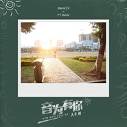

Cany Justin
============================

|  |  |
| :--: | :-- |
| [ Cany Justin](https://i.xiami.com/musiccany_real) | **播放数**: 1041904 **粉丝数**: 197 **评论数**: 3 **地区**: China 中国大陆 **风格**: 国语流行 Mandarin Pop, 标准歌曲 Standards, 流行 Pop  |

## 档案

Cany Justin（钩子），中文名：张振钧，中国男歌手，青年音乐人，混音师，新生代音乐制作人。 
毕业于深圳市光明新区高级中学现就读于广州星海音乐学院现代音乐与戏剧学院录音艺术专业。 
2014年开始写歌并学习音乐制作 
2015年开始在多个pub驻唱和弹键盘，并到唱片公司学习唱片制作。 
2015年底开始给国内多个青少年组合写歌曲小样和制作歌曲。 
2016年2月19日发行首个个人单曲「下一个寒冬」 
2016年中，考入星海音乐学院 
2016年10月开始担纲多位独立音乐人的专辑制作以及音乐顾问 
2017年3月任王俊凯私人吉他老师、创作老师 
2017年5月18日与好友合伙人、吴佳妮、BEI一同创办@覆听音乐工作室前身C.J STUDIO工作室 
2017年6月18日发行自编自导的青春音乐纪录片《音为有你》的主题曲「空 ·  弦」并担纲作词、作曲以及编曲制作

## 专辑

| 名称 | 语种 | 唱片公司 | 发行时间 | 专辑类别 | 专辑风格 |
| :--: | :-- | :-- | :-- | :-- | :-- |
| [ 半熟青春Ending Page](./albums/2104556748.md) | 国语 |  | 2019年02月05日 | 录音室专辑 | 流行 Pop, 国语流行 Mandarin Pop |
| [ 昨日青空cover 尤长靖](./albums/2103937657.md) | 国语 | 独立发行 | 2018年08月20日 | 录音室专辑 | 流行 Pop, 国语流行 Mandarin Pop |
| [ 梦想番梦想番·翻唱集](./albums/2103577063.md) | 国语 | 独立发行 | 2018年03月02日 | 录音室专辑 | 流行 Pop, 国语流行 Mandarin Pop |
| [ 放学别走](./albums/2103511173.md) | 国语 | 独立发行 | 2018年01月31日 | 录音室专辑 | 流行 Pop, 国语流行 Mandarin Pop |
| [ 天黑黑（cover）天oo](./albums/2103492877.md) | 国语 | 独立发行 | 2018年01月17日 | 录音室专辑 | 流行 Pop, 国语流行 Mandarin Pop |
| [ 空 ·  弦音乐纪录片《音为有你》插曲](./albums/2102767789.md) | 国语 | 独立发行 | 2017年06月18日 | EP, 单曲 | 流行 Pop |

## 评论

|  |  |  |  |
| :-- | :-- | :-- | :-- |
|  [虾米用户](https://emumo.xiami.com/u/286987980)  2017-06-23 22:11 赞(0) 踩(0) | 
继续加油努力！看好你！
 |
|  [虾米用户](https://emumo.xiami.com/u/245152222)  2017-06-18 20:07 赞(0) 踩(0) | 
va这个人唱歌也太好听了吧 
 |
|  [虾米用户](https://emumo.xiami.com/u/40510707) Music·Life 2017-06-18 17:05 赞(0) 踩(0) | 
我刚入驻了虾米音乐人，欢迎大家来我的个人主页，收听我的最新音乐
 |
