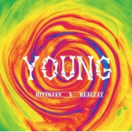
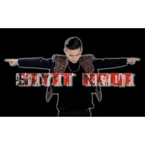

热依木江
============================

|  |  |
| :--: | :-- |
| [ 热依木江](https://i.xiami.com/riyimjan) | **地区**: China 中国大陆 **风格**: 流行 Pop, 华语唱作人 Chinese Singer-Songwriter, 出神舞曲 Trance **播放数**: 1805515 **粉丝数**: 45 **评论数**: 6  |

## 档案

热依木.哈力甫（Riyimjan-Halip），生于新疆喀什的一个音乐世家，维吾尔族人。 
2005年在首届“全国少儿歌手”新疆亚军 
2008年奥运会闭幕演出作为应邀成员出演 
2009年应邀参加第五届中南亚商品交易会开幕式中独唱《你是我的我的玫瑰花》 
2008年北京市参加五彩喀什噶尔儿童艺术团并在保利剧院演出 
2010年应邀参加第六届中南亚商品交易会开幕式中独唱《热爱》 
2011年在深圳、喀什联合举办的“深喀塔”中小学生歌咏比赛中荣获一等奖 
2012年在北京，第四届全国少数民族文艺汇演开幕式晚会《盛世中华》获“优秀演员”，给前国家领导人演出获赞赏。 
2012年被选为代表中国前往韩国的交流使者，现场献演，并与韩国，日本的小朋友们一起制作童话书 
2012年参加新疆电视台《年度诺鲁孜文艺晚会》 
2015年参加新疆达人秀节目，深受新疆人民赞赏 
2015-2016连续两届应邀参加新疆网络春晚南疆站嘉宾，并在现场献唱 
2016应邀参加新疆喀什足协杯首届“农商银行杯”，担任形象大使，并献唱主题曲 
此外，各年均参加新疆以及内地的各类晚会活动 
2017年参加湖南卫视快乐男声节目，夺得全国30强，西安赛区50强 以及三星赛区亚军，并在全国7强踢馆资格赛中成功突围 
2017受邀参加中央人民广播电台《MLD QANAL》专访录制。

## 专辑

| 名称 | 语种 | 唱片公司 | 发行时间 | 专辑类别 | 专辑风格 |
| :--: | :-- | :-- | :-- | :-- | :-- |
| [ 青春（YOUNG）( feat.Realzat )](./albums/2102908991.md) | 国语 | 独立发行 | 2017年11月06日 | 录音室专辑 | 流行 Pop, 嘻哈 Hip-Hop |
| [ Say Something](./albums/2102885456.md) | 英语 | 独立发行 | 2017年08月24日 | EP, 单曲 | 流行 Pop |
| [ SIYIT NOQI维吾尔语歌曲](./albums/2102885435.md) | 维语 | 独立发行 | 2016年05月20日 | EP, 单曲 | 世界音乐 World Music, 根源唱作人 Singer-Songwriter |
| [ 快歌合集](./albums/2102885443.md) | 国语 | 独立发行 | 2016年04月11日 | 精选集 | 电子 Electronic |
| [ 慢歌合集（国语）翻唱混集](./albums/2102885428.md) | 国语 | 独立发行 | 2016年01月20日 | 合集, 杂锦 | 流行 Pop |

## 评论

|  |  |  |
| :-- | :-- | :-- |
|  [虾米用户](https://emumo.xiami.com/u/342908523) 고봄향 2019-08-04 05:34 赞(0) 踩(0) | 
ㅡ
 |
|  [虾米用户](https://emumo.xiami.com/u/324879742)   2019-05-22 04:44 赞(0) 踩(0) | 
.
 |
|  [虾米用户](https://emumo.xiami.com/u/285036334)  2018-11-15 11:25 赞(0) 踩(0) | 
大舌头？
 |
|  [虾米用户](https://emumo.xiami.com/u/402672540)  2018-08-27 22:53 赞(1) 踩(0) | 
男神棒棒哒 
 |
|  [虾米用户](https://emumo.xiami.com/u/402672540)  2018-08-27 22:21 赞(1) 踩(0) | 
男神不仅声音好听，人也好帅哦！ 
 |
|  [虾米用户](https://emumo.xiami.com/u/332181914) 微博：RJ-Offici... 2017-10-29 15:53 赞(1) 踩(0) | 
我刚入驻了虾米音乐人，欢迎大家来我的个人主页，收听我的最新音乐
 |
