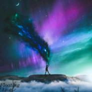
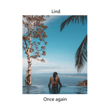
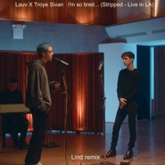
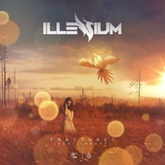
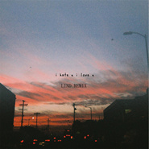

Lind
============================

|  |  |
| :--: | :-- |
| [ Lind](https://i.xiami.com/lind) | **播放数**: 15508550 **粉丝数**: 466 **评论数**: 42 **地区**: China 中国大陆 **风格**: 电子 Electronic, 热带浩室 Tropical House  |

## 档案

姓    名 ：黎展鹏 
出 生 地 ;中国 湛江（China ZhanJiang） 
出生日期： 2000-11-14 
职    业： 电子音乐制作人&DJ

## 专辑

| 名称 | 语种 | 唱片公司 | 发行时间 | 专辑类别 | 专辑风格 |
| :--: | :-- | :-- | :-- | :-- | :-- |
| [ Stargazing (Lind Remake)](./albums/5022023940.md) | 英语 | 独立发行 | 2020年11月27日 | EP, 单曲 | 热带浩室 Tropical House |
| [ Тень](./albums/5021723296.md) | 其他 | Self-Released | 2020年10月23日 | EP, 单曲 | 嘻哈 Hip-Hop |
| [ Only See Ur Face](./albums/5021457777.md) | 英语 | 看见音乐 (上海) | 2020年09月12日 | EP, 单曲 | 嘻哈 Hip-Hop |
| [ The Ocean (Lind Remix)](./albums/5021023768.md) | 英语 | 独立发行 | 2020年07月03日 | EP, 单曲 | 热带浩室 Tropical House |
| [ Floating](./albums/5020638416.md) | 英语 |  | 2020年05月21日 | EP, 单曲 | 前卫浩室 Progressive House |
| [ Knockout (Lind Remix)](./albums/2105905798.md) | 英语 | 独立发行 | 2020年02月14日 | EP, 单曲 | 热带浩室 Tropical House |
| [ Once again](./albums/2105705011.md) | 纯音乐 | 独立发行 | 2020年01月10日 | EP, 单曲 | 浩室舞曲 House |
| [ Can We Kiss Forever (Lind Remix)](./albums/2105538431.md) | 英语 |  | 2019年12月06日 | EP, 单曲 | 电子 Electronic |
| [ By my side](./albums/2105159958.md) | 纯音乐 |  | 2019年08月19日 | EP, 单曲 | 热带浩室 Tropical House |
| [ im so tired... (Stripped - Live in LA)(Lind Remix)](./albums/2104724814.md) | 英语 |  | 2019年03月29日 | EP, 单曲 | 独立流行 Indie Pop |
| [ Lucky](./albums/2104564650.md) | 纯音乐 |  | 2019年02月01日 | EP, 单曲 | 热带浩室 Tropical House |
| [ Happy](./albums/2104397344.md) | 英语 |  | 2018年12月21日 | EP, 单曲 | 热带浩室 Tropical House |
| [ Hold Me](./albums/2103705645.md) | 纯音乐 | 独立发行 | 2018年05月11日 | EP, 单曲 | 电子 Electronic |
| [ This Town (Lind Remix)](./albums/2103574337.md) | 英语 | 独立发行 | 2018年03月02日 | EP, 单曲 | 电子 Electronic |
| [ 2017 END MIX](./albums/2103499988.md) | 英语 | 独立发行 | 2018年01月26日 | 录音室专辑 | 电子 Electronic, 嘻哈 Hip-Hop |
| [ Fractures (Lind Mashup)](./albums/2103485615.md) | 英语 | 独立发行 | 2018年01月12日 | 录音室专辑 | 电子 Electronic |
| [ We Dont Talk Anymore&Fade(FairyTale Remix/Lind 3D）](./albums/2103465209.md) | 英语 | 独立发行 | 2018年01月02日 | 录音室专辑 | 欧美流行 Western Pop, 电音流行 Electropop, 电子 Electronic |
| [ Ready in to strong light for weekend(Lind Mashup)](./albums/2102866786.md) | 英语 | 独立发行 | 2017年10月10日 | 录音室专辑 | 电子 Electronic |
| [ I Hate You,i Love You [Lind Remix]](./albums/2102816024.md) | 英语 | 独立发行 | 2017年08月18日 | EP, 单曲 | 电子 Electronic |
| [ Shape Of You (Bkaye x Lind x Keiviin Remix)](./albums/2102777273.md) | 英语 | 独立发行 | 2017年07月13日 | EP, 单曲 | 电子 Electronic |
| [ Tired (3D/ Remix)](./albums/2102774400.md) | 英语 | 独立发行 | 2017年07月01日 | EP, 单曲 | 电子 Electronic |

## 评论

|  |  |  |  |
| :-- | :-- | :-- | :-- |
|  [虾米用户](https://emumo.xiami.com/u/21298110)  2020-11-20 08:42 赞(0) 踩(0) | 
加油哈！好棒！
 |
|  [虾米用户](https://emumo.xiami.com/u/316509349) 梦是不死的欲望 2020-03-21 12:45 赞(1) 踩(0) | 
喜欢
 |
|  [虾米用户](https://emumo.xiami.com/u/325374787)  2020-01-10 11:33 赞(0) 踩(0) | 
，
 |
|  [虾米用户](https://emumo.xiami.com/u/158140484)     2019-12-16 23:21 赞(0) 踩(0) | 
啊！Lind只比我大两岁，为什么这么有才华 
 |
| ⇒ |  [虾米用户](https://emumo.xiami.com/u/302298331)  2019-12-18 08:45 赞(0) 踩(0) | 
没有啦
 |
|  [虾米用户](https://emumo.xiami.com/u/14827655)  2019-12-05 04:35 赞(1) 踩(0) | 
你的remix真的有实力和灵感mixture，爱了，加油！
 |
| ⇒ |  [虾米用户](https://emumo.xiami.com/u/302298331)  2019-12-05 11:29 赞(0) 踩(0) | 
谢谢谢谢
 |
|  [虾米用户](https://emumo.xiami.com/u/283614544) Music is lif... 2019-07-01 23:34 赞(1) 踩(0) | 
哎突然发现Lind是11-24的生日 我是25号哎 
 |
| ⇒ |  [虾米用户](https://emumo.xiami.com/u/302298331)  2019-07-02 17:46 赞(0) 踩(0) | 
那么巧
 |
|  [虾米用户](https://emumo.xiami.com/u/349400287) CALL ME BY Y... 2019-06-27 20:07 赞(3) 踩(0) | 
为你打call
 |
|  [虾米用户](https://emumo.xiami.com/u/187649491) EXO 灿嫂~澎~ 2019-06-16 13:20 赞(3) 踩(0) | 
同是广东人的同龄人加油(ง •̀_•́)ง希望可以听到更多更好的作品
 |
|  [虾米用户](https://emumo.xiami.com/u/415273321) 音乐是灵魂的药 2019-03-07 17:37 赞(3) 踩(0) | 
加油
 |
|  [虾米用户](https://emumo.xiami.com/u/328437065)  2019-02-05 12:16 赞(2) 踩(0) | 
可以可以  
 |
|  [虾米用户](https://emumo.xiami.com/u/334533188) never 2018-05-22 21:45 赞(3) 踩(0) | 
建议歌曲中间切歌时用一些混音淡入一下
 |
|  [虾米用户](https://emumo.xiami.com/u/289967633) ⛓紫色灵魂⛓ 2018-04-26 20:01 赞(3) 踩(0) | 
加油(ง &amp;bull;̀_&amp;bull;́)ง，对了，记得不要只有简单的小改，而且插入的不够完美，有一些突兀，希望采纳意见，越来越好(✪▽✪)！
 |
|  [虾米用户](https://emumo.xiami.com/u/70570460) 春雨如酒，柳如烟 2018-03-12 00:34 赞(8) 踩(0) | 
好想学DJ 啊，不想只听听 ，，，羡慕，，膜拜
 |
|  [虾米用户](https://emumo.xiami.com/u/334733950)  2018-02-14 23:11 赞(2) 踩(0) | 
加油(ง &amp;bull;̀_&amp;bull;́)ง
 |
|  [虾米用户](https://emumo.xiami.com/u/142713468) 但愿我能够住在你的角膜里... 2018-01-26 11:18 赞(3) 踩(0) | 
嗯希望你可以越来越棒，然后有自己的原创歌曲作品出现 
 |
| ⇒ |  [虾米用户](https://emumo.xiami.com/u/302298331)  2018-01-26 11:23 赞(0) 踩(0) | 
谢谢谢谢，会尽快有原创的
 |
| ⇒ |  [虾米用户](https://emumo.xiami.com/u/142713468) 但愿我能够住在你的角膜里... 2018-01-26 11:24 赞(0) 踩(0) | 
<q><b>Lind说：</b></q>
 |
|  [虾米用户](https://emumo.xiami.com/u/298022288)  2018-01-21 13:50 赞(1) 踩(0) | 
歌曲还不错，加油 （第一百个收藏）
 |
|  [虾米用户](https://emumo.xiami.com/u/44226617) qnmd 2018-01-08 00:01 赞(3) 踩(0) | 
我严肃地跟你提个建议，提高制作水平，歌里很多听起来贼尴尬的切换
 |
|  [虾米用户](https://emumo.xiami.com/u/48776824) 喜极为悲、痴极如狂 2018-01-05 18:33 赞(2) 踩(0) | 
一直很喜欢We dont talk anymore这首歌，这个版本是我喜欢的，很不错呢，我不懂这些音乐什么的，只觉得前奏好听、空旷飘渺就好，谢谢你，让我有机会听到自己喜欢的感觉
 |
|  [虾米用户](https://emumo.xiami.com/u/272959673) rappers are ... 2017-12-21 10:42 赞(2) 踩(0) | 
加油！我16，你音乐做的真的很棒
 |
|  [虾米用户](https://emumo.xiami.com/u/284392045) 这家伙很聪明什么也没留下... 2017-11-23 11:55 赞(0) 踩(0) | 
为什么我上传了混音作品, 然后都入住虾米音乐人失败     
 |
| ⇒ |  [虾米用户](https://emumo.xiami.com/u/45584637)  2017-11-27 09:32 赞(0) 踩(0) | 
需要你的原创歌曲哦！混音歌曲由于辨识度较差，而且每个音乐平台都是支持原创音乐的，所以你需要又原创歌曲哦！
 |
| ⇒ |  [虾米用户](https://emumo.xiami.com/u/17144354)  2017-12-20 19:23 赞(0) 踩(0) | 
<q><b>Rabbit Head说：</b></q>
 |
|  [虾米用户](https://emumo.xiami.com/u/116662352) 等待与你再次相逢的那天 2017-09-30 23:01 赞(0) 踩(0) | 
好棒！加油
 |
|  [虾米用户](https://emumo.xiami.com/u/214417722) 天才说唱爱好者 2017-09-29 15:12 赞(1) 踩(0) | 
用什么软件？
 |
|  [虾米用户](https://emumo.xiami.com/u/20484291) q：1187496927 2017-09-12 21:29 赞(0) 踩(0) | 
大爱
 |
| ⇒ |  [虾米用户](https://emumo.xiami.com/u/302298331)  2017-09-13 06:50 赞(0) 踩(0) | 
谢谢  
 |
|  [虾米用户](https://emumo.xiami.com/u/265154265) “希望大幸运术也能让我拥... 2017-08-09 17:35 赞(0) 踩(0) | 
好棒！ 
 |
| ⇒ |  [虾米用户](https://emumo.xiami.com/u/302298331)  2017-08-09 19:22 赞(0) 踩(0) | 
谢谢
 |
| ⇒ |  [虾米用户](https://emumo.xiami.com/u/265154265) “希望大幸运术也能让我拥... 2017-08-10 09:49 赞(0) 踩(0) | 
<q><b>Lind说：</b></q>
 |
|  [虾米用户](https://emumo.xiami.com/u/185428878) wuli. ..... 2017-07-27 15:47 赞(4) 踩(0) | 
看到你的资料写着 00年的 我顿时就很方想到和你同岁的自己 你做音乐的音乐很棒 我呢。。。捂脸( &amp;acute;･&amp;omega;･)ﾉ(._.`) 加油＾０＾~
 |
| ⇒ |  [虾米用户](https://emumo.xiami.com/u/302298331)  2017-07-27 16:09 赞(0) 踩(0) | 
好的
 |
|  [虾米用户](https://emumo.xiami.com/u/253316420) From now on ... 2017-07-20 21:06 赞(0) 踩(0) | 
不错哦
 |
| ⇒ |  [虾米用户](https://emumo.xiami.com/u/302298331)  2017-07-20 22:40 赞(0) 踩(0) | 
谢谢夸奖
 |
|  [虾米用户](https://emumo.xiami.com/u/274296687)   2017-07-11 09:52 赞(0) 踩(0) | 
很喜欢你的歌
 |
| ⇒ |  [虾米用户](https://emumo.xiami.com/u/302298331)  2017-07-11 10:34 赞(0) 踩(0) | 
谢谢欣赏
 |
|  [虾米用户](https://emumo.xiami.com/u/302298331)  2017-06-29 17:57 赞(17) 踩(0) | 
我刚入驻了虾米音乐人，欢迎大家来我的个人主页，收听我的最新音乐
 |
| ⇒ |  [虾米用户](https://emumo.xiami.com/u/423562597) 不说了，千言万语说不出口... 2020-04-24 10:25 赞(0) 踩(0) | 
厉害！世界第一DJ也能搭上！
 |
