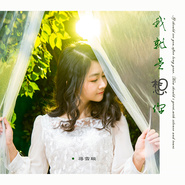

我就是想你
============================

|  |  |
| :--: | :-- |
| [ 我就是想你](https://emumo.xiami.com/album/2102974907) | **艺人**: [蒋雪璇](../index.md) **语种**: 国语 **唱片公司**: 腾研国际 **发行时间**: 2017年12月15日 **专辑类别**: EP, 单曲 **专辑风格**:  **播放数**: 440994 **收藏数**: 8 **评论数**: 0  |

## 简介

每个人的故事都那么的一样又那么不一样，好像总有千丝万缕的联系，同一件事在我们自己的角度看自己的故事和看别人的故事又有那么的不同。别人的故事里会有我们臆想的各种美好背景，而自己的故事才深刻到那么多数不清的细小的无奈。心里面惦念的不是一个人，而是一段过往，一种喜欢，一起情份，那是青春给予的，或荷尔蒙激荡的瞬间或一句揪着心的话，我想你。 

## 曲目

## 评论

|  |  |  |  |
| :-- | :-- | :-- | :-- |
