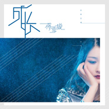

蒋雪璇
============================

|  |  |
| :--: | :-- |
| [ 蒋雪璇](https://i.xiami.com/jxxwan) | **地区**: China 中国大陆 **风格**: 民谣 Folk, 流行 Pop **播放数**: 5026493 **粉丝数**: 298 **评论数**: 16  |

## 档案

## 专辑

| 名称 | 语种 | 唱片公司 | 发行时间 | 专辑类别 | 专辑风格 |
| :--: | :-- | :-- | :-- | :-- | :-- |
| [ 我想为你唱一首诗](./albums/2105017413.md) | 国语 | 造梦嘉音乐 | 2019年07月25日 | EP, 单曲 |  |
| [ 我想做你女朋友](./albums/2104965496.md) | 国语 | 造梦嘉音乐 | 2019年06月29日 | EP, 单曲 |  |
| [ 靠近我](./albums/2104950543.md) | 国语 | 咚吧嗒文化 | 2019年06月18日 | EP, 单曲 |  |
| [ 一两三四](./albums/2104881420.md) | 国语 | 咚吧嗒文化 | 2019年05月09日 | EP, 单曲 |  |
| [ 亲爱滴](./albums/2104893755.md) | 国语 | 咚吧嗒文化 | 2019年05月09日 | EP, 单曲 |  |
| [ 还是分手吧](./albums/2104888952.md) | 国语 | 咚吧嗒文化 | 2019年05月09日 | EP, 单曲 |  |
| [ 真心物语](./albums/2104881328.md) | 国语 | 咚吧嗒文化 | 2019年05月09日 | EP, 单曲 |  |
| [ 我并不是个没有人要的姑娘](./albums/2104783550.md) | 国语 | 造梦嘉音乐 | 2019年04月17日 | EP, 单曲 | 国语流行 Mandarin Pop |
| [ 我想要见到你](./albums/2103988392.md) | 国语 | 微播视界 | 2018年09月05日 | EP, 单曲 | 国语流行 Mandarin Pop |
| [ 成长](./albums/2103949781.md) | 国语 | 鲸鱼向海 | 2018年08月28日 | EP, 单曲 | 国语流行 Mandarin Pop |
| [ 假如你有一个亿](./albums/2103826255.md) | 国语 | 独立发行 | 2018年07月18日 | EP, 单曲 | 国语流行 Mandarin Pop |
| [ 那个女孩](./albums/2103755131.md) | 国语 | 独立发行 | 2018年06月25日 | 录音室专辑 | 国语流行 Mandarin Pop |
| [ 莎啦啦 (对唱版)](./albums/2104603533.md) | 国语 | 鲸鱼向海 | 2018年05月04日 | EP, 单曲 | 国语流行 Mandarin Pop |
| [ 一天天](./albums/2103679961.md) | 国语 | 腾研国际 | 2018年04月12日 | EP, 单曲 |  |
| [ 青与春](./albums/2103663272.md) | 国语 | 腾研国际 | 2018年03月17日 | EP, 单曲 |  |
| [ 莎啦啦](./albums/2103591550.md) | 国语 | 腾研国际 | 2018年02月13日 | EP, 单曲 | 电音流行 Electropop |
| [ 莎啦啦](./albums/2103526712.md) | 国语 | 腾研国际 | 2018年02月12日 | EP, 单曲 |  |
| [ 玻璃球](./albums/2103484297.md) | 国语 | 腾研国际 | 2018年01月10日 | EP, 单曲 |  |
| [ 我就是想你](./albums/2102974907.md) | 国语 | 腾研国际 | 2017年12月15日 | EP, 单曲 |  |
| [ 月光下的秘密](./albums/2102902895.md) | 国语 | 独立发行 | 2017年11月02日 | EP, 单曲 | 国语流行 Mandarin Pop |
| [ 太小](./albums/2102878251.md) | 国语 | 腾研国际 | 2017年10月23日 | EP, 单曲 |  |

## 评论

|  |  |  |
| :-- | :-- | :-- |
|  [虾米用户](https://emumo.xiami.com/u/358104299) 悲观的唯心存在现实解构虚... 2020-03-13 09:23 赞(0) 踩(0) | 
14935
 |
|  [虾米用户](https://emumo.xiami.com/u/428258122) 沉默 2019-09-02 15:06 赞(1) 踩(0) | 

 |
|  [虾米用户](https://emumo.xiami.com/u/291320403) 伊，鹏，业。 2019-07-27 13:54 赞(1) 踩(0) | 
喜欢
 |
|  [虾米用户](https://emumo.xiami.com/u/17326351)  2019-07-27 07:49 赞(1) 踩(0) | 

 |
|  [虾米用户](https://emumo.xiami.com/u/285550137) 感谢虾米给我孤独的海外人... 2019-06-21 07:02 赞(1) 踩(0) | 
好听加油
 |
|  [虾米用户](https://emumo.xiami.com/u/325374787)  2019-06-06 12:05 赞(1) 踩(0) | 
好好
 |
|  [虾米用户](https://emumo.xiami.com/u/293692544) 你敢给我说话吗？我咬你 2019-03-03 07:41 赞(2) 踩(0) | 
好听
 |
|  [虾米用户](https://emumo.xiami.com/u/343957187) 寻欢作乐 2018-10-26 16:51 赞(2) 踩(0) | 
我爱你，深爱
 |
|  [虾米用户](https://emumo.xiami.com/u/256443549)  2018-09-19 20:33 赞(2) 踩(0) | 
我的偶像&amp;mdash;&amp;mdash;蒋雪璇
 |
|  [虾米用户](https://emumo.xiami.com/u/377737332)  2018-07-06 00:43 赞(2) 踩(0) | 
我傻，傻啦啦啦   这个吧 
 |
|  [虾米用户](https://emumo.xiami.com/u/230503713)  2018-05-19 13:18 赞(3) 踩(0) | 
喜欢莎啦啦
 |
|  [虾米用户](https://emumo.xiami.com/u/315285332)  2018-03-15 07:10 赞(4) 踩(0) | 
我喜欢你的唱腔
 |
|  [虾米用户](https://emumo.xiami.com/u/273242632)  2017-10-15 19:39 赞(13) 踩(0) | 
我刚入驻了虾米音乐人，欢迎大家来我的个人主页，收听我的最新音乐
 |
| ⇒ |  [虾米用户](https://emumo.xiami.com/u/256443549)  2018-09-19 20:35 赞(0) 踩(0) | 
我爱你❤，祝你越唱越好听！
 |
| ⇒ |  [虾米用户](https://emumo.xiami.com/u/1618831)  2019-07-27 18:32 赞(0) 踩(0) | 
丫头，你的声音好美，好听。
 |
| ⇒ |  [虾米用户](https://emumo.xiami.com/u/334479272)  2020-07-04 00:32 赞(0) 踩(0) | 
听不到你的青与春
 |
