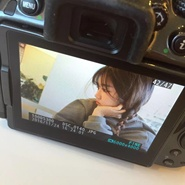

冯心怡
============================

|  |  |
| :--: | :-- |
| [ 冯心怡](https://i.xiami.com/fengxinyi) | **播放数**: 21401129 **粉丝数**: 2424 **评论数**: 146 **地区**: China 中国大陆 **风格**: 流行 Pop, 韩国流行 K-Pop, 国语流行 Mandarin Pop  |

## 档案

## 专辑

| 名称 | 语种 | 唱片公司 | 发行时间 | 专辑类别 | 专辑风格 |
| :--: | :-- | :-- | :-- | :-- | :-- |
| [ 冯心怡](./albums/5022059916.md) | 国语 | 汇悦动听 | 2020年12月01日 | EP, 单曲 | 国语流行 Mandarin Pop |
| [ 今夜风不凉](./albums/2105344460.md) | 国语 | 汇悦动听 | 2019年10月21日 | EP, 单曲 |  |
| [ 废纸](./albums/2104441526.md) | 国语 |  | 2019年01月01日 | 录音室专辑 | 流行 Pop |
| [ 陷阱](./albums/2104085041.md) | 国语 | 独立发行 | 2018年10月01日 | 录音室专辑 | 流行 Pop, 国语流行 Mandarin Pop |
| [ 往后余生](./albums/2103775413.md) | 国语 | 独立发行 | 2018年07月01日 | 录音室专辑 | 国语流行 Mandarin Pop |
| [ 纸短情长](./albums/2103683163.md) | 国语 | 独立发行 | 2018年04月01日 | 录音室专辑 | 流行 Pop |
| [ 体面](./albums/2103478711.md) | 国语 | 独立发行 | 2018年01月09日 | 录音室专辑 | 流行 Pop, 国语流行 Mandarin Pop |
| [ 一半](./albums/2103498111.md) | 国语 | 独立发行 | 2018年01月01日 | 录音室专辑 | 流行 Pop |
| [ 残酷月光](./albums/2102977876.md) | 国语 | 独立发行 | 2017年12月05日 | 录音室专辑 | 流行 Pop, 国语流行 Mandarin Pop |
| [ 老街](./albums/2102905552.md) | 国语 | 独立发行 | 2017年11月01日 | 录音室专辑 | 流行 Pop, 国语流行 Mandarin Pop |
| [ 我好像在哪见过你](./albums/2102921817.md) | 国语 | 独立发行 | 2017年11月01日 | 录音室专辑 | 流行 Pop, 国语流行 Mandarin Pop |
| [ 像风一样](./albums/2102905604.md) | 国语 | 独立发行 | 2017年11月01日 | 录音室专辑 | 流行 Pop |
| [ 残酷月光](./albums/2102905551.md) | 国语 | 独立发行 | 2017年11月01日 | 录音室专辑 | 流行 Pop, 国语流行 Mandarin Pop |
| [ 别](./albums/2102905728.md) | 国语 | 独立发行 | 2017年11月01日 | 录音室专辑 | 流行 Pop, 国语流行 Mandarin Pop |
| [ 纯粹是因为](./albums/2102853744.md) | 国语 | 独立发行 | 2017年09月21日 | 录音室专辑 | 流行 Pop, 国语流行 Mandarin Pop |
| [ 冯心怡 翻唱](./albums/2102788303.md) | 国语 | 独立发行 | 2017年07月06日 | 录音室专辑 | 流行 Pop, 国语流行 Mandarin Pop |
| [ 非酋](./albums/2102801442.md) | 国语 | 独立发行 | 2017年07月05日 | 录音室专辑 | 流行 Pop, 国语流行 Mandarin Pop |
| [ 冯心怡 翻唱Demo](./albums/2102788293.md) | 国语 | 独立发行 | 2017年07月02日 | 录音室专辑 | 流行 Pop, 国语流行 Mandarin Pop |
| [ 暧昧](./albums/2102788237.md) | 国语 | 独立发行 | 2017年07月02日 | 录音室专辑 | 流行 Pop, 国语流行 Mandarin Pop |
| [ 那些 3](./albums/2104798015.md) | 国语 | 独立发行 | 不详 | 录音室专辑 | 流行 Pop |
| [ 拿走了什么](./albums/2104301250.md) | 国语 |  | 不详 | 录音室专辑 | 流行 Pop |
| [ 忽而今夏](./albums/2105265511.md) | 国语 |  | 不详 | 录音室专辑 | 流行 Pop, 国语流行 Mandarin Pop |
| [ 那些 2](./albums/2104798009.md) | 国语 | 独立发行 | 不详 | 录音室专辑 | 流行 Pop |
| [ 那些 1](./albums/2104797840.md) | 国语 | 独立发行 | 不详 | 录音室专辑 | 流行 Pop |

## 评论

|  |  |  |  |
| :-- | :-- | :-- | :-- |
|  [虾米用户](https://emumo.xiami.com/u/68036840) 曰落，最后一束阳光润黄了... 2019-09-02 22:12 赞(0) 踩(0) | 
很喜欢她！
 |
|  [虾米用户](https://emumo.xiami.com/u/409706986)  2019-06-29 23:57 赞(0) 踩(0) | 
全网最好听 没有之一
 |
|  [虾米用户](https://emumo.xiami.com/u/164622394) bye 2019-06-29 01:37 赞(1) 踩(0) | 
歌全部下架了？
 |
|  [虾米用户](https://emumo.xiami.com/u/423975230) 别想了，那些没用。 2019-05-25 21:48 赞(1) 踩(0) | 
很棒的女生
 |
|  [虾米用户](https://emumo.xiami.com/u/403386773)  2019-04-29 12:39 赞(0) 踩(0) | 
你只是一句玩笑 我却赔上了整个青春 希望你过得比谁都好 希望我永远不知道 我与世界只差一个你 因为是你晚一点没关系 以后你快乐就好 我不凑热闹 你不要把我 当成故事讲给别人听 总不能耗尽一生 换你的一句有可能 主动太累 你我都深有体会 爱情死了 但你得活 我只顾喜欢 却忘了不合适
 |
|  [虾米用户](https://emumo.xiami.com/u/58354884) 我能欣赏到美好音乐！ 2019-04-27 17:24 赞(0) 踩(0) | 
评论了会火起来么？！ 
 |
|  [虾米用户](https://emumo.xiami.com/u/306065331) 幸福开始有人选 2019-04-23 00:37 赞(0) 踩(0) | 
好听sil~~
 |
|  [虾米用户](https://emumo.xiami.com/u/306065331) 幸福开始有人选 2019-04-06 23:02 赞(0) 踩(0) | 
棒棒哒
 |
|  [虾米用户](https://emumo.xiami.com/u/44581032) 这个家伙很聪明，什么也没... 2019-04-02 23:15 赞(1) 踩(0) | 
加油，心怡
 |
|  [虾米用户](https://emumo.xiami.com/u/410951197)  2019-03-11 18:32 赞(0) 踩(0) | 
棒棒哒！么么哒
 |
|  [虾米用户](https://emumo.xiami.com/u/85466586) 从小听了很多道理，可依旧... 2019-02-16 01:11 赞(0) 踩(0) | 
很好听，喜欢，可惜虾米大部分都下架了
 |
|  [虾米用户](https://emumo.xiami.com/u/375422342)  2019-01-22 20:42 赞(0) 踩(0) | 
咋全下架了？
 |
|  [虾米用户](https://emumo.xiami.com/u/403580951)  2019-01-17 07:27 赞(0) 踩(0) | 
支持你
 |
|  [虾米用户](https://emumo.xiami.com/u/330102909)  2019-01-16 16:17 赞(0) 踩(0) | 
原来是翻唱？我还以为原唱呢～
 |
|  [虾米用户](https://emumo.xiami.com/u/14427933)  2019-01-13 22:18 赞(0) 踩(0) | 
非常棒的演唱
 |
|  [虾米用户](https://emumo.xiami.com/u/401810405) 我是 2019-01-13 19:31 赞(0) 踩(0) | 
哇
 |
|  [虾米用户](https://emumo.xiami.com/u/222552130)  2019-01-10 17:27 赞(2) 踩(0) | 
声音太好听了叭
 |
|  [虾米用户](https://emumo.xiami.com/u/171987298)   2019-01-04 16:43 赞(0) 踩(0) | 
能唱一首薛之谦的《其实》吗很喜欢听你唱歌 很想听你的版本
 |
|  [虾米用户](https://emumo.xiami.com/u/68036840) 曰落，最后一束阳光润黄了... 2019-01-04 14:57 赞(3) 踩(0) | 
她真的很不错呢！
 |
|  [虾米用户](https://emumo.xiami.com/u/351421684)  2019-01-04 00:58 赞(0) 踩(0) | 
好聽
 |
|  [虾米用户](https://emumo.xiami.com/u/311050496)  2019-01-01 10:33 赞(1) 踩(0) | 
点个赞。 
 |
|  [虾米用户](https://emumo.xiami.com/u/411583723) 我最开心的事就是身边有你 2019-01-01 05:31 赞(0) 踩(0) | 
好嗨哦
 |
|  [虾米用户](https://emumo.xiami.com/u/10836546) 好奇心，害死猫~ 2018-12-31 15:46 赞(1) 踩(0) | 
有音乐大佬的感觉！
 |
|  [虾米用户](https://emumo.xiami.com/u/332903806)  2018-12-30 07:29 赞(0) 踩(0) | 
咦？我的留言呢
 |
|  [虾米用户](https://emumo.xiami.com/u/403279129) 没有签名的签名 2018-12-28 18:19 赞(0) 踩(0) | 
很好听  也很漂亮 加油，追求属于自己的。
 |
|  [虾米用户](https://emumo.xiami.com/u/411318075) 离开只是为了逃避殇心 2018-12-27 07:41 赞(1) 踩(0) | 
 
 |
|  [虾米用户](https://emumo.xiami.com/u/348792242) 我就是爱粘着她 2018-12-22 00:18 赞(2) 踩(0) | 
加油(ง •̀_•́)ง
 |
|  [虾米用户](https://emumo.xiami.com/u/251699395)  2018-12-20 21:41 赞(2) 踩(0) | 
生活的苦涩听见了你声音里的温暖 
 |
|  [虾米用户](https://emumo.xiami.com/u/410451245) 蝼蚁望青天丶可笑不自量 2018-12-19 16:24 赞(2) 踩(0) | 
希望，有一个专属于你的往后他可以真正陪你走过这漫长而短暂的余生。<a href="http://emumo.xiami.com/u/277369276" target="_blank" rel="nofollow" name_card="277369276">@冯心怡 </a>他真幸福。
 |
|  [虾米用户](https://emumo.xiami.com/u/410567174)  2018-12-19 14:34 赞(3) 踩(0) | 
最爱冯心怡 往后余生！独一无二！
 |
|  [虾米用户](https://emumo.xiami.com/u/404712965)  2018-12-16 10:05 赞(1) 踩(0) | 
想加好友~
 |
|  [虾米用户](https://emumo.xiami.com/u/47200982) 我还没想好要写什么... 2018-12-15 21:11 赞(2) 踩(0) | 
喜欢小姐姐的声音
 |
|  [虾米用户](https://emumo.xiami.com/u/410535113)  2018-12-14 17:16 赞(1) 踩(0) | 
音乐很好听，我的生命里不能缺少了音乐
 |
|  [虾米用户](https://emumo.xiami.com/u/357096523)  2018-12-14 00:18 赞(1) 踩(0) | 
留个微信别
 |
|  [虾米用户](https://emumo.xiami.com/u/379652774)  2018-12-13 21:23 赞(1) 踩(0) | 
同姓 
 |
|  [虾米用户](https://emumo.xiami.com/u/400834389)  2018-12-12 13:09 赞(1) 踩(0) | 
超喜欢的声音
 |
|  [虾米用户](https://emumo.xiami.com/u/245614052)  2018-12-08 22:54 赞(1) 踩(0) | 
为什么没有往后余生 找了好多地方才找到
 |
| ⇒ |  [虾米用户](https://emumo.xiami.com/u/410223910)  2018-12-09 13:14 赞(0) 踩(0) | 
有的
 |
|  [虾米用户](https://emumo.xiami.com/u/101553678) 这个人很懒哦 2018-12-06 05:41 赞(1) 踩(0) | 
喜欢你的眼睛
 |
|  [虾米用户](https://emumo.xiami.com/u/409985713)  2018-12-05 20:40 赞(1) 踩(0) | 
陶醉了！谢谢你……
 |
|  [虾米用户](https://emumo.xiami.com/u/329045548)  2018-12-05 16:44 赞(2) 踩(0) | 

 |
|  [虾米用户](https://emumo.xiami.com/u/9103905) 五月天 周杰伦 Nell... 2018-12-04 13:29 赞(1) 踩(0) | 
最喜欢你的翻唱
 |
|  [虾米用户](https://emumo.xiami.com/u/246657071)  2018-11-01 15:32 赞(0) 踩(0) | 
你最棒！
 |
|  [虾米用户](https://emumo.xiami.com/u/406904468) 我还没想好要写什么... 2018-10-26 19:38 赞(1) 踩(0) | 
   
 |
|  [虾米用户](https://emumo.xiami.com/u/18865438)   2018-10-18 16:52 赞(0) 踩(0) | 
陷阱这首歌应该写上 cover 王北车 吧，人家是原唱吧
 |
| ⇒ |  [虾米用户](https://emumo.xiami.com/u/101679460)  2018-12-01 16:43 赞(0) 踩(0) | 
写不写无所谓
 |
|  [虾米用户](https://emumo.xiami.com/u/314002226) 我还没想好要写什么... 2018-09-29 20:31 赞(1) 踩(0) | 
我也姓冯 好巧
 |
| ⇒ |  [虾米用户](https://emumo.xiami.com/u/101679460)  2018-12-01 16:43 赞(0) 踩(0) | 
冯这个姓氏很少见吗？有什么巧的？！
 |
|  [虾米用户](https://emumo.xiami.com/u/404355314)  2018-09-24 11:47 赞(0) 踩(0) | 
好听，值得收藏 
 |
|  [虾米用户](https://emumo.xiami.com/u/299586255)  2018-09-20 11:32 赞(0) 踩(0) | 
为了你的声音我下了几个播放器，终于找到了你，冯心怡
 |
|  [虾米用户](https://emumo.xiami.com/u/379811134)  2018-09-16 09:58 赞(0) 踩(0) | 
处女座的内心还是很细腻！很喜欢
 |
|  [虾米用户](https://emumo.xiami.com/u/246409483) 心的驿站 2018-09-15 11:18 赞(0) 踩(0) | 
谢谢你心怡，加油
 |
|  [虾米用户](https://emumo.xiami.com/u/401025394) 我还没想好要写什么... 2018-09-12 20:15 赞(0) 踩(0) | 
支持，唱的歌很好听，尤其是第一次听到你唱的往后余生。
 |
|  [虾米用户](https://emumo.xiami.com/u/403890841)  2018-09-11 06:20 赞(0) 踩(0) | 
为了听你唱的《往后余生》来的。
 |
|  [虾米用户](https://emumo.xiami.com/u/89110406) 我还没想好要写什么喔 2018-09-05 20:09 赞(0) 踩(0) | 
好听
 |
|  [虾米用户](https://emumo.xiami.com/u/331282635) 我还没想好要写什么... 2018-09-03 10:10 赞(0) 踩(0) | 
真好听 
 |
|  [虾米用户](https://emumo.xiami.com/u/402213680)  2018-09-01 08:23 赞(3) 踩(0) | 
好久好久没有去认真聴一首歌了，谢谢你。
 |
|  [虾米用户](https://emumo.xiami.com/u/257799206)  2018-08-28 09:21 赞(1) 踩(0) | 
心怡，这名字做什么都成功！ 让汪峰老师包装一下吧&amp;hellip;&amp;hellip;肯定红
 |
|  [虾米用户](https://emumo.xiami.com/u/284257205)  2018-08-27 17:10 赞(1) 踩(0) | 
一下午找了多个版本，只有这个姐们的调调最动人，拿捏得恰到好处，平淡自然地流露感情。
 |
|  [虾米用户](https://emumo.xiami.com/u/360089376)  2018-08-27 00:44 赞(0) 踩(0) | 
音乐平淡，平淡中走过了自己。节奏舒缓，舒缓中又遇到自己。
 |
|  [虾米用户](https://emumo.xiami.com/u/354097066)  2018-08-27 00:00 赞(1) 踩(0) | 
第一次听，就入了耳更是入了心❤好好听！
 |
|  [虾米用户](https://emumo.xiami.com/u/357388575)  2018-08-26 20:16 赞(0) 踩(0) | 
很有感觉
 |
|  [虾米用户](https://emumo.xiami.com/u/377426891)  2018-08-23 09:17 赞(0) 踩(0) | 
听着干净 
 |
|  [虾米用户](https://emumo.xiami.com/u/401867994) 变美直通车 gxsy01... 2018-08-17 20:18 赞(1) 踩(0) | 
好听啊小姐姐，边听歌边捏鼻子一个礼拜高一点爽爆
 |
|  [虾米用户](https://emumo.xiami.com/u/401836034)  2018-08-17 07:24 赞(3) 踩(0) | 
为了往后余生特意抛弃了酷狗来到了虾米，余生，请多关照！
 |
|  [虾米用户](https://emumo.xiami.com/u/335877026)  2018-08-14 09:00 赞(0) 踩(0) | 
碉堡天
 |
|  [虾米用户](https://emumo.xiami.com/u/401279165)  2018-08-13 02:35 赞(0) 踩(0) | 
很棒的感觉，动人的音调，迷醉
 |
|  [虾米用户](https://emumo.xiami.com/u/2044643) 氤氲对你的痴情。 2018-08-12 14:34 赞(0) 踩(0) | 
喜欢
 |
|  [虾米用户](https://emumo.xiami.com/u/270532329) 心情好听的才是歌，心情不... 2018-08-02 11:30 赞(1) 踩(0) | 
挺好听的，莫名的感觉
 |
|  [虾米用户](https://emumo.xiami.com/u/1091873) 最多12个字符。 2018-07-30 23:32 赞(0) 踩(0) | 
我喜欢这个声音
 |
|  [虾米用户](https://emumo.xiami.com/u/49449669) 相逢 2018-07-29 12:34 赞(0) 踩(0) | 
这首歌是不是声音压低一点更有感觉 
 |
|  [虾米用户](https://emumo.xiami.com/u/49449669) 相逢 2018-07-29 12:33 赞(2) 踩(0) | 
唱得很好 加油
 |
|  [虾米用户](https://emumo.xiami.com/u/365628813)  2018-07-28 18:22 赞(3) 踩(0) | 
你的声音很有感觉
 |
|  [虾米用户](https://emumo.xiami.com/u/343901550)  2018-07-26 19:08 赞(0) 踩(0) | 
喜欢这磁力音
 |
|  [虾米用户](https://emumo.xiami.com/u/355974403) 来自海外的90后的男孩 2018-07-26 14:18 赞(0) 踩(0) | 
什么时候发布怀念青春啊我好想听
 |
|  [虾米用户](https://emumo.xiami.com/u/39477610) 强哥 2018-07-19 19:05 赞(1) 踩(0) | 
很好听的声音，加油，做自己喜欢的音乐
 |
|  [虾米用户](https://emumo.xiami.com/u/336971723)  2018-07-18 22:10 赞(2) 踩(0) | 
我很喜欢你的声音
 |
|  [虾米用户](https://emumo.xiami.com/u/347136074)  2018-07-18 20:26 赞(2) 踩(0) | 
加油
 |
|  [虾米用户](https://emumo.xiami.com/u/376262809)  2018-07-17 20:26 赞(1) 踩(0) | 
卧槽，声音真好听小姐姐
 |
|  [虾米用户](https://emumo.xiami.com/u/378734194)  2018-07-16 09:39 赞(1) 踩(0) | 
你唱的好好听  不用谢我 
 |
|  [虾米用户](https://emumo.xiami.com/u/5404899)   2018-07-15 22:45 赞(2) 踩(0) | 
加油加油～
 |
|  [虾米用户](https://emumo.xiami.com/u/248486479) 我想和你虚度时光 2018-07-12 11:46 赞(0) 踩(0) | 
861 往后余生 我只要你
 |
|  [虾米用户](https://emumo.xiami.com/u/334086960)  2018-07-11 20:36 赞(2) 踩(0) | 
感觉老薛唱出了无助，而您唱出的是一种平淡，对感情的看淡
 |
|  [虾米用户](https://emumo.xiami.com/u/345420085)  2018-07-08 08:22 赞(0) 踩(0) | 
往后余生，我只要你
 |
|  [虾米用户](https://emumo.xiami.com/u/300040096) 我就是爱曼联 2018-07-07 22:51 赞(0) 踩(0) | 
加油额，期待出专辑。
 |
|  [虾米用户](https://emumo.xiami.com/u/320377310)   2018-06-26 18:12 赞(0) 踩(0) | 
nice
 |
|  [虾米用户](https://emumo.xiami.com/u/178918688) 随遇而安  顺其自然 2018-06-25 13:38 赞(0) 踩(0) | 
想听你的退后
 |
|  [虾米用户](https://emumo.xiami.com/u/325232407) 愿化为羽，翱于蓝天 2018-05-30 22:57 赞(0) 踩(0) | 
QQ号说来，我个朋友要您的QQ号
 |
|  [虾米用户](https://emumo.xiami.com/u/94611702) 宇宙深处不在约束，简单快... 2018-05-28 00:55 赞(0) 踩(0) | 
车载里听到好耳熟在哪里听过，结果你唱的歌都听过哈哈哈
 |
|  [虾米用户](https://emumo.xiami.com/u/310357)  2018-05-27 20:59 赞(1) 踩(0) | 
喜欢的女生开始听你的歌了只不过我在虾米听她在QQ音乐，觉得这就像我们之间的缘分...
 |
|  [虾米用户](https://emumo.xiami.com/u/305939898)  2018-04-30 18:02 赞(1) 踩(0) | 
什么时候来演唱会，请告诉我
 |
|  [虾米用户](https://emumo.xiami.com/u/85455352)  2018-04-30 14:24 赞(0) 踩(0) | 
我是633 
 |
|  [虾米用户](https://emumo.xiami.com/u/355847522)  2018-04-17 12:59 赞(0) 踩(0) | 
喜欢
 |
|  [虾米用户](https://emumo.xiami.com/u/358605644)  2018-04-16 23:16 赞(0) 踩(0) | 
非常好支持你
 |
|  [虾米用户](https://emumo.xiami.com/u/90538606)  2018-04-16 19:54 赞(0) 踩(0) | 
喜欢她
 |
|  [虾米用户](https://emumo.xiami.com/u/339102722)  2018-04-15 08:58 赞(0) 踩(0) | 
很好
 |
|  [虾米用户](https://emumo.xiami.com/u/356266461)  2018-04-14 18:10 赞(1) 踩(0) | 
我是你第521颗 
 |
|  [虾米用户](https://emumo.xiami.com/u/350006198)  2018-04-13 23:57 赞(0) 踩(0) | 
加油＾０＾~＾０＾~
 |
|  [虾米用户](https://emumo.xiami.com/u/37454254)  2018-04-12 23:50 赞(0) 踩(0) | 
真心好听， 
 |
|  [虾米用户](https://emumo.xiami.com/u/5199627) 我还没想好要写什么... 2018-03-25 19:53 赞(1) 踩(0) | 
我们同名呢 真的很喜欢你的声音 和你翻唱的歌 
 |
|  [虾米用户](https://emumo.xiami.com/u/281510144)  2018-02-22 01:22 赞(1) 踩(0) | 
网易云见你，虾米为你
 |
|  [虾米用户](https://emumo.xiami.com/u/206050580)  2018-02-20 00:11 赞(1) 踩(0) | 
声音和你的名字一样美
 |
|  [虾米用户](https://emumo.xiami.com/u/261930263) 没有冲动，就没有未来！ 2018-01-14 18:21 赞(0) 踩(0) | 
加油！好听！
 |
|  [虾米用户](https://emumo.xiami.com/u/5768938) 暂无签名~ 2018-01-10 14:12 赞(0) 踩(0) | 
我就安静听歌
 |
|  [虾米用户](https://emumo.xiami.com/u/10813248)  2018-01-06 21:30 赞(1) 踩(0) | 
有没有微博呀？
 |
|  [虾米用户](https://emumo.xiami.com/u/287775281) Star Sky 2017-12-31 21:54 赞(0) 踩(0) | 
声音喜欢 特别
 |
|  [虾米用户](https://emumo.xiami.com/u/243085057)   2017-12-28 00:37 赞(0) 踩(0) | 
不错的 加油噢
 |
|  [虾米用户](https://emumo.xiami.com/u/309894902)  2017-12-21 01:19 赞(0) 踩(0) | 

 |
|  [虾米用户](https://emumo.xiami.com/u/53624177) 天下熙熙皆為利來，天下攘... 2017-12-03 21:26 赞(0) 踩(0) | 
不错
 |
|  [虾米用户](https://emumo.xiami.com/u/205516505)  2017-12-02 15:35 赞(1) 踩(0) | 
小姐姐很棒啊 
 |
|  [虾米用户](https://emumo.xiami.com/u/311900628)  2017-12-01 18:04 赞(0) 踩(0) | 
不知道怎么点进来的，整个列表听了一下午，喜欢。
 |
|  [虾米用户](https://emumo.xiami.com/u/77894328) …… 2017-12-01 11:11 赞(0) 踩(0) | 
我说怎么云村看不到你了  在这来了啊。。。
 |
|  [虾米用户](https://emumo.xiami.com/u/266665442)  2017-11-08 17:25 赞(0) 踩(0) | 
真好
 |
|  [虾米用户](https://emumo.xiami.com/u/332526362)  2017-11-07 11:55 赞(0) 踩(0) | 

 |
|  [虾米用户](https://emumo.xiami.com/u/333374293)  2017-11-05 13:27 赞(0) 踩(0) | 
小姐姐到哪我们就到哪
 |
|  [虾米用户](https://emumo.xiami.com/u/299226307)  2017-10-30 08:21 赞(0) 踩(0) | 
加油，开场声音非常舒服 
 |
|  [虾米用户](https://emumo.xiami.com/u/331991837) Me 2017-10-29 14:17 赞(0) 踩(0) | 
婊贝我来听你的歌了
 |
|  [虾米用户](https://emumo.xiami.com/u/313611730) 好吧~_~~_~~_~~... 2017-10-18 21:54 赞(1) 踩(0) | 
为什么悄无声息呢 
 |
|  [虾米用户](https://emumo.xiami.com/u/313611730) 好吧~_~~_~~_~~... 2017-10-10 22:20 赞(2) 踩(0) | 
唱的这么好，真心比原唱好。就是不知道快手的那个是不是你。
 |
|  [虾米用户](https://emumo.xiami.com/u/305393174)  2017-10-05 19:50 赞(2) 踩(0) | 
加油
 |
|  [虾米用户](https://emumo.xiami.com/u/304035657)  2017-10-02 11:17 赞(2) 踩(0) | 
从云村过来的，因为部分歌在云村那边下架了 
 |
|  [虾米用户](https://emumo.xiami.com/u/49789930)  2017-09-25 23:27 赞(1) 踩(0) | 
好酥，就是部分气息控制不是很好
 |
|  [虾米用户](https://emumo.xiami.com/u/279900530)  2017-09-11 11:35 赞(1) 踩(0) | 
支持一下！能加好友么？
 |
|  [虾米用户](https://emumo.xiami.com/u/279900530)  2017-09-11 11:34 赞(3) 踩(0) | 
我闺女叫冯欣怡
 |
|  [虾米用户](https://emumo.xiami.com/u/324366432)  2017-09-10 16:44 赞(2) 踩(0) | 
可以的
 |
|  [虾米用户](https://emumo.xiami.com/u/324366432)  2017-09-10 16:44 赞(2) 踩(0) | 
冯心怡
 |
|  [虾米用户](https://emumo.xiami.com/u/256005842)  2017-09-06 22:02 赞(1) 踩(0) | 
音色真棒(&amp;acute;▽｀)ノ♪
 |
|  [虾米用户](https://emumo.xiami.com/u/280403575) 我还没想好要写什么... 2017-09-01 02:30 赞(2) 踩(0) | 
如果你看到这条消息的时候 一定要回复我 因为我是无意间听到声音像你结果发现你就是我曾经加过微信聊的很好的那个女孩...是哪种再一次相遇的感觉 
 |
| ⇒ |  [虾米用户](https://emumo.xiami.com/u/277369276)  2017-09-03 00:33 赞(0) 踩(0) | 
？？？
 |
| ⇒ |  [虾米用户](https://emumo.xiami.com/u/13255598)  2018-12-03 04:29 赞(0) 踩(0) | 
哈哈哈，本尊回复了，怎么没下文了？
 |
|  [虾米用户](https://emumo.xiami.com/u/267641837)  2017-08-28 21:16 赞(2) 踩(0) | 
  
 |
|  [虾米用户](https://emumo.xiami.com/u/270024183)  2017-08-20 22:11 赞(2) 踩(0) | 
哇 你好棒啊，加油加油吧 
 |
|  [虾米用户](https://emumo.xiami.com/u/308936344) 帅哥聊聊呗！ 2017-08-18 19:41 赞(2) 踩(0) | 
加油吧！↖(^&amp;omega;^)↗
 |
|  [虾米用户](https://emumo.xiami.com/u/276888458)  2017-08-14 00:20 赞(3) 踩(0) | 

 |
|  [虾米用户](https://emumo.xiami.com/u/276888458)  2017-08-14 00:19 赞(4) 踩(0) | 
你唱的很好
 |
|  [虾米用户](https://emumo.xiami.com/u/301896749) 爱是不是不开口才珍贵 2017-08-07 19:05 赞(3) 踩(0) | 
我想把你唱的末日不孤单设置为彩铃 可是10086告诉我 只有李代沫唱的 我就没换
 |
|  [虾米用户](https://emumo.xiami.com/u/301896749) 爱是不是不开口才珍贵 2017-08-07 19:04 赞(2) 踩(0) | 
很好听 你也很漂亮
 |
|  [虾米用户](https://emumo.xiami.com/u/266665442)  2017-08-05 22:40 赞(3) 踩(0) | 
挺好的
 |
|  [虾米用户](https://emumo.xiami.com/u/315548313)  2017-07-31 11:10 赞(2) 踩(0) | 
支持 
 |
|  [虾米用户](https://emumo.xiami.com/u/263960842)  2017-07-24 00:51 赞(1) 踩(0) | 
唱的很好
 |
|  [虾米用户](https://emumo.xiami.com/u/311926244)  2017-07-13 18:34 赞(1) 踩(0) | 

 |
|  [虾米用户](https://emumo.xiami.com/u/277369276)  2017-07-13 16:50 赞(23) 踩(0) | 
内容已删除
 |
| ⇒ |  [虾米用户](https://emumo.xiami.com/u/295841058)  2017-07-22 23:19 赞(0) 踩(0) | 
加油，音乐很好听，谢谢！
 |
| ⇒ |  [虾米用户](https://emumo.xiami.com/u/138516230)  2017-08-30 02:37 赞(0) 踩(0) | 
很喜欢 加油哇
 |
| ⇒ |  [虾米用户](https://emumo.xiami.com/u/305393174)  2017-10-13 00:53 赞(0) 踩(0) | 
加油
 |
| ⇒ |  [虾米用户](https://emumo.xiami.com/u/338329977)  2018-01-10 22:33 赞(0) 踩(0) | 
因为你从网易转战虾米，但是还是没有一半啊
 |
| ⇒ |  [虾米用户](https://emumo.xiami.com/u/186869723) Worth it☀️ 2018-02-03 12:37 赞(0) 踩(0) | 
声音条件很好的，灿灿支持你哦！关注！qiu～ 
 |
