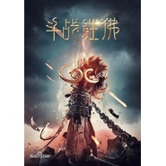

斗战胜佛致大圣归来
============================

|  |  |
| :--: | :-- |
| [ 斗战胜佛致大圣归来](https://emumo.xiami.com/album/2102801358) | **艺人**: [刘长武](../index.md) **语种**: 国语 **唱片公司**: 独立发行 **发行时间**: 2017年07月22日 **专辑类别**: EP, 单曲 **专辑风格**: 流行 Pop, 同人音乐 DouJin **播放数**: 86281 **收藏数**: 25 **评论数**: 0  |

## 简介

 有一天，山妖来劫掠童男童女，江流儿救了一个小女孩，惹得山妖追杀，他一路逃跑，跑进了五行山，盲打误撞地解除了孙悟空的封印。悟空自由之后只想回花果山，却无奈腕上封印未解，又欠江流儿人情，勉强地护送他回长安城。 

## 曲目

## 评论

