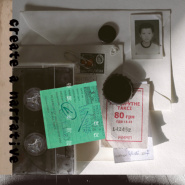

虚构一些问题
============================

|  |  |
| :--: | :-- |
| [ 虚构一些问题](https://emumo.xiami.com/album/2105209915) | **艺人**: [伏仪](../index.md) **语种**: 国语 **唱片公司**: 博生兄弟 **发行时间**: 2019年07月25日 **专辑类别**: 录音室专辑 **专辑风格**: 独立民谣 Indie Folk **播放数**: 1183928 **收藏数**: 86 **评论数**: 15  |

## 简介

《虚构一些问题》这张专辑由伏仪作曲并演唱，唐映枫作词，赵鑫编曲，候E设计。专辑的名字取自法国存在主义作家波伏娃的小说 —— 《人都是要死的》 ​；她在小说中写道，我们自己虚构了一些问题，然后又炮制了一些答案。  
  
身处于都市当中的人，每日重复的工作，社交，对于未来茫然，无论是选择秩序当中的稳定性，还是遵从理想的妥协，都会使人渐入一种类似于“弥留”的情感困境。专辑将从人对于情感生活、社会现状、内心矛盾等角度入手，以实际生活场景的构建，日常倾诉的形式，呈现现代人对于自身和都市的郁结心病。

## 曲目

## 评论

|  |  |  |
| :-- | :-- | :-- |
|  [虾米用户](https://emumo.xiami.com/u/3496718) idle space 2020-08-21 13:07 赞(0) 踩(0) | 
听了一首余生的第一天陷入进来
 |
|  [虾米用户](https://emumo.xiami.com/u/42665850)  2020-08-01 14:07 赞(0) 踩(0) | 
好听
 |
|  [虾米用户](https://emumo.xiami.com/u/164976658)   2020-07-07 22:28 赞(2) 踩(0) | 
600年，他再梦不到其他人，他已没有什么说的。
 |
|  [虾米用户](https://emumo.xiami.com/u/355469212)  2020-06-17 10:54 赞(1) 踩(0) | 
有丧有元气，真是个精彩的人。
 |
|  [虾米用户](https://emumo.xiami.com/u/289766910) 是时代的泪呢 2020-03-04 12:47 赞(0) 踩(0) | 
哇哈。
 |
|  [虾米用户](https://emumo.xiami.com/u/181119264) 永远心怀希望。 2020-02-09 21:59 赞(0) 踩(0) | 
不管如何，我喜欢它，很喜欢
 |
|  [虾米用户](https://emumo.xiami.com/u/23296123) 懒癌 2020-01-23 20:14 赞(0) 踩(0) | 
伏仪的声音和咬字都有自己的特色 很有意思
 |
|  [虾米用户](https://emumo.xiami.com/u/263625478)  2020-01-09 14:39 赞(2) 踩(0) | 
一张深情而又如梦飘渺灵动的专辑
 |
|  [虾米用户](https://emumo.xiami.com/u/307897900)  2020-01-06 10:21 赞(1) 踩(0) | 
内容正如这个专辑的名字 爱了 虽然我现在很难过，但我知道这些歌可能是药
 |
|  [虾米用户](https://emumo.xiami.com/u/112326836)  2019-12-16 20:53 赞(0) 踩(0) | 
广州站巡演来报到
 |
|  [虾米用户](https://emumo.xiami.com/u/254122247) 一只小飞侠 2019-09-06 17:24 赞(0) 踩(0) | 
好久没有下载过整专，没什么好说的，喜欢便是喜欢，耳朵喜欢，内心欣喜。整张专辑很赞，感谢歌者的分享(σﾟ∀ﾟ)σ⁶⁶⁶⁶⁶⁶⁶⁶⁶⁶
 |
|  [虾米用户](https://emumo.xiami.com/u/293603139) ??? 2019-09-05 10:05 赞(1) 踩(0) | 
如果唱的能换个方式就好了。。。编曲讲道理挺喜欢的还是，就觉得唱的这轨。。。也许是我个人喜好的问题吧
 |
|  [虾米用户](https://emumo.xiami.com/u/290243065) 荒唐的梦，醒来的人，苦涩... 2019-09-04 18:35 赞(2) 踩(0) | 
伏仪的歌很有特色，独特的音色吸引了我，他的词让我感到惊喜，现代诗词歌手？我很喜欢他的一些歌，给四星，留一星希望您还有进步空间，给我们带来更多惊喜
 |
|  [虾米用户](https://emumo.xiami.com/u/8226204) ≡ 2019-09-04 01:01 赞(0) 踩(0) | 
list
 |
|  [虾米用户](https://emumo.xiami.com/u/31531934) 恋の道に近道はない 2019-09-03 22:10 赞(0) 踩(0) | 
請大家來聆聽收藏
 |
