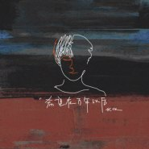

希望在万年以后
============================

|  |  |
| :--: | :-- |
| [ 希望在万年以后](https://emumo.xiami.com/album/5021863847) | **艺人**: [伏仪](../index.md) **语种**: 国语 **唱片公司**: 博生兄弟 **发行时间**: 2020年11月08日 **专辑类别**: EP, 单曲 **专辑风格**: 国语流行 Mandarin Pop **播放数**: 250882 **收藏数**: 5 **评论数**: 2  |

## 简介

伏仪全新专辑《自我之下》第二首。

 

表达了一种当下愿望。希望新生的世界，是秩序而自由的，希望在万年以后，银河的涟漪，重振爱在这个世间的美丽 。

## 曲目

## 评论

|  |  |  |  |
| :-- | :-- | :-- | :-- |
|  [虾米用户](https://emumo.xiami.com/u/71825336) 为了遇见你，我连呼吸都反... 2020-11-23 21:49 赞(0) 踩(0) | 
万年以后，尘是尘，埃是埃，再也不见吧
 |
|  [虾米用户](https://emumo.xiami.com/u/298710998) 年年有风 风吹年年 慢慢... 2020-11-11 11:16 赞(0) 踩(0) | 
喜欢伏仪的歌。歌词很触动人心，他低低地吟唱的声音，很温柔。
 |
