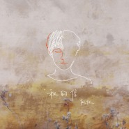
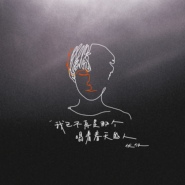

伏仪
============================

|  |  |
| :--: | :-- |
| [ 伏仪](https://i.xiami.com/fuyi) | **地区**: China 中国大陆 **风格**: 独立民谣 Indie Folk, 迷幻流行 Psychedelic Pop **播放数**: 5811114 **粉丝数**: 3346 **评论数**: 101  |

## 档案

伏仪，独立音乐人，2016年开始在虾米音乐上发行个人音乐作品，并加入枯鱼肆，与唐映枫合作发行了两张个人专辑，《硬骨见鹿集》、《虚构一些问题》。 2020年10月开始发行第三张个人专辑《自我之下》。

## 专辑

| 名称 | 语种 | 唱片公司 | 发行时间 | 专辑类别 | 专辑风格 |
| :--: | :-- | :-- | :-- | :-- | :-- |
| [ 秋的信 (dear myself)](./albums/5022121753.md) | 国语 | 博生兄弟 | 2020年12月06日 | EP, 单曲 | 国语流行 Mandarin Pop |
| [ 镜子里的人](./albums/5021996515.md) | 国语 | 博生兄弟 | 2020年11月22日 | EP, 单曲 | 国语流行 Mandarin Pop, 城市民谣 Urban Folk |
| [ 希望在万年以后](./albums/5021863847.md) | 国语 | 博生兄弟 | 2020年11月08日 | EP, 单曲 | 国语流行 Mandarin Pop |
| [ 我已不再是那个唱着春天的人](./albums/5021744143.md) | 国语 | 博生兄弟 | 2020年10月25日 | EP, 单曲 | 民谣 Folk |
| [ 虚构一些问题](./albums/2105209915.md) | 国语 | 博生兄弟 | 2019年07月25日 | 录音室专辑 | 独立民谣 Indie Folk |
| [ 我要和你在一起](./albums/2103925330.md) | 国语 | 博生兄弟 | 2018年08月17日 | EP, 单曲 |  |
| [ 硬骨见鹿集Only Beauty Shall Be Seen](./albums/2103619558.md) | 国语 | 博生兄弟 | 2018年03月16日 | 录音室专辑 | 独立民谣 Indie Folk, 民谣流行 Folk Pop |
| [ Life](./albums/2102866613.md) | 国语 | 独立发行 | 2016年04月27日 | EP, 单曲 |  |

## 评论

|  |  |  |
| :-- | :-- | :-- |
|  [虾米用户](https://emumo.xiami.com/u/8337431) 以乐会友 2021-01-10 07:01 赞(0) 踩(0) | 
20210110.92
 |
|  [虾米用户](https://emumo.xiami.com/u/362083809) 尘归尘 2020-11-12 09:19 赞(0) 踩(0) | 
我会以你想我的方式，来想你
 |
|  [虾米用户](https://emumo.xiami.com/u/40381006) 摇啊摇，摇到奈何桥 2020-11-03 02:53 赞(0) 踩(0) | 
不错，不错，继续加油
 |
|  [虾米用户](https://emumo.xiami.com/u/443172137)  2020-05-29 17:26 赞(0) 踩(0) | 
一列绿皮
 |
|  [虾米用户](https://emumo.xiami.com/u/443172137)  2020-05-28 19:21 赞(0) 踩(0) | 
加油，加油。
 |
|  [虾米用户](https://emumo.xiami.com/u/431137466) 与生俱来的欲望与执念 2020-04-27 02:06 赞(0) 踩(0) | 
来了
 |
|  [虾米用户](https://emumo.xiami.com/u/150621852) 这世界真的不算可爱 宝贝 2020-04-02 03:25 赞(0) 踩(0) | 
加油呀
 |
|  [虾米用户](https://emumo.xiami.com/u/424672282) 最美的不是风景，而是有你... 2020-03-19 22:22 赞(0) 踩(0) | 
非常喜欢你的歌，期待你更多的作品
 |
|  [虾米用户](https://emumo.xiami.com/u/241812971)  2020-02-26 14:00 赞(0) 踩(0) | 
嘻嘻
 |
|  [虾米用户](https://emumo.xiami.com/u/432254363)  2020-02-06 11:46 赞(0) 踩(0) | 
余生相~非常喜欢 
 |
|  [虾米用户](https://emumo.xiami.com/u/248620889) 淘宝给的会员。希望歌多点 2019-12-09 21:58 赞(0) 踩(0) | 
这首歌进心里了
 |
|  [虾米用户](https://emumo.xiami.com/u/378159388) 我还没想好要写什么... 2019-12-06 21:45 赞(0) 踩(0) | 
很抱歉今天才听到这首歌，瞬间粉了。
 |
|  [虾米用户](https://emumo.xiami.com/u/5773358)  2019-07-22 14:34 赞(0) 踩(0) | 
你的歌像谁的呢？
 |
|  [虾米用户](https://emumo.xiami.com/u/344018512) 我还没想好要写什么... 2019-07-03 19:52 赞(1) 踩(0) | 
D
 |
|  [虾米用户](https://emumo.xiami.com/u/3696419) 翍☉曉 2019-06-20 22:40 赞(0) 踩(0) | 
声音和郑元畅有点像，不管是声音的气质和声线，很耐听。
 |
|  [虾米用户](https://emumo.xiami.com/u/284544656)  2019-06-10 16:52 赞(1) 踩(0) | 
这个男孩子唱歌好好听啊。 这些歌的词也写得很有味道。 粉了粉了。
 |
|  [虾米用户](https://emumo.xiami.com/u/47655919) 我还没想好要写什么... 2019-06-08 20:33 赞(0) 踩(0) | 
听了好几个月还是很好听 Real
 |
|  [虾米用户](https://emumo.xiami.com/u/47655919) 我还没想好要写什么... 2019-06-08 20:33 赞(0) 踩(0) | 

 |
|  [虾米用户](https://emumo.xiami.com/u/42644986)  2019-06-04 18:43 赞(0) 踩(0) | 
歌都超好听，想去现场
 |
|  [虾米用户](https://emumo.xiami.com/u/136858038)  2019-05-11 20:25 赞(0) 踩(0) | 
看，我发现了一个宝藏男孩！  
 |
|  [虾米用户](https://emumo.xiami.com/u/199359329)  2019-04-21 17:07 赞(1) 踩(0) | 
唯一的关注，开心  
 |
|  [虾米用户](https://emumo.xiami.com/u/3696419) 翍☉曉 2019-04-12 10:28 赞(1) 踩(0) | 
雀跃的硬骨，频调很带感。
 |
|  [虾米用户](https://emumo.xiami.com/u/345594139) 我还没想好要写什么... 2019-03-22 09:31 赞(0) 踩(0) | 
让伏仪陪你穿梭宇宙
 |
|  [虾米用户](https://emumo.xiami.com/u/4906611)  2019-03-06 15:01 赞(0) 踩(0) | 
真好听啊，温暖的午后。
 |
|  [虾米用户](https://emumo.xiami.com/u/11573744) Quizas... 2019-02-02 07:29 赞(2) 踩(0) | 
小伙儿，别乱搞，前途不可限量。
 |
|  [虾米用户](https://emumo.xiami.com/u/201112168)  2019-01-19 23:41 赞(0) 踩(0) | 
感动的声音
 |
|  [虾米用户](https://emumo.xiami.com/u/9597157) ， 2019-01-19 23:37 赞(0) 踩(0) | 
今晚成都场的live气氛很好呀~ 嗓音淡而平和 歌词写得很好很有才情 加油~
 |
|  [虾米用户](https://emumo.xiami.com/u/47494497) 李志、陈升，“虾米也没有... 2019-01-11 13:18 赞(1) 踩(0) | 
有旅行团的感觉
 |
|  [虾米用户](https://emumo.xiami.com/u/202710834) 宝贝。我知道。虽然你不说... 2019-01-08 20:00 赞(0) 踩(0) | 
是我的宝贝呀
 |
|  [虾米用户](https://emumo.xiami.com/u/209853096) 旧人拨流苏 2018-12-17 10:18 赞(2) 踩(0) | 
因为一个温柔的女生
 |
|  [虾米用户](https://emumo.xiami.com/u/346586477) 我还没想好要写什么... 2018-12-14 14:36 赞(4) 踩(0) | 
唯一一个全部歌我都下载了的歌手 
 |
|  [虾米用户](https://emumo.xiami.com/u/367778980) 我还没想好要写什么... 2018-11-25 15:07 赞(2) 踩(0) | 
新大陆
 |
|  [虾米用户](https://emumo.xiami.com/u/71825336) 为了遇见你，我连呼吸都反... 2018-11-20 21:24 赞(1) 踩(0) | 
能听懂你想说的 
 |
|  [虾米用户](https://emumo.xiami.com/u/116450142) 无味 无谓 也无畏 2018-11-15 00:23 赞(2) 踩(0) | 
声音好温柔！！
 |
|  [虾米用户](https://emumo.xiami.com/u/280682655)  2018-11-08 10:17 赞(1) 踩(0) | 
好听ƪ(˘⌣˘)ʃ
 |
|  [虾米用户](https://emumo.xiami.com/u/245969445) 假装这里有个签名 2018-11-04 23:39 赞(1) 踩(0) | 
加油(ง •̀_•́)ง支持你
 |
|  [虾米用户](https://emumo.xiami.com/u/404828335)  2018-10-26 21:39 赞(1) 踩(0) | 
声音清澈❤
 |
|  [虾米用户](https://emumo.xiami.com/u/121607546) 我还没想好要写什么... 2018-09-22 14:28 赞(3) 踩(0) | 
果然就这样才最美好
 |
|  [虾米用户](https://emumo.xiami.com/u/356959421) 你是我生命的浩劫 2018-08-12 03:40 赞(4) 踩(0) | 
看看我找到了什么宝贝 
 |
|  [虾米用户](https://emumo.xiami.com/u/2422135) 逝者如斯 2018-08-10 22:32 赞(2) 踩(0) | 
词美曲妙唱腔好
 |
|  [虾米用户](https://emumo.xiami.com/u/114340730) 你是白雪茫茫的路旁。 2018-08-07 13:32 赞(1) 踩(0) | 
记昨日书 人间情诗 深情演绎 伏仪 真的很棒~
 |
|  [虾米用户](https://emumo.xiami.com/u/378236559)  2018-07-11 17:09 赞(2) 踩(0) | 
好听 
 |
|  [虾米用户](https://emumo.xiami.com/u/77662950) 人生总在期待… 2018-06-11 10:11 赞(2) 踩(0) | 
又找到一个喜欢的声音
 |
|  [虾米用户](https://emumo.xiami.com/u/339191478)   2018-06-08 10:35 赞(1) 踩(0) | 
你的名字真好听。&amp;ldquo;伏仪&amp;rdquo;
 |
|  [虾米用户](https://emumo.xiami.com/u/339191478)   2018-06-08 10:34 赞(1) 踩(0) | 
:-)
 |
| ⇒ |  [虾米用户](https://emumo.xiami.com/u/2422135) 逝者如斯 2018-08-10 22:32 赞(0) 踩(0) | 
一路开到荼蘼
 |
|  [虾米用户](https://emumo.xiami.com/u/20177386) 感谢一切美好的遇见❤️ 2018-05-26 01:36 赞(3) 踩(0) | 
声音很干净 暖暖的 舒服～
 |
|  [虾米用户](https://emumo.xiami.com/u/195925764)  2018-05-25 20:39 赞(1) 踩(0) | 
余生相 很好听 循环好几天了。谢谢。
 |
|  [虾米用户](https://emumo.xiami.com/u/322757784) zzzzz长时间嗑觉 2018-05-25 20:26 赞(1) 踩(0) | 

 |
|  [虾米用户](https://emumo.xiami.com/u/335788090)  2018-05-14 11:08 赞(3) 踩(0) | 
谢谢记昨日书 ps长得好像古川
 |
| ⇒ |  [虾米用户](https://emumo.xiami.com/u/335788090)  2018-05-14 11:08 赞(0) 踩(0) | 
古川雄辉
 |
|  [虾米用户](https://emumo.xiami.com/u/254361200) The palm tre... 2018-04-23 09:42 赞(3) 踩(0) | 
谢谢你来虾米 
 |
|  [虾米用户](https://emumo.xiami.com/u/355318000)  2018-04-15 18:51 赞(1) 踩(0) | 
很喜欢！你的歌听着很舒服  
 |
|  [虾米用户](https://emumo.xiami.com/u/348605342)  2018-04-14 14:29 赞(1) 踩(0) | 
喜欢你的曲风，声音也好听
 |
|  [虾米用户](https://emumo.xiami.com/u/304732256) 各种粉 2018-03-16 16:54 赞(3) 踩(0) | 
词写的超级用心呐
 |
|  [虾米用户](https://emumo.xiami.com/u/259165133) 人有11次生命，你可以拿... 2018-03-14 23:24 赞(1) 踩(0) | 
很阳光
 |
|  [虾米用户](https://emumo.xiami.com/u/313510032)  2018-03-09 13:00 赞(3) 踩(0) | 
刚听了一句就决定收藏
 |
|  [虾米用户](https://emumo.xiami.com/u/103149858)  2018-03-08 22:01 赞(2) 踩(0) | 
好听的歌词，歌词写得是一首诗，很棒！
 |
|  [虾米用户](https://emumo.xiami.com/u/161526488)  2018-03-03 18:38 赞(1) 踩(0) | 
伏老师
 |
|  [虾米用户](https://emumo.xiami.com/u/33575558) 一丈孤勇心外仙 2018-02-28 16:59 赞(1) 踩(0) | 
喜欢你的曲风，嗯。
 |
|  [虾米用户](https://emumo.xiami.com/u/345223834) 盼啊盼啊，春来了 2018-02-24 23:24 赞(1) 踩(0) | 
晚安，祝大家今日皆有所得。
 |
|  [虾米用户](https://emumo.xiami.com/u/342206116)  2018-02-10 16:03 赞(4) 踩(0) | 
记昨日书  词真的很好  很文艺呐
 |
|  [虾米用户](https://emumo.xiami.com/u/1364559) 这一刻，踏实的安静 2018-02-02 18:15 赞(3) 踩(0) | 
记昨日书，早晚要火，加油
 |
|  [虾米用户](https://emumo.xiami.com/u/248476445)   2018-01-25 01:42 赞(1) 踩(0) | 
专辑做好后  18年能看到你嘛
 |
|  [虾米用户](https://emumo.xiami.com/u/245954262)  2018-01-23 19:48 赞(3) 踩(0) | 
不喧宾夺主，却又引人入胜。孕吐难受，超级治愈。词曲皆美，让只听newage的我找到新的最爱。弟弟加油！
 |
|  [虾米用户](https://emumo.xiami.com/u/279963963) 嘿！原来你也在这儿～ 2018-01-12 00:15 赞(1) 踩(0) | 
有点迷人哦～
 |
|  [虾米用户](https://emumo.xiami.com/u/80691722) 一切都是最好的安排。 2018-01-09 23:35 赞(1) 踩(0) | 
 
 |
|  [虾米用户](https://emumo.xiami.com/u/43648786) 安静的知了 2018-01-09 15:59 赞(4) 踩(0) | 
声音温柔又性感。 
 |
|  [虾米用户](https://emumo.xiami.com/u/66823378)  2018-01-04 21:38 赞(2) 踩(0) | 
你是不是很喜欢朴树 ，我也是
 |
|  [虾米用户](https://emumo.xiami.com/u/66823378)  2018-01-04 21:25 赞(1) 踩(0) | 
有点帅
 |
|  [虾米用户](https://emumo.xiami.com/u/328721279)  2018-01-04 20:08 赞(2) 踩(0) | 
很好睡的歌
 |
|  [虾米用户](https://emumo.xiami.com/u/276866059)  2018-01-04 19:50 赞(1) 踩(0) | 
很喜欢你的音乐，加油~
 |
|  [虾米用户](https://emumo.xiami.com/u/22444238) 邱比官方虾米 2018-01-04 13:22 赞(4) 踩(0) | 
get
 |
|  [虾米用户](https://emumo.xiami.com/u/339279618)  2018-01-01 20:48 赞(3) 踩(0) | 
我最喜欢记昨日书
 |
|  [虾米用户](https://emumo.xiami.com/u/221519854) 好久没用虾米了•́ω•̀... 2017-12-12 23:31 赞(2) 踩(0) | 
小哥哥好听歌好看
 |
|  [虾米用户](https://emumo.xiami.com/u/263488003) 只因人在风中，聚散不由你... 2017-12-10 20:53 赞(26) 踩(0) | 
我会在每个有意义的时辰       看着你 记昨日书       在一列绿皮里       回忆人间情事      余生相中      独醒纪
 |
|  [虾米用户](https://emumo.xiami.com/u/263488003) 只因人在风中，聚散不由你... 2017-12-07 22:55 赞(1) 踩(0) | 
期待 
 |
|  [虾米用户](https://emumo.xiami.com/u/303874872)  2017-12-07 09:41 赞(2) 踩(0) | 
一定要坚持做下去
 |
|  [虾米用户](https://emumo.xiami.com/u/334957030)  2017-11-15 15:51 赞(1) 踩(0) | 
好听好听~加油呀~
 |
|  [虾米用户](https://emumo.xiami.com/u/302478104) 我还没想好要写什么... 2017-11-07 08:39 赞(2) 踩(0) | 
很好听！加油！❤️❤️❤️
 |
|  [虾米用户](https://emumo.xiami.com/u/12464012) 这个世界太疯狂 2017-10-16 11:50 赞(1) 踩(0) | 
期待第一张专辑！
 |
|  [虾米用户](https://emumo.xiami.com/u/194683340) 怎么办 青海青 人间有我... 2017-10-05 02:12 赞(1) 踩(0) | 
❤️
 |
|  [虾米用户](https://emumo.xiami.com/u/269095889) 平整土地   而非焦虑时... 2017-09-23 21:43 赞(1) 踩(0) | 
很喜欢
 |
|  [虾米用户](https://emumo.xiami.com/u/313357824) 横看迷人侧潇洒，远近高低... 2017-08-29 22:52 赞(14) 踩(0) | 
伏仪人很帅，歌也很好听  喜欢
 |
|  [虾米用户](https://emumo.xiami.com/u/7056237) 暗號不變， 江湖再見 2017-08-27 21:01 赞(1) 踩(0) | 
旋律很有味道&amp;middot;&amp;middot;&amp;middot;  听了容易感化内心&amp;middot;
 |
|  [虾米用户](https://emumo.xiami.com/u/13691875) 谁的感叹 偶然合拍 2017-08-27 10:48 赞(2) 踩(0) | 
音乐人，终于来虾米了！是不是今年能看到你了
 |
|  [虾米用户](https://emumo.xiami.com/u/321618120)   2017-08-27 00:01 赞(1) 踩(0) | 
词真好
 |
|  [虾米用户](https://emumo.xiami.com/u/263183593)  2017-08-26 21:16 赞(2) 踩(0) | 
歌好好听~
 |
|  [虾米用户](https://emumo.xiami.com/u/304128313)  2017-08-26 20:39 赞(1) 踩(0) | 
喜欢
 |
|  [虾米用户](https://emumo.xiami.com/u/313357824) 横看迷人侧潇洒，远近高低... 2017-08-26 20:17 赞(3) 踩(0) | 
-陌生人，我也为你祝福， 愿你有一个灿烂的前程， 愿你有情人终成眷属， 愿你在尘世获得幸福， 我只愿面朝大海，春暖花开。    
 |
|  [虾米用户](https://emumo.xiami.com/u/321682480) 微博：@伏仪仪 工作联系... 2017-08-26 17:08 赞(92) 踩(0) | 
我刚入驻了虾米音乐人，欢迎大家来我的个人主页，收听我的最新音乐
 |
| ⇒ |  [虾米用户](https://emumo.xiami.com/u/3057085) 虾米你好，我是来听歌的。 2017-08-26 17:38 赞(0) 踩(0) | 
您姓伏吗
 |
| ⇒ |  [虾米用户](https://emumo.xiami.com/u/337939498)  2018-01-18 10:18 赞(0) 踩(0) | 
真的很特别，真的真的
 |
| ⇒ |  [虾米用户](https://emumo.xiami.com/u/342206116)  2018-02-10 16:07 赞(0) 踩(0) | 
歌词很好  你声音很像我初恋男友   加油
 |
| ⇒ |  [虾米用户](https://emumo.xiami.com/u/148122090)  2018-04-06 09:53 赞(0) 踩(0) | 
hi 请问哪里还可以买到你的硬骨见鹿集的CD,谢谢 
 |
| ⇒ |  [虾米用户](https://emumo.xiami.com/u/32329260) 很困 2018-12-16 00:01 赞(0) 踩(0) | 
等我开工资，就买这好听的骨头都疼的歌
 |
| ⇒ |  [虾米用户](https://emumo.xiami.com/u/404672901)  2019-02-21 13:45 赞(0) 踩(0) | 
<q><b>伯爵茶说：</b></q>
 |
| ⇒ |  [虾米用户](https://emumo.xiami.com/u/49214593) 有些爱，只能止于唇齿，掩... 2019-02-22 22:09 赞(0) 踩(0) | 
发现宝藏
 |
|  [虾米用户](https://emumo.xiami.com/u/25471400) 只活一次的话才没理由随波... 2017-08-26 13:38 赞(4) 踩(0) | 
这声音加这脸 他肯定会火
 |
| ⇒ |  [虾米用户](https://emumo.xiami.com/u/38071573)  2017-09-11 09:25 赞(0) 踩(0) | 
好听的歌，一下子就爱上了，加油，多点佳作
 |
|  [虾米用户](https://emumo.xiami.com/u/87843346) 起风了,我听见整个森林的... 2017-08-26 12:58 赞(1) 踩(0) | 
笔芯
 |
