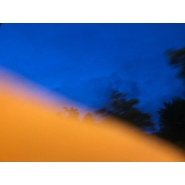
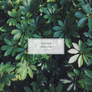

王圳一
============================

|  |  |
| :--: | :-- |
| [ 王圳一](https://i.xiami.com/doiulod) | **地区**: China 中国大陆 **风格**: 华语唱作人 Chinese Singer-Songwriter **播放数**: 2439378 **粉丝数**: 251 **评论数**: 22  |

## 档案

王圳一（Jean）

## 专辑

| 名称 | 语种 | 唱片公司 | 发行时间 | 专辑类别 | 专辑风格 |
| :--: | :-- | :-- | :-- | :-- | :-- |
| [ 晚安](./albums/2105239481.md) | 国语 |  | 2019年09月01日 | 现场专辑 | 流行 Pop |
| [ 刚入夏的日子](./albums/2103832824.md) | 国语 | 独立发行 | 2018年07月22日 | 现场专辑 | 国语流行 Mandarin Pop, 独立流行 Indie Pop |
| [ 娘子壹章](./albums/2102875301.md) | 国语 | 独立发行 | 2017年10月18日 | EP, 单曲 | 中国风 China-Wave, 国语流行 Mandarin Pop, 流行 Pop |
| [ Guitar Season III](./albums/2102823160.md) | 国语 | 独立发行 | 2017年08月30日 | 现场专辑 | 国语流行 Mandarin Pop, 轻音乐 Easy Listening |
| [ Guitar Season II](./albums/2102820002.md) | 国语 | 独立发行 | 2017年08月25日 | 现场专辑 | 独立流行 Indie Pop, 国语流行 Mandarin Pop, 轻音乐 Easy Listening |
| [ Guitar Season](./albums/2102819976.md) | 国语 | 独立发行 | 2017年08月25日 | 现场专辑 | 独立流行 Indie Pop, 国语流行 Mandarin Pop, 轻音乐 Easy Listening |
| [ 放手是错](./albums/5020871139.md) | 国语 | 独立发行 | 2007年09月20日 | EP, 单曲 | 流行 Pop |

## 评论

|  |  |  |
| :-- | :-- | :-- |
|  [虾米用户](https://emumo.xiami.com/u/212099038) 我还没想好要写什么... 2020-09-18 14:54 赞(0) 踩(0) | 
这个声音，爱了爱了
 |
|  [虾米用户](https://emumo.xiami.com/u/59690012)  2020-07-23 16:18 赞(0) 踩(0) | 
喜欢你的吉他弹唱，喜欢你温柔温暖的声音。
 |
|  [虾米用户](https://emumo.xiami.com/u/315194191) 永不丧失年轻人的热切 2020-02-20 21:42 赞(0) 踩(0) | 
好听啊
 |
|  [虾米用户](https://emumo.xiami.com/u/246787242) 我能聽到風裡有歌兒 2019-04-28 12:36 赞(0) 踩(0) | 
这把嗓音很适合雨后凉凉的天气，四月正好。
 |
|  [虾米用户](https://emumo.xiami.com/u/11724420)  2019-03-02 04:15 赞(0) 踩(0) | 
正在学吉他的我感觉发现了新大陆哦！
 |
|  [虾米用户](https://emumo.xiami.com/u/6479973)  2019-01-26 20:03 赞(0) 踩(0) | 
很好听！ 听你唱歌可以平复心情，谢谢你。
 |
|  [虾米用户](https://emumo.xiami.com/u/44819990) confused 2018-07-06 01:52 赞(0) 踩(0) | 
很棒
 |
|  [虾米用户](https://emumo.xiami.com/u/321520746)   2017-09-17 20:23 赞(0) 踩(0) | 
等新歌
 |
|  [虾米用户](https://emumo.xiami.com/u/50469650) 我还没想好要写什么... 2017-08-29 19:46 赞(2) 踩(0) | 
太好听了比心
 |
|  [虾米用户](https://emumo.xiami.com/u/322030291)   2017-08-29 10:13 赞(4) 踩(0) | 
在我被工作强奸得快要吐血的时候，你的声音把我的烦恼轻轻埋葬了
 |
|  [虾米用户](https://emumo.xiami.com/u/8313685) 情节丰富的钢琴纯音乐 2017-08-29 03:13 赞(0) 踩(0) | 
哦~~~~goose bumps, 声音真是了得。
 |
|  [虾米用户](https://emumo.xiami.com/u/322024626)   2017-08-28 16:15 赞(0) 踩(0) | 
这位先生。才华横溢
 |
|  [虾米用户](https://emumo.xiami.com/u/322027778)   2017-08-28 11:48 赞(0) 踩(0) | 
智哥       
 |
|  [虾米用户](https://emumo.xiami.com/u/322012464)   2017-08-28 11:20 赞(5) 踩(0) | 
什么时候发那些原创啊好期待啊   
 |
|  [虾米用户](https://emumo.xiami.com/u/261170045)  2017-08-26 14:35 赞(0) 踩(0) | 
我跟这个声音很熟，人虽然不认识，但应该是个好人，只有好人才配得上这个声音。
 |
|  [虾米用户](https://emumo.xiami.com/u/7470848)   2017-08-26 10:38 赞(6) 踩(0) | 
好听 每次听到别人的唱吧 我都要翻出你唱的 然后推荐给别人  
 |
|  [虾米用户](https://emumo.xiami.com/u/320209542)   2017-08-26 09:59 赞(0) 踩(0) | 
这声音太有磁性了！帅到掉渣～
 |
|  [虾米用户](https://emumo.xiami.com/u/321520746)   2017-08-25 19:57 赞(0) 踩(0) | 
无限循环 :)
 |
|  [虾米用户](https://emumo.xiami.com/u/50469650) 我还没想好要写什么... 2017-08-25 19:16 赞(0) 踩(0) | 
好喜欢的声音  
 |
|  [虾米用户](https://emumo.xiami.com/u/321058864) 我还没想好要写什么... 2017-08-23 18:25 赞(9) 踩(0) | 
我刚入驻了虾米音乐人，欢迎大家来我的个人主页，收听我的最新音乐
 |
| ⇒ |  [虾米用户](https://emumo.xiami.com/u/286062)  2018-04-20 09:15 赞(0) 踩(0) | 
有微博吗
 |
| ⇒ |  [虾米用户](https://emumo.xiami.com/u/321058864) 我还没想好要写什么... 2018-07-22 12:32 赞(0) 踩(0) | 
<q><b>sun说：</b></q>
 |
