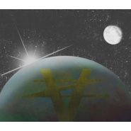
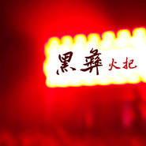

Vince Zhang
============================

|  |  |
| :--: | :-- |
| [ Vince Zhang](https://i.xiami.com/vincezhang) | **播放数**: 1475714 **粉丝数**: 88 **评论数**: 7 **地区**: China 中国大陆 **风格**: 电音流行 Electropop  |

## 档案

## 专辑

| 名称 | 语种 | 唱片公司 | 发行时间 | 专辑类别 | 专辑风格 |
| :--: | :-- | :-- | :-- | :-- | :-- |
| [ My heart my universe](./albums/5022556080.md) | 国语 |  | 2019年12月15日 | 录音室专辑 |  |
| [ MFP Lifestyle](./albums/2104840430.md) | 英语 |  | 2019年05月05日 | 精选集 | 电子 Electronic |
| [ Children's Dream](./albums/2104823473.md) | 其他 |  | 2019年04月28日 | 精选集 | 浩室舞曲 House |
| [ Be](./albums/2104760048.md) | 纯音乐 |  | 2019年04月10日 | 精选集 | 电子舞曲 EDM / Electronic Dance Music |
| [ 生活伴奏曲](./albums/2104726473.md) | 英语 |  | 2019年03月29日 | 精选集 | 爵士 Jazz, 摇摆乐 Swing, 爵士放克 Jazz Funk |
| [ chinacore](./albums/2104726472.md) | 纯音乐 |  | 2019年03月29日 | EP, 单曲 | 硬派舞曲 Hardstyle |
| [ 迷失与绝望 穿越 勇气与希望](./albums/2104650165.md) | 国语 |  | 2019年03月04日 | 精选集 | 电子 Electronic |
| [ My lifestyle](./albums/2104649085.md) | 纯音乐 |  | 2019年03月03日 | 精选集 | 出神舞曲 Trance |
| [ Oldschool](./albums/2104571718.md) | 英语 |  | 2019年02月03日 | EP, 单曲 | 迪斯科 Disco, 欧陆舞曲 Euro-Dance, 电子舞曲 EDM / Electronic Dance Music |
| [ El Mimso Sol Hardstyle Edie](./albums/2104423516.md) | 西班牙语 |  | 2018年12月28日 | EP, 单曲 | 硬核科技舞曲 Hardcore Techno, 电子舞曲 EDM / Electronic Dance Music |
| [ 艾迪二世](./albums/2104194856.md) | 英语 |  | 2018年11月09日 | EP, 单曲 | 电子舞曲 EDM / Electronic Dance Music |
| [ Don't let me go](./albums/2104040174.md) | 英语 | 独立发行 | 2018年09月19日 | EP, 单曲 | 电子舞曲 EDM / Electronic Dance Music |
| [ Florida](./albums/2103947599.md) | 英语 | 独立发行 | 2018年08月26日 | 精选集 | 电子舞曲 EDM / Electronic Dance Music |
| [ Loving one](./albums/2103924001.md) | 国语 | 独立发行 | 2018年08月14日 | 精选集 | 电子舞曲 EDM / Electronic Dance Music |
| [ VZ](./albums/2103879084.md) | 国语 | 独立发行 | 2018年07月31日 | 精选集 | 电子舞曲 EDM / Electronic Dance Music |
| [ Emotional Monster](./albums/2103751068.md) | 纯音乐 | 独立发行 | 2018年06月15日 | 精选集 | 电子 Electronic, 电子舞曲 EDM / Electronic Dance Music, 浩室舞曲 House |
| [ Street Lights](./albums/5022447699.md) | 纯音乐 |  | 2018年05月24日 | EP, 单曲 |  |
| [ If I May](./albums/2103695223.md) | 国语 | 独立发行 | 2018年04月24日 | EP, 单曲 | 电子舞曲 EDM / Electronic Dance Music |
| [ 张将军](./albums/5022457174.md) | 纯音乐 |  | 2018年04月02日 | 录音室专辑 |  |
| [ 信松哥](./albums/2103630748.md) | 国语 | 独立发行 | 2018年03月22日 | EP, 单曲 | 电子舞曲 EDM / Electronic Dance Music |
| [ 彝王](./albums/5022424912.md) | 纯音乐 |  | 2018年03月17日 | 录音室专辑 |  |
| [ That girl is my bae](./albums/5022438725.md) | 纯音乐 |  | 2018年03月07日 | 录音室专辑 |  |
| [ 龙](./albums/2103497017.md) | 国语 | 独立发行 | 2018年01月21日 | 精选集 | 电音流行 Electropop |
| [ Savior](./albums/2103471252.md) | 英语 | 独立发行 | 2018年01月06日 | EP, 单曲 | 电子 Electronic |
| [ Sorry](./albums/2102975518.md) | 国语 | 独立发行 | 2017年12月16日 | EP, 单曲 | 出神舞曲 Trance, 电子 Electronic |
| [ Universe](./albums/2102966908.md) | 英语 | 独立发行 | 2017年12月05日 | 精选集 | 氛围浩室舞曲 Ambient House |
| [ 彝](./albums/2102929169.md) | 英语 | 独立发行 | 2017年11月15日 | EP, 单曲 | 电子 Electronic, 浩室舞曲 House |
| [ Sunrise](./albums/2102851662.md) | 纯音乐 | 独立发行 | 2017年09月01日 | EP, 单曲 | 电子 Electronic |
| [ 电音指挥家](./albums/5022413902.md) | 纯音乐 |  | 2017年08月02日 | 录音室专辑 |  |
| [ Happy Birthday](./albums/5022539728.md) | 国语 |  | 2017年07月18日 | 录音室专辑 |  |
| [ 她的流苏](./albums/2102856088.md) | 国语 | 独立发行 | 2017年07月07日 | EP, 单曲 | 轻音乐 Easy Listening |
| [ 海盗爸爸](./albums/5022540667.md) | 纯音乐 |  | 2017年07月07日 | 录音室专辑 |  |
| [ 海侠](./albums/5022538629.md) | 纯音乐 |  | 2017年06月08日 | 录音室专辑 |  |
| [ Light](./albums/5022416948.md) | 纯音乐 |  | 2017年03月18日 | 录音室专辑 |  |
| [ Iridescent](./albums/2105010636.md) | 其他 |  | 不详 | 精选集 | 电子 Electronic |

## 评论

|  |  |  |  |
| :-- | :-- | :-- | :-- |
|  [虾米用户](https://emumo.xiami.com/u/3237763) 用音乐装点生活   20... 2019-09-14 12:57 赞(0) 踩(0) | 
出乎意料，赞
 |
|  [虾米用户](https://emumo.xiami.com/u/31709801) 还活着，真的是太好了..... 2019-05-19 23:51 赞(1) 踩(0) | 
看好你！
 |
|  [虾米用户](https://emumo.xiami.com/u/2947032) 我还没想好要写什么... 2019-03-23 01:01 赞(1) 踩(0) | 
中国人的电音, 不错哦! 看好你哦! 加油!
 |
|  [虾米用户](https://emumo.xiami.com/u/341662443)  2018-12-17 22:03 赞(0) 踩(0) | 
好听，有意思！
 |
|  [虾米用户](https://emumo.xiami.com/u/11909136)  2018-04-30 17:33 赞(1) 踩(0) | 
加油啊！
 |
|  [虾米用户](https://emumo.xiami.com/u/248018240) 风起云涌…… 2017-12-02 10:44 赞(2) 踩(0) | 
不错的
 |
