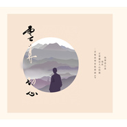

云来·初心禅心似月
============================

|  |  |
| :--: | :-- |
| [ 云来·初心禅心似月](https://emumo.xiami.com/album/2102857274) | **艺人**: [宗铄法师](../index.md) **语种**: 国语 **唱片公司**: 广州新京文音像有限公司 **发行时间**: 2017年09月25日 **专辑类别**: EP, 单曲 **专辑风格**: 佛教音乐 Buddhist Music, 世界音乐 World Music, 华语唱作人 Chinese Singer-Songwriter **播放数**: 210168 **收藏数**: 106 **评论数**: 18  |

## 简介

 
 

      记忆中，有一个声音抹之不去，那是一次是宗铄法师梵唱。声音落在满江的月光中，在寂静似铁的群山里，一树柳条被春风摆弄得那么柔软。世界在那一刻，像是睡在摇篮的婴儿！
 

       在法师梵唱里，内心闪烁过许许多多的念头，它仿佛森林中警觉的小鹿，注视、又轻巧地跳走！
 

       延着法师声线铺陈的方向，看见一种缘起，它包容着我对待人生的迷惘、自信、爱恋、离别……
 

        那一刻，细雨湿润了繁星，过去种种，犹如不待风吹而落的片片花瓣，
 

      化作一片云烟、远去
 

      化作一池莲花、绽放
 

      化作今生的温柔，深情的拥抱那一刻的我……
 

      三年后的今天，法师终于发行了他的作品。愿，闻者有缘，于听闻刹那，得观三千大千世界，不离自性！
 

 

## 曲目

## 评论

|  |  |  |  |
| :-- | :-- | :-- | :-- |
|  [虾米用户](https://emumo.xiami.com/u/372390548) 因缘所生法，我说既是空 2020-03-05 13:33 赞(0) 踩(0) | 
感动，感恩三宝
 |
|  [虾米用户](https://emumo.xiami.com/u/119883454)  2019-11-10 12:37 赞(0) 踩(0) | 
怜悯众生 一汪净湖般的柔情。美～   
 |
|  [虾米用户](https://emumo.xiami.com/u/87346556)  2019-10-15 23:32 赞(0) 踩(0) | 
期待新歌…… 
 |
|  [虾米用户](https://emumo.xiami.com/u/174021202) 发菩提心，修解脱道 2019-03-15 17:38 赞(0) 踩(0) | 
来自佛国的天籁之音
 |
|  [虾米用户](https://emumo.xiami.com/u/87346556)  2019-02-22 19:13 赞(0) 踩(0) | 
歌曲虽少，首首精品。最喜欢的则旭法师和宗铄法师的歌曲了。
 |
|  [虾米用户](https://emumo.xiami.com/u/32031632)  2018-09-08 15:34 赞(0) 踩(0) | 
南无阿弥佗佛
 |
|  [虾米用户](https://emumo.xiami.com/u/13463537)  2017-11-05 09:26 赞(2) 踩(0) | 
一张碟子三首歌简直不够听啊 
 |
|  [虾米用户](https://emumo.xiami.com/u/257109116)  2017-09-21 12:18 赞(2) 踩(0) | 
        
 |
|  [虾米用户](https://emumo.xiami.com/u/247650145) 红尘一梦，彼岸花开 2017-09-21 10:29 赞(3) 踩(0) | 
期待很久了！法师终于出了专辑！！音声佛事，同是度众生！阿弥陀佛！
 |
|  [虾米用户](https://emumo.xiami.com/u/29459110)  2017-09-18 16:59 赞(3) 踩(0) | 
师父的歌是一轮明月，我是那满天星辰；师父的歌是一缕清风，我便是那随风舞动的柳。每一次成长都有陪伴，每一个音符都缓缓的放飞我紧锁的心扉。
 |
|  [虾米用户](https://emumo.xiami.com/u/325663997)  2017-09-18 16:58 赞(3) 踩(0) | 
很好，法师唱得感人
 |
|  [虾米用户](https://emumo.xiami.com/u/250238229) 梵呗音乐唱作人 2017-09-17 23:10 赞(5) 踩(0) | 
南无本师释迦牟尼佛~
 |
|  [虾米用户](https://emumo.xiami.com/u/1339634)  2017-09-17 22:40 赞(3) 踩(0) | 
从演唱到录制都异常考究 细节入微 由内而外无不渗透出词曲创作者的用心 纷繁世界 难觅自我觉醒的空间 难寻知我交心的良友 得空听听这安抚心灵的声音 为你换来内心的平静
 |
|  [虾米用户](https://emumo.xiami.com/u/202811012) 飞鸟也有停靠的时候，做最... 2017-09-17 21:04 赞(3) 踩(0) | 
太棒啦！你好听好听
 |
|  [虾米用户](https://emumo.xiami.com/u/1323020)  2017-09-17 05:13 赞(3) 踩(0) | 
太美了！难得这样洞彻人心的佛乐！
 |
|  [虾米用户](https://emumo.xiami.com/u/325189331)  2017-09-15 21:41 赞(4) 踩(0) | 
南无阿弥陀佛&amp;hellip;&amp;hellip;感恩师父天籁之音弘法利生   
 |
|  [虾米用户](https://emumo.xiami.com/u/148610710) 世间，若有人呵护你的痛楚... 2017-09-15 19:25 赞(4) 踩(0) | 
宗铄法师，一位音乐普法的慈悲师父，永远不会忘记师父对我的教导！感恩师父   
 |
|  [虾米用户](https://emumo.xiami.com/u/7424753) 我还没想好要写什么... 2017-09-15 11:11 赞(5) 踩(0) | 
有诗意，深具情怀！
 |
