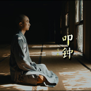

叩钟
============================

|  |  |
| :--: | :-- |
| [ 叩钟](https://emumo.xiami.com/album/2105661104) | **艺人**: [宗铄法师](../index.md) **语种**: 国语 **唱片公司**: 独立发行 **发行时间**: 2020年01月01日 **专辑类别**: EP, 单曲 **专辑风格**: 佛教音乐 Buddhist Music, 当代唱作人 Contemporary Singer-Songwriter, 自由即兴 Free Improvisation **播放数**: 9364 **收藏数**: 20 **评论数**: 7  |

## 简介

叩钟偈是佛教流传最广的一首梵呗音乐，也是我心目当中，最优美的一首梵呗。每天日初出时，以及入夜止静时，师父们都会叩钟，为这个世界祈祷。节录其中四大菩萨的一段，祈愿见闻者，平安喜乐。

## 曲目

## 评论

|  |  |  |
| :-- | :-- | :-- |
|  [虾米用户](https://emumo.xiami.com/u/7049013)  2020-04-06 00:17 赞(0) 踩(0) | 

 |
|  [虾米用户](https://emumo.xiami.com/u/431637196)  2020-03-12 11:51 赞(0) 踩(0) | 
太棒了
 |
|  [虾米用户](https://emumo.xiami.com/u/441002502)  2020-03-01 03:02 赞(0) 踩(0) | 
阿彌陀佛！願正法久住。感恩師父！
 |
|  [虾米用户](https://emumo.xiami.com/u/288086405)  2020-01-06 18:00 赞(1) 踩(0) | 
感恩法师布施清凉的梵音。清净悠扬。
 |
|  [虾米用户](https://emumo.xiami.com/u/243318405) 我还没想好要写什么... 2020-01-01 16:54 赞(0) 踩(0) | 
纯净
 |
|  [虾米用户](https://emumo.xiami.com/u/325205625)  2020-01-01 08:35 赞(4) 踩(0) | 
好
 |
| ⇒ |  [虾米用户](https://emumo.xiami.com/u/434898155)  2020-01-01 14:37 赞(0) 踩(0) | 
叩钟，刚刚看到
 |
