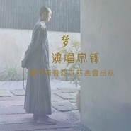

梦
============================

|  |  |
| :--: | :-- |
| [ 梦](https://emumo.xiami.com/album/5020528969) | **艺人**: [宗铄法师](../index.md) **语种**: 国语 **唱片公司**: 独立发行 **发行时间**: 2020年05月09日 **专辑类别**: EP, 单曲 **专辑风格**: 民谣 Folk, 佛教音乐 Buddhist Music **播放数**: 5056 **收藏数**: 5 **评论数**: 3  |

## 简介

汩半生哀乐之长逝兮，感亲之恩其永垂。  
——厦门南普陀寺慈善会母亲节荣誉出品

## 曲目

## 评论

|  |  |  |
| :-- | :-- | :-- |
|  [虾米用户](https://emumo.xiami.com/u/445430616) 婴儿 2020-10-25 18:15 赞(0) 踩(0) | 
梵音好似天籁之声。使人好似又回到了梦开始的时候。
 |
|  [虾米用户](https://emumo.xiami.com/u/1909821) 陪伴我喜怒哀乐的这些音符... 2020-10-21 23:15 赞(0) 踩(0) | 
无意中听到宗铄的声音，干净，情深的声音吸引了我，让我能够从世俗中安静下来。感念师父！
 |
|  [虾米用户](https://emumo.xiami.com/u/348474805) 我还没想好要写什么... 2020-06-23 07:05 赞(0) 踩(0) | 
就是喜欢，没有理由
 |
