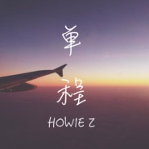

单程
============================

|  |  |
| :--: | :-- |
| [ 单程](https://emumo.xiami.com/album/2103538169) | **艺人**: [Howie Z](../index.md) **语种**: 国语 **唱片公司**: 看见文娱 **发行时间**: 2018年02月18日 **专辑类别**: EP, 单曲 **专辑风格**: 国语流行 Mandarin Pop, 华语唱作人 Chinese Singer-Songwriter, 节奏布鲁斯 R&B **播放数**: 2873020 **收藏数**: 3 **评论数**: 7  |

## 简介

1314天的留学时光  
溶进了这3分33秒  
愿未来时光  
你我都好

## 曲目

## 评论

|  |  |  |  |
| :-- | :-- | :-- | :-- |
|  [虾米用户](https://emumo.xiami.com/u/419147194) 我还没想好要写什么... 2020-10-19 13:26 赞(0) 踩(0) | 
好听加油
 |
|  [虾米用户](https://emumo.xiami.com/u/223398701)  2020-03-28 07:59 赞(0) 踩(0) | 
天空与海底，相遇都有意义
 |
|  [虾米用户](https://emumo.xiami.com/u/355807953)  2019-07-24 20:14 赞(0) 踩(0) | 
抄袭！！！！！赤裸裸的抄袭好嘛？！？
 |
|  [虾米用户](https://emumo.xiami.com/u/355807953)  2019-07-24 20:14 赞(0) 踩(0) | 
抄袭潘玮柏的《哑巴》   
 |
|  [虾米用户](https://emumo.xiami.com/u/339205406)  2019-07-08 13:52 赞(0) 踩(0) | 
很不错，加油！
 |
|  [虾米用户](https://emumo.xiami.com/u/18212862)  2019-05-27 18:08 赞(1) 踩(0) | 
好听
 |
|  [虾米用户](https://emumo.xiami.com/u/334598801)  2019-04-03 22:39 赞(0) 踩(0) | 
听前面几句，我唱出了潘玮柏的哑巴
 |
