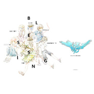

Blessing
============================

|  |  |
| :--: | :-- |
| [ Blessing](https://emumo.xiami.com/album/2102864410) | **艺人**: [苏刘](../index.md) **语种**: 日语 **唱片公司**: 独立发行 **发行时间**: 2017年05月25日 **专辑类别**: EP, 单曲 **专辑风格**: 日本流行 J-Pop, 日本动漫游戏 Japanese ACG, 同人音乐 DouJin **播放数**: 2558 **收藏数**: 1 **评论数**: 0  |

## 简介

2017.05.13中南大学异次元动漫社“孟夏未歇”晚会上我们演唱了这首歌曲，于是决定将他录下来，经过了一个暑假的录制，一路克服了很多困难录好了这首歌曲，感谢小蝶和绿茶的非常棒的后期和混音，得以让这首歌曲成为我们完美定格的美好回忆。这也是我们翻唱向外迈出的第一步!Blessing,and blessing for your everyday~!即使无法哭泣,即使无法欢笑,即使无法歌唱,即使一无所有,即使无法爱人,即使不被人爱,即使明天世界将会灭亡,前进直到最后一秒吧!!Blessing for 作为听众的每一个你们能找到如歌中一般温馨治愈的归宿~！ 

## 曲目

## 评论

|  |  |  |  |
| :-- | :-- | :-- | :-- |
