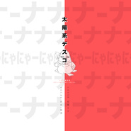

太阳系DISCO
============================

|  |  |
| :--: | :-- |
| [ 太阳系DISCO](https://emumo.xiami.com/album/2105506560) | **艺人**: [苏刘](../index.md) **语种**: 日语 **唱片公司**:  **发行时间**: 2019年12月10日 **专辑类别**: EP, 单曲 **专辑风格**: 日本流行 J-Pop, 日本动漫游戏 Japanese ACG **播放数**: 2350 **收藏数**: 0 **评论数**: 0  |

## 简介

原唱 : 初音ミク  
作词 : ナユタン星人  
作曲 : ナユタン星人  
演唱 : 苏刘SULIU,这脑洞能玩一年  
混音 : 白萝卜工作室  
曲绘 : 苏刘SULIU  
封面 : 苏刘SULIU  
视频 : 三星堆工作室  
出品 : 中南大学异次元动漫社HATO唱见组  
-

## 曲目

## 评论

|  |  |  |  |
| :-- | :-- | :-- | :-- |
