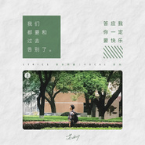

至此
============================

|  |  |
| :--: | :-- |
| [ 至此](https://emumo.xiami.com/album/2108407055) | **艺人**: [苏刘](../index.md) **语种**: 国语 **唱片公司**: 独立发行 **发行时间**: 2020年05月10日 **专辑类别**: EP, 单曲 **专辑风格**: 民谣流行 Folk Pop, 青少年流行 Teen Pop **播放数**: 330 **收藏数**: 0 **评论数**: 0  |

## 简介

原唱 : 房东的猫  
作曲 : 少年佩  
作词 : 少年佩/镜千  
演唱 : 苏刘  
混音 : 三星堆工作室  
题字 : 苏刘  
封面 : 苏刘  
出品 : 中南大学异次元动漫社HATO唱见组

## 曲目

## 评论

