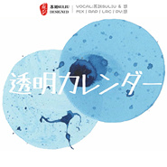
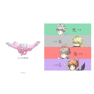

苏刘
============================

|  |  |
| :--: | :-- |
| [ 苏刘](https://i.xiami.com/suliu) | **播放数**: 6016177 **粉丝数**: 389 **评论数**: 57 **地区**: China 中国大陆 **风格**: 流行 Pop, 日本流行 J-Pop, 国语流行 Mandarin Pop, 日本动漫游戏 Japanese ACG, 同人音乐 DouJin  |

## 档案

## 专辑

| 名称 | 语种 | 唱片公司 | 发行时间 | 专辑类别 | 专辑风格 |
| :--: | :-- | :-- | :-- | :-- | :-- |
| [ 中南结献曲中南大学2020年毕业季](./albums/5020925416.md) | 国语 | 独立发行 | 2020年06月20日 | EP, 单曲 | 民谣流行 Folk Pop, 校园民谣 Campus Folk |
| [ 和我一起吧！](./albums/5020748495.md) | 国语 | 独立发行 | 2020年05月30日 | EP, 单曲 | 电子舞曲 EDM / Electronic Dance Music, 流行舞曲 Dance-Pop |
| [ 至此](./albums/2108407055.md) | 国语 | 独立发行 | 2020年05月10日 | EP, 单曲 | 民谣流行 Folk Pop, 青少年流行 Teen Pop |
| [ 2020萧清明生日贺曲](./albums/2108416027.md) | 国语 | 独立发行 | 2020年05月02日 | EP, 单曲 | 中国风 China-Wave, 古风 GuFeng Music |
| [ 献曲中南大学合并组建20周年纪念日](./albums/2108385153.md) | 国语 | 独立发行 | 2020年04月29日 | EP, 单曲 | 青少年流行 Teen Pop, 阳光流行 Sunshine Pop |
| [ 好像掉进爱情海里](./albums/2108389031.md) | 国语 | 独立发行 | 2020年04月20日 | EP, 单曲 | 青少年流行 Teen Pop, 民谣流行 Folk Pop |
| [ 琐梦](./albums/2108311041.md) | 国语 | 独立发行 | 2020年04月10日 | EP, 单曲 | 古风 GuFeng Music, 中国风 China-Wave |
| [ -ERROR](./albums/2108309035.md) | 日语 | 独立发行 | 2020年04月10日 | EP, 单曲 | 青少年流行 Teen Pop, 摇滚 Rock & Roll |
| [ summertime](./albums/2108157603.md) | 日语 | 独立发行 | 2020年03月10日 | EP, 单曲 | 青少年流行 Teen Pop, 民谣流行 Folk Pop |
| [ 青城山下白素贞](./albums/2108139123.md) | 国语 | 独立发行 | 2020年03月08日 | EP, 单曲 | 古风 GuFeng Music, 民谣流行 Folk Pop |
| [ 一起飞行，好吗](./albums/2108135038.md) | 国语 | 独立发行 | 2020年03月07日 | EP, 单曲 | 青少年流行 Teen Pop, 民谣流行 Folk Pop |
| [ 分开旅行](./albums/2106042696.md) | 国语 | 独立发行 | 2020年02月14日 | EP, 单曲 | 流行说唱 Pop Rap, 民谣流行 Folk Pop |
| [ 我最喜欢你](./albums/2106030359.md) | 国语 | 独立发行 | 2020年02月14日 | EP, 单曲 | 民谣流行 Folk Pop, 青少年流行 Teen Pop |
| [ 那家伙被好奇心杀死了](./albums/2106029510.md) | 日语 | 独立发行 | 2020年02月10日 | EP, 单曲 | 流行舞曲 Dance-Pop, 电子舞曲 EDM / Electronic Dance Music |
| [ 哔哩哔哩2020拜年祭](./albums/2105814483.md) | 国语 | 独立发行 | 2020年02月05日 | EP, 单曲 | 青少年流行 Teen Pop, 古风 GuFeng Music |
| [ 谈恋爱前不如先养猫](./albums/2105762803.md) | 国语 | 独立发行 | 2020年01月20日 | EP, 单曲 | 民谣流行 Folk Pop, 青少年流行 Teen Pop |
| [ 古德奈先生](./albums/2105707973.md) | 国语 | 独立发行 | 2020年01月10日 | 录音室专辑 | 民谣流行 Folk Pop, 青少年流行 Teen Pop |
| [ 心愿便利贴电视剧《命中注定我爱你》片尾曲](./albums/2105627039.md) | 国语 | 独立发行 | 2019年12月25日 | EP, 单曲 | 青少年流行 Teen Pop, 流行舞曲 Dance-Pop |
| [ 她真漂亮声入人心版](./albums/2105506561.md) | 国语 |  | 2019年12月20日 | EP, 单曲 | 国语流行 Mandarin Pop, 歌剧 Opera |
| [ 太阳系DISCO](./albums/2105506560.md) | 日语 |  | 2019年12月10日 | EP, 单曲 | 日本流行 J-Pop, 日本动漫游戏 Japanese ACG |
| [ 广播剧《伪装学渣》主题曲](./albums/2105452486.md) | 国语 |  | 2019年11月20日 | EP, 单曲 | 青少年流行 Teen Pop, 阳光流行 Sunshine Pop |
| [ 恋爱轻扬](./albums/2105452465.md) | 日语 |  | 2019年11月20日 | EP, 单曲 | 日本流行 J-Pop, 民谣流行 Folk Pop |
| [ Just A Kiss](./albums/2105426857.md) | 英语 |  | 2019年11月10日 | EP, 单曲 |  |
| [ 杨花落尽子规啼](./albums/2105359312.md) | 国语 |  | 2019年10月20日 | EP, 单曲 | 古风 GuFeng Music, 民谣流行 Folk Pop |
| [ Dancing Hero (Eat You Up)](./albums/2105359309.md) | 日语 |  | 2019年10月20日 | EP, 单曲 | 电子舞曲 EDM / Electronic Dance Music, 流行舞曲 Dance-Pop |
| [ 魔道祖师曦瑶同人曲（原曲 : 少年熬至老）](./albums/2105322025.md) | 国语 |  | 2019年10月10日 | EP, 单曲 | 古风 GuFeng Music, 中国风 China-Wave |
| [ 后来的我们](./albums/2105258906.md) | 国语 |  | 2019年09月20日 | 录音室专辑 | 青少年流行 Teen Pop, 民谣流行 Folk Pop |
| [ Parade](./albums/2105174328.md) | 日语 |  | 2019年09月10日 | EP, 单曲 | 日本摇滚 J-Rock |
| [ 摸摸它](./albums/2105169949.md) | 国语 |  | 2019年08月23日 | EP, 单曲 | 民谣流行 Folk Pop |
| [ 失眠飞行](./albums/2105160982.md) | 国语 |  | 2019年08月20日 | EP, 单曲 | 流行说唱 Pop Rap, 电子 Electronic |
| [ Shut Up](./albums/2105161905.md) | 英语 |  | 2019年08月20日 | EP, 单曲 | 青少年流行 Teen Pop, 放克电子 Electro (Electro-Funk) |
| [ 嘿](./albums/2105160983.md) | 国语 |  | 2019年08月20日 | EP, 单曲 | 民谣流行 Folk Pop |
| [ bad guy](./albums/2105099985.md) | 英语 |  | 2019年08月10日 | EP, 单曲 | 电子舞曲 EDM / Electronic Dance Music, 欧美流行 Western Pop |
| [ 超喜欢你](./albums/2105054880.md) | 国语 |  | 2019年08月01日 | EP, 单曲 | 民谣流行 Folk Pop |
| [ 马马嘟嘟骑](./albums/2105054731.md) | 国语 |  | 2019年08月01日 | EP, 单曲 | 民谣流行 Folk Pop |
| [ 太多](./albums/2105017568.md) | 国语 |  | 2019年07月24日 | 录音室专辑 | 民谣流行 Folk Pop |
| [ 倩音流年](./albums/2105009251.md) | 国语 |  | 2019年07月20日 | 录音室专辑 | 古风 GuFeng Music |
| [ 海风](./albums/2104979229.md) | 国语 |  | 2019年07月10日 | 录音室专辑 | 校园民谣 Campus Folk |
| [ 凭谁解我浮生梦 · 记沈复和陈芸](./albums/2104952431.md) | 国语 |  | 2019年06月20日 | EP, 单曲 | 古风 GuFeng Music |
| [ 中南后回忆未央献曲中南大学2019届毕业季](./albums/2104950209.md) | 国语 |  | 2019年06月18日 | 录音室专辑 | 青少年流行 Teen Pop, 民谣流行 Folk Pop |
| [ 与子同袍 - 影视剧《杨家将》同人曲](./albums/2104938521.md) | 国语 |  | 2019年06月10日 | EP, 单曲 | 古风 GuFeng Music |
| [ HATO唱见组2周年](./albums/2104900869.md) | 国语 |  | 2019年05月25日 | 录音室专辑 | 青少年流行 Teen Pop |
| [ 素描](./albums/2104881443.md) | 国语 |  | 2019年05月20日 | EP, 单曲 | 民谣流行 Folk Pop |
| [ 里面](./albums/2104851982.md) | 国语 |  | 2019年05月10日 | EP, 单曲 | 电子 Electronic, 民谣流行 Folk Pop |
| [ 江山行歌](./albums/2104839698.md) | 国语 |  | 2019年05月04日 | 录音室专辑 | 古风 GuFeng Music |
| [ 中南少年时 - 献曲中南大学合并组建19周年纪念日](./albums/2104819477.md) | 国语 |  | 2019年04月29日 | EP, 单曲 | 民谣流行 Folk Pop |
| [ 独居男子](./albums/2104791973.md) | 国语 |  | 2019年04月20日 | EP, 单曲 | 民谣流行 Folk Pop |
| [ 欢庆](./albums/2104815364.md) | 国语 | 联合互娱 | 2019年04月10日 | EP, 单曲 | 民谣流行 Folk Pop |
| [ PLANET](./albums/2104640505.md) | 日语 |  | 2019年02月28日 | EP, 单曲 | 青少年流行 Teen Pop |
| [ # HATO唱见组 ＆ 飞船少年404 # 元宵节快乐!](./albums/2104604274.md) | 国语 | 独立发行 | 2019年02月19日 | EP, 单曲 | 流行 Pop, 国语流行 Mandarin Pop |
| [ KISS OF DEATH（《DARLING in the FRANXX》主题曲）](./albums/2104595853.md) | 日语 |  | 2019年02月14日 | EP, 单曲 | 日本动漫游戏 Japanese ACG, 电子 Electronic |
| [ # HAPPY NEW YEAR #青柠](./albums/2104573661.md) | 国语 |  | 2019年02月04日 | EP, 单曲 | 民谣流行 Folk Pop |
| [ 黑暗审判](./albums/2104561820.md) | 国语 |  | 2019年01月31日 | EP, 单曲 | 日本动漫游戏 Japanese ACG |
| [ Connecting](./albums/2104525825.md) | 日语 |  | 2019年01月23日 | EP, 单曲 | 日本动漫游戏 Japanese ACG, 日本流行 J-Pop, 日本摇滚 J-Rock |
| [ 月明かりのDEAREST- うたの☆プリンスさまっ -](./albums/2104365973.md) | 日语 |  | 2018年12月12日 | EP, 单曲 | 日本动漫游戏 Japanese ACG |
| [ 千步锦绣行歌里《听琴图》](./albums/2104366312.md) | 国语 |  | 2018年12月12日 | EP, 单曲 | 古风 GuFeng Music |
| [ #HATO唱见组#可念不可说《太子妃升职记》主题曲](./albums/2104307338.md) | 国语 |  | 2018年12月02日 | EP, 单曲 | 古风 GuFeng Music |
| [ #飞船少年404#我不介意你慢动作](./albums/2104196681.md) | 国语 |  | 2018年11月11日 | EP, 单曲 | 青少年流行 Teen Pop, 民谣流行 Folk Pop |
| [ 透明カレンダー/透明日历](./albums/2104131771.md) | 日语 | 独立发行 | 2018年10月22日 | 录音室专辑 | 日本动漫游戏 Japanese ACG, 日本流行 J-Pop, 同人音乐 DouJin |
| [ さよなら、ミッドナイト/再见midnight](./albums/2104116121.md) | 日语 | 独立发行 | 2018年10月17日 | EP, 单曲 | 日本动漫游戏 Japanese ACG, 民谣 Folk, 日本流行 J-Pop |
| [ HATO唱见组一周年发歌企划](./albums/2103718527.md) | 国语 | 独立发行 | 2018年05月25日 | 录音室专辑 | 流行 Pop |
| [ 千秋令](./albums/2103702783.md) | 国语 | 独立发行 | 2018年05月05日 | EP, 单曲 | 国语流行 Mandarin Pop, 电子 Electronic, 古风 GuFeng Music |
| [ 林深时见鹿](./albums/2104366362.md) | 国语 |  | 2018年05月02日 | EP, 单曲 | 民谣流行 Folk Pop |
| [ 结草手游《楚留香》角色同人曲《牵机》](./albums/2103685589.md) | 国语 | 独立发行 | 2018年04月15日 | 录音室专辑 | 古风 GuFeng Music, 同人音乐 DouJin, 日本动漫游戏 Japanese ACG |
| [ 长命同归《上弦の月》填词翻唱](./albums/2103686511.md) | 国语 | 独立发行 | 2018年04月15日 | EP, 单曲 | 国语流行 Mandarin Pop, 同人音乐 DouJin, 古风 GuFeng Music |
| [ なまえのないうた/无名之歌](./albums/2103658432.md) | 日语 | 独立发行 | 2018年04月03日 | 录音室专辑 | 日本流行 J-Pop, 流行 Pop |
| [ ┗-∵-┓東京ウインターセッション/东京冬日相会](./albums/2103589087.md) | 日语 | 独立发行 | 2018年03月07日 | 录音室专辑 | 日本流行 J-Pop, 同人音乐 DouJin, 日本动漫游戏 Japanese ACG |
| [ 孤帆HATO唱见组](./albums/2102884760.md) | 国语 | 独立发行 | 2017年10月28日 | EP, 单曲 | 流行 Pop, 日本动漫游戏 Japanese ACG, 同人音乐 DouJin |
| [ 魑魅魍魉](./albums/2103492519.md) | 国语 | 独立发行 | 2017年05月25日 | 录音室专辑 | 流行 Pop, 国语流行 Mandarin Pop, 日本流行 J-Pop |
| [ 光るなら/若能绽放光芒《四月は君の嘘(四月是你的谎言)》OP1](./albums/2102874577.md) | 日语 | 独立发行 | 2017年05月25日 | EP, 单曲 | 日本流行 J-Pop, 日本动漫游戏 Japanese ACG, 流行摇滚 Pop Rock |
| [ 启程(HATO唱见组组歌)](./albums/2102864407.md) | 国语 | 独立发行 | 2017年05月25日 | EP, 单曲 | 流行 Pop, 同人音乐 DouJin, 国语流行 Mandarin Pop |
| [ Blessing](./albums/2102864410.md) | 日语 | 独立发行 | 2017年05月25日 | EP, 单曲 | 日本流行 J-Pop, 日本动漫游戏 Japanese ACG, 同人音乐 DouJin |
| [ 末日派热舞](./albums/2104457047.md) | 国语 |  | 不详 | EP, 单曲 | 电子舞曲 EDM / Electronic Dance Music |

## 评论

|  |  |  |  |
| :-- | :-- | :-- | :-- |
|  [虾米用户](https://emumo.xiami.com/u/33236905) 只想深陷水草，潦倒一生。 2020-10-25 14:37 赞(1) 踩(0) | 
好听 我很喜欢带着好听鼻音的声音 加油
 |
|  [虾米用户](https://emumo.xiami.com/u/427960607)  2020-07-05 08:44 赞(1) 踩(0) | 
支持苏刘大大
 |
|  [虾米用户](https://emumo.xiami.com/u/258780018)  2020-05-07 20:54 赞(2) 踩(0) | 
98级中南校友来看看
 |
|  [虾米用户](https://emumo.xiami.com/u/422123758)  2020-04-22 12:30 赞(2) 踩(0) | 
从撒野这首歌来的，去年陪我度过了毕业最难熬的那段时间。谢谢。
 |
|  [虾米用户](https://emumo.xiami.com/u/51423885) 华晨宇 2020-03-27 15:19 赞(1) 踩(0) | 
好听
 |
|  [虾米用户](https://emumo.xiami.com/u/244688408) 雜食性物種 2020-03-05 22:14 赞(2) 踩(0) | 
这嗓音真的太强了——！！！早点！！
 |
|  [虾米用户](https://emumo.xiami.com/u/411803326)  2020-02-08 08:11 赞(2) 踩(0) | 
好听
 |
|  [虾米用户](https://emumo.xiami.com/u/346263836) 早月像极了轻吻的痕 2020-02-04 16:28 赞(2) 踩(0) | 
         好听
 |
|  [虾米用户](https://emumo.xiami.com/u/4486462) 不和听垃圾的人做朋友。 2020-01-27 15:18 赞(2) 踩(0) | 
是什么性感男子？
 |
|  [虾米用户](https://emumo.xiami.com/u/420926110)  2019-12-17 08:30 赞(2) 踩(0) | 
好听
 |
| ⇒ |  [虾米用户](https://emumo.xiami.com/u/326259428) 中南大学第三届“中南好声... 2019-12-20 04:57 赞(0) 踩(0) | 
谢谢 
 |
| ⇒ |  [虾米用户](https://emumo.xiami.com/u/430737285)  2019-12-23 13:11 赞(0) 踩(0) | 
<q><b>苏刘说：</b></q>
 |
| ⇒ |  [虾米用户](https://emumo.xiami.com/u/347774080) 曲情词路，欲引何处༄༄༄ 2020-04-18 13:29 赞(0) 踩(0) | 
<q><b>苏刘说：</b></q>
 |
|  [虾米用户](https://emumo.xiami.com/u/301468192)  2019-12-11 14:22 赞(2) 踩(0) | 
翻唱的不错
 |
|  [虾米用户](https://emumo.xiami.com/u/327715717)  2019-12-06 12:00 赞(2) 踩(0) | 
你好，想用一下翻唱的badguy做视频BGM，可以用吗
 |
| ⇒ |  [虾米用户](https://emumo.xiami.com/u/326259428) 中南大学第三届“中南好声... 2019-12-09 11:27 赞(0) 踩(0) | 
可以的，请注明出处哦
 |
|  [虾米用户](https://emumo.xiami.com/u/374639603) 谢谢虾米音乐 2019-04-30 00:53 赞(6) 踩(0) | 
好喜欢你的撒野 
 |
|  [虾米用户](https://emumo.xiami.com/u/403983935)  2019-04-28 13:19 赞(2) 踩(0) | 
为什么你唱的盜将行听不了了，好遗憾啊，
 |
| ⇒ |  [虾米用户](https://emumo.xiami.com/u/326259428) 中南大学第三届“中南好声... 2019-04-29 13:43 赞(0) 踩(0) | 
版权问题！
 |
|  [虾米用户](https://emumo.xiami.com/u/327242691) 有时候一转身便是一辈子 2019-04-27 13:26 赞(1) 踩(0) | 
从中南毕业十几年了，恍惚就在前几天
 |
|  [虾米用户](https://emumo.xiami.com/u/311874519) 素质不由年龄决定 2019-04-21 11:08 赞(2) 踩(0) | 
支持！！！支持
 |
|  [虾米用户](https://emumo.xiami.com/u/286704094) 全世界最好的EXO 2019-03-30 20:14 赞(1) 踩(0) | 
从云村过来的，加油加油
 |
|  [虾米用户](https://emumo.xiami.com/u/299527075)  2019-02-21 20:46 赞(1) 踩(0) | 
超爱！！
 |
|  [虾米用户](https://emumo.xiami.com/u/356520544)  2019-02-08 17:09 赞(2) 踩(0) | 
我觉得唱得很好，但是也要尊重巫哲大大，作词要改一下
 |
| ⇒ |  [虾米用户](https://emumo.xiami.com/u/326259428) 中南大学第三届“中南好声... 2019-02-08 18:25 赞(0) 踩(0) | 
虾米的bug，我传歌的时候都是自己做的动态歌词，发布后就不显示了，现在是网友上传的歌词版本
 |
| ⇒ |  [虾米用户](https://emumo.xiami.com/u/356520544)  2019-02-09 16:57 赞(0) 踩(0) | 
<q><b>苏刘说：</b></q>
 |
|  [虾米用户](https://emumo.xiami.com/u/330990808) ❤️ 2019-01-31 16:55 赞(0) 踩(0) | 
小声bb:其实受一点挺好的♥
 |
|  [虾米用户](https://emumo.xiami.com/u/330990808) ❤️ 2019-01-31 16:54 赞(0) 踩(0) | 
好听好听！支持大大！声音超级攻哒（啊呸 ）
 |
|  [虾米用户](https://emumo.xiami.com/u/205492781) 过春风十里，尽荞麦青青 2019-01-21 20:42 赞(3) 踩(0) | 
看了《撒野》，最喜欢听你的《撒野》！
 |
|  [虾米用户](https://emumo.xiami.com/u/142798876)  2019-01-11 01:39 赞(1) 踩(0) | 
有意思，关注你们了！
 |
|  [虾米用户](https://emumo.xiami.com/u/52056952) 人生即是到來、相遇、陪伴... 2019-01-06 20:46 赞(2) 踩(0) | 
♪(^∇^*)加油~
 |
|  [虾米用户](https://emumo.xiami.com/u/364662391)  2018-12-26 00:35 赞(0) 踩(0) | 
可以出个盗将行的MV吗？我元旦用 
 |
| ⇒ |  [虾米用户](https://emumo.xiami.com/u/326259428) 中南大学第三届“中南好声... 2018-12-26 01:02 赞(0) 踩(0) | 
哈哈哈哈哈盗将行没有mv   
 |
| ⇒ |  [虾米用户](https://emumo.xiami.com/u/364662391)  2018-12-26 23:02 赞(0) 踩(0) | 
我把你的歌点到了元旦上，我来唱哈哈哈哈 
 |
|  [虾米用户](https://emumo.xiami.com/u/258284695) 他结婚的时候 新郎会不会... 2018-11-11 12:48 赞(2) 踩(0) | 
加油
 |
|  [虾米用户](https://emumo.xiami.com/u/213229710) (☆´≧∀≦)σ ⌒.*... 2018-10-14 21:43 赞(2) 踩(0) | 
 
 |
|  [虾米用户](https://emumo.xiami.com/u/357081297)  2018-10-06 10:43 赞(1) 踩(0) | 
好好听，小苏苏唱的不错  
 |
|  [虾米用户](https://emumo.xiami.com/u/353659803) 好喜欢你，都快要变成你了... 2018-08-25 03:49 赞(2) 踩(0) | 
苏苏，加油
 |
|  [虾米用户](https://emumo.xiami.com/u/379746359)  2018-08-02 17:37 赞(3) 踩(0) | 
醉
 |
|  [虾米用户](https://emumo.xiami.com/u/271699041)  2018-06-14 21:00 赞(2) 踩(0) | 
好听(๑&amp;ordm;ั╰╯&amp;ordm;ั๑)
 |
| ⇒ |  [虾米用户](https://emumo.xiami.com/u/326259428) 中南大学第三届“中南好声... 2018-06-14 23:11 赞(0) 踩(0) | 
谢谢你的支持喔~
 |
|  [虾米用户](https://emumo.xiami.com/u/49245085) 余生皆假期 2018-05-28 20:59 赞(4) 踩(0) | 
小哥哥声音这么好听评论这么少不科学！！！
 |
|  [虾米用户](https://emumo.xiami.com/u/33720753) 在日 2018-05-10 13:52 赞(2) 踩(0) | 
コンプリケイションのラップむずいよね
 |
| ⇒ |  [虾米用户](https://emumo.xiami.com/u/326259428) 中南大学第三届“中南好声... 2018-05-10 14:24 赞(0) 踩(0) | 
そうですねえ
 |
|  [虾米用户](https://emumo.xiami.com/u/323698753)  2018-04-13 20:36 赞(3) 踩(0) | 
加油哦  
 |
| ⇒ |  [虾米用户](https://emumo.xiami.com/u/326259428) 中南大学第三届“中南好声... 2018-04-14 13:48 赞(0) 踩(0) | 
阿里嘎多w
 |
|  [虾米用户](https://emumo.xiami.com/u/280169514)  2018-03-18 13:25 赞(0) 踩(0) | 
加油
 |
| ⇒ |  [虾米用户](https://emumo.xiami.com/u/326259428) 中南大学第三届“中南好声... 2018-03-19 07:39 赞(0) 踩(0) | 
谢谢！一定会加油的！
 |
| ⇒ |  [虾米用户](https://emumo.xiami.com/u/280169514)  2018-03-20 22:46 赞(0) 踩(0) | 
<q><b>苏刘说：</b></q>
 |
| ⇒ |  [虾米用户](https://emumo.xiami.com/u/280169514)  2018-03-20 22:47 赞(0) 踩(0) | 
<q><b>小疯子说：</b></q>
 |
| ⇒ |  [虾米用户](https://emumo.xiami.com/u/326259428) 中南大学第三届“中南好声... 2018-03-20 23:48 赞(0) 踩(0) | 
<q><b>小疯子说：</b></q>
 |
| ⇒ |  [虾米用户](https://emumo.xiami.com/u/280169514)  2018-03-21 22:57 赞(0) 踩(0) | 
<q><b>苏刘说：</b></q>
 |
|  [虾米用户](https://emumo.xiami.com/u/283433966) 。。。 2018-03-07 19:39 赞(1) 踩(0) | 
加油~
 |
| ⇒ |  [虾米用户](https://emumo.xiami.com/u/326259428) 中南大学第三届“中南好声... 2018-03-07 22:47 赞(0) 踩(0) | 
谢谢！我会的！
 |
|  [虾米用户](https://emumo.xiami.com/u/229619635)  2017-11-22 22:37 赞(1) 踩(0) | 
赞赞赞 
 |
|  [虾米用户](https://emumo.xiami.com/u/322459016) 没人想听我的故事…… 2017-11-10 19:56 赞(1) 踩(0) | 

 |
|  [虾米用户](https://emumo.xiami.com/u/326259428) 中南大学第三届“中南好声... 2017-09-25 19:10 赞(18) 踩(0) | 
我刚入驻了虾米音乐人，欢迎大家来我的个人主页，收听我的最新音乐
 |
