Rwind Top Shelf NCS
============================

|  |  |
| :--: | :-- |
| [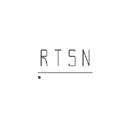 Rwind Top Shelf NCS](https://i.xiami.com/rwindremixncs) | **播放数**: 6062847 **粉丝数**: 894 **评论数**: 39 **地区**: United States of America 美国 **风格**: 另类舞曲 Alternative Dance, 电子 Electronic  |

## 档案

Rwind Top Shelf NCS,简称   RTSN无版权音乐厂牌

## 专辑

| 名称 | 语种 | 唱片公司 | 发行时间 | 专辑类别 | 专辑风格 |
| :--: | :-- | :-- | :-- | :-- | :-- |
| [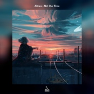 Not Our Time](./albums/5021650498.md) | 英语 | 独立发行 | 2020年10月11日 | EP, 单曲 | 电子舞曲 EDM / Electronic Dance Music, 蒙巴顿舞曲 Moombahton, 蒸汽波 Vaporwave |
| [ Walk Away](./albums/5021658672.md) | 国语 | 独立发行 | 2020年10月11日 | EP, 单曲 | 电子舞曲 EDM / Electronic Dance Music |
| [ I Wanna Love](./albums/5021645484.md) | 纯音乐 | 独立发行 | 2020年10月11日 | EP, 单曲 | 电子舞曲 EDM / Electronic Dance Music |
| [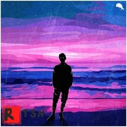 Luv Letter](./albums/5021329801.md) | 纯音乐 | 独立发行 | 2020年08月21日 | EP, 单曲 | 合成器流行 Synthpop, 弛放 Chillout, 后回响重拍 Brostep |
| [ Alan Walker-End of Time(REMIX)](./albums/5021307962.md) | 纯音乐 | 独立发行 | 2020年08月18日 | 原声带, 影视音乐 | 陷阱舞曲 Trap, 大节拍 Big Beat, 炸房浩室 Big Room House |
| [ Rain](./albums/5021175454.md) | 纯音乐 | 独立发行 | 2020年07月28日 | EP, 单曲 | 电子舞曲 EDM / Electronic Dance Music |
| [ On My Own](./albums/5021048805.md) | 纯音乐 | 独立发行 | 2020年07月07日 | EP, 单曲 | 电子舞曲 EDM / Electronic Dance Music, 传统流行 Traditional Pop |
| [ Blossom(feat. 初音未来)](./albums/5021050531.md) | 纯音乐 | 独立发行 | 2020年07月05日 | EP, 单曲 | 电子舞曲 EDM / Electronic Dance Music, 未来浩室 Future House, 缓拍 Downtempo |
| [ Get Me Outta Here](./albums/5020935089.md) | 纯音乐 | 独立发行 | 2020年06月20日 | EP, 单曲 | 电子舞曲 EDM / Electronic Dance Music |
| [ Heading Home(Remix)](./albums/5020705011.md) | 纯音乐 | 独立发行 | 2020年05月24日 | EP, 单曲 | 电子舞曲 EDM / Electronic Dance Music |
| [ Sad Sometimes(Remix)](./albums/2108399031.md) | 纯音乐 | 独立发行 | 2020年05月03日 | EP, 单曲 | 浩室舞曲 House |
| [ On My Way(Remix)](./albums/2108420029.md) | 纯音乐 | 独立发行 | 2020年05月03日 | EP, 单曲 | 未来贝斯 Future Bass, 回响贝斯 Dubstep |
| [ Love Me Like You Do(Mix）](./albums/2108399032.md) | 英语 | 独立发行 | 2020年05月03日 | EP, 单曲 | 流行 Pop |
| [ Stronger (feat. Chelsea Paige)](./albums/2108405025.md) | 英语 | 独立发行 | 2020年05月01日 | EP, 单曲 | 电子舞曲 EDM / Electronic Dance Music |
| [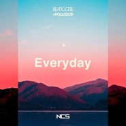 Everyday(小清新女声）](./albums/2108401011.md) | 英语 | 独立发行 | 2020年05月01日 | EP, 单曲 | 电子舞曲 EDM / Electronic Dance Music |
| [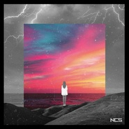 Heavenly (feat. Romi)](./albums/2108403026.md) | 英语 | 独立发行 | 2020年05月01日 | EP, 单曲 | 电子舞曲 EDM / Electronic Dance Music |
| [ Astronomia(remix)](./albums/2108417012.md) | 纯音乐 | 独立发行 | 2020年04月30日 | EP, 单曲 | 电子舞曲 EDM / Electronic Dance Music |
| [ DJSnake-Made in China( Remix)](./albums/2108384136.md) | 纯音乐 | 独立发行 | 2020年04月27日 | EP, 单曲 | 流行说唱 Pop Rap |
| [ All Falls Down(Remix)](./albums/2108265718.md) | 英语 | 独立发行 | 2020年03月31日 | EP, 单曲 | 电子 Electronic |
| [ Fades](./albums/2108276574.md) | 纯音乐 | 独立发行 | 2020年03月31日 | EP, 单曲 | 电子 Electronic |
| [ Run（Inspired By Alan Walker)](./albums/2420358100.md) | 纯音乐 | 独立发行 | 2020年03月03日 | EP, 单曲 | 电子 Electronic |
| [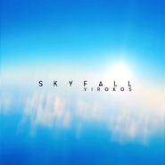 Skyfall](./albums/2420357084.md) | 纯音乐 | 独立发行 | 2020年03月03日 | EP, 单曲 | 电子 Electronic |
| [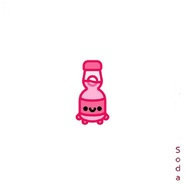 Soda](./albums/2420364047.md) | 纯音乐 | 独立发行 | 2020年03月03日 | EP, 单曲 | 未来贝斯 Future Bass |
| [ On My Way(Remix)](./albums/2420315667.md) | 英语 | 独立发行 | 2020年02月29日 | EP, 单曲 | 电子 Electronic |
| [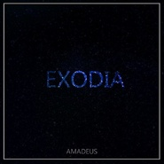 Exodia](./albums/2106065091.md) | 纯音乐 | 独立发行 | 2020年02月18日 | EP, 单曲 | 合成器流行 Synthpop |
| [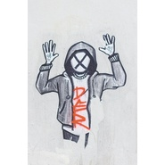 Heaven（Inspired By K-391)](./albums/2105698248.md) | 纯音乐 | 独立发行 | 2020年01月08日 | EP, 单曲 | 合成器流行 Synthpop, 英国车库舞曲 UK Garage, 神游舞曲 Trip Hop |
| [ Wanderlust](./albums/2105463056.md) | 纯音乐 |  | 2019年11月21日 | EP, 单曲 | 未来贝斯 Future Bass, 浩室舞曲 House |
| [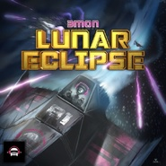 Lunar Eclipse](./albums/2105463347.md) | 纯音乐 |  | 2019年11月21日 | EP, 单曲 | 浩室舞曲 House |
| [ Dominance](./albums/2105452201.md) | 国语 |  | 2019年11月19日 | EP, 单曲 |  |
| [ Infinity 2019](./albums/2105151394.md) | 英语 |  | 2019年08月12日 | EP, 单曲 | 合成器流行 Synthpop |
| [ Pure Light](./albums/2105151392.md) | 英语 |  | 2019年08月12日 | EP, 单曲 | 合成器流行 Synthpop, 陷阱舞曲 Trap, 蒙巴顿舞曲 Moombahton |
| [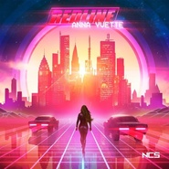 Red Line](./albums/2105041937.md) | 英语 |  | 2019年07月29日 | EP, 单曲 | 浩室舞曲 House, 氛围音乐 Ambient |
| [ Revolution](./albums/2104998901.md) | 纯音乐 |  | 2019年07月16日 | EP, 单曲 | 未来贝斯 Future Bass, 电子舞曲 EDM / Electronic Dance Music, 电子 Electronic |
| [ Nothing To Lose (JW Remix)](./albums/2104965217.md) | 英语 |  | 2019年06月27日 | EP, 单曲 | 智能舞曲 IDM, 浩室舞曲 House, 鼓打贝斯 Drum & Bass |
| [ The One](./albums/2104936375.md) | 英语 |  | 2019年06月09日 | EP, 单曲 | 脉冲流行 Glitch Hop, 电子舞曲 EDM / Electronic Dance Music, 复合电气 Complextro |
| [ Messy（Shadowkey Remix）](./albums/2104780987.md) | 英语 |  | 2019年04月16日 | EP, 单曲 | 电音流行 Electropop, 氛围流行 Ambient Pop, 梦幻流行 Dream Pop |
| [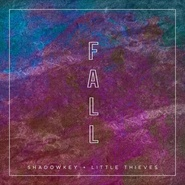 Shadowkey & Little Thieves](./albums/2104692322.md) | 英语 |  | 2019年03月21日 | EP, 单曲 | 浩室舞曲 House, 未来贝斯 Future Bass, 电气浩室 Electro House |
| [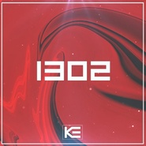 1302](./albums/2104668164.md) | 纯音乐 |  | 2019年03月13日 | EP, 单曲 | 浩室舞曲 House, 蒸汽波 Vaporwave |
| [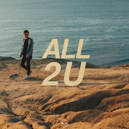 ALL 2 U](./albums/2104604723.md) | 英语 | 独立发行 | 2019年02月19日 | EP, 单曲 | 浩室舞曲 House, 电子舞曲 EDM / Electronic Dance Music, 电子 Electronic |
| [ Yours Tonight（Official version）](./albums/2104595802.md) | 英语 | 独立发行 | 2019年02月14日 | EP, 单曲 | 欧美流行 Western Pop, 电音流行 Electropop, 电子舞曲 EDM / Electronic Dance Music |
| [ Shadowkey & Airmow[feat. Chelsea Paige]](./albums/2103707848.md) | 英语 | 独立发行 | 2018年05月14日 | EP, 单曲 | 电子 Electronic, 电子舞曲 EDM / Electronic Dance Music |
| [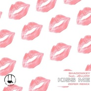 (Zeper Remix)](./albums/2103707851.md) | 英语 | 独立发行 | 2018年05月14日 | EP, 单曲 | 电子 Electronic, 电子舞曲 EDM / Electronic Dance Music, 深浩室舞曲 Deep House |
| [ Zalenn & Shadowkey(Ft. Chelsea Paige & Ebby)](./albums/2103707850.md) | 纯音乐 | 独立发行 | 2018年05月14日 | EP, 单曲 | 电子 Electronic, 电子舞曲 EDM / Electronic Dance Music, 未来贝斯 Future Bass |
| [ Superior](./albums/2103688396.md) | 纯音乐 | 独立发行 | 2018年04月17日 | EP, 单曲 | 电子 Electronic, 电子舞曲 EDM / Electronic Dance Music, 浩室舞曲 House |
| [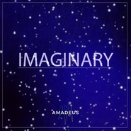 Amadeus](./albums/2103542603.md) | 纯音乐 | 独立发行 | 2018年02月20日 | EP, 单曲 | 电子 Electronic, 电子舞曲 EDM / Electronic Dance Music |
| [ SHADOWKEY](./albums/2103498966.md) | 英语 | 独立发行 | 2018年01月23日 | EP, 单曲 | 另类舞曲 Alternative Dance, 深浩室舞曲 Deep House, 电子 Electronic |
| [ Sk-Hall inspired_by_Alan_Walker](./albums/2102955371.md) | 纯音乐 | 独立发行 | 2017年11月22日 | 精选集 | 电子 Electronic, 鼓打贝斯 Drum & Bass, 未来车库舞曲 Future Garage |
| [ Different Heaven](./albums/2102879743.md) | 纯音乐 | 独立发行 | 2017年10月25日 | EP, 单曲 | 电子 Electronic, 酸性浩室舞曲 Acid House, 氛围浩室舞曲 Ambient House |
| [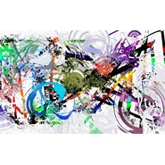 DJ Nike.M](./albums/2102867746.md) | 纯音乐 | 独立发行 | 2017年10月04日 | EP, 单曲 | 电子 Electronic |
| [ 3mon](./albums/2102867740.md) | 其他 | 独立发行 | 2017年10月04日 | EP, 单曲 | 电子 Electronic |
| [ Naron](./albums/2102867743.md) | 英语 | 独立发行 | 2017年10月01日 | EP, 单曲 | 电子 Electronic |
| [ Tonyz](./albums/2102867741.md) | 其他 | 独立发行 | 2017年10月01日 | EP, 单曲 | 电子 Electronic |
| [ SHADOWKEY & RUBIKA](./albums/2102867762.md) | 英语 | 独立发行 | 2017年10月01日 | EP, 单曲 | 电子 Electronic |
| [ AC](./albums/2102867759.md) | 英语 | 独立发行 | 2017年10月01日 | EP, 单曲 | 电子 Electronic |
| [ M5H](./albums/2102867761.md) | 纯音乐 | 独立发行 | 2017年10月01日 | EP, 单曲 | 电子 Electronic |
| [ Naron【Inspired By Alan Walker】](./albums/2102867747.md) | 纯音乐 | 独立发行 | 2017年10月01日 | EP, 单曲 | 电子 Electronic |
| [ Amadeus](./albums/2102867744.md) | 纯音乐 | 独立发行 | 2017年10月01日 | EP, 单曲 | 电子 Electronic |
| [ Konrad Mil](./albums/2102867752.md) | 纯音乐 | 独立发行 | 2017年10月01日 | EP, 单曲 | 电子 Electronic |
| [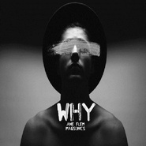 MagSonics](./albums/2102867750.md) | 英语 | 独立发行 | 2017年10月01日 | EP, 单曲 | 电子 Electronic |
| [ Kalle](./albums/2102867758.md) | 纯音乐 | 独立发行 | 2017年10月01日 | EP, 单曲 | 电子 Electronic |

## 评论

|  |  |  |  |
| :-- | :-- | :-- | :-- |
|  [虾米用户](https://emumo.xiami.com/u/440728986)  2020-11-29 19:48 赞(1) 踩(0) | 
wtf what a heck
 |
|  [虾米用户](https://emumo.xiami.com/u/440728986)  2020-11-29 19:47 赞(0) 踩(0) | 
veryyyyyyyyy good!!!!!!! oh my Gosh
 |
|  [虾米用户](https://emumo.xiami.com/u/377146899) Anti-TikTok ... 2020-11-13 21:43 赞(2) 踩(0) | 
Go f yourself and stop steeling songs from NCS and other music producers you better delete this or make these songs free or next day your mom is gonna explode with blood spreading inside your mom's house everywhere do you understand b***h?
 |
|  [虾米用户](https://emumo.xiami.com/u/442841922) 孤 2020-05-17 12:58 赞(1) 踩(0) | 
emmmmm
 |
|  [虾米用户](https://emumo.xiami.com/u/325205625)  2019-08-20 13:23 赞(0) 踩(0) | 
好
 |
|  [虾米用户](https://emumo.xiami.com/u/325205625)  2019-08-20 13:22 赞(0) 踩(0) | 
好
 |
|  [虾米用户](https://emumo.xiami.com/u/427494476) 我还没想好要写什么... 2019-07-19 21:35 赞(6) 踩(0) | 
举报举报，这人是甘文龙，他冒充的ncs，
 |
|  [虾米用户](https://emumo.xiami.com/u/243406695) 合成器佬就是我 2019-07-19 11:16 赞(1) 踩(0) | 
这是啥？！
 |
|  [虾米用户](https://emumo.xiami.com/u/330900828) 高舉一面五星紅旗在蝦米！ 2019-07-17 20:57 赞(0) 踩(0) | 
感謝
 |
|  [虾米用户](https://emumo.xiami.com/u/266302534) 没有魅力 就使暴力 2019-05-17 06:00 赞(28) 踩(0) | 
偷曲的改别人作品的 把自己名字加上的 就别投稿了 国内那些所谓的DJ 你在酒吧好好打你的碟 喊你的麦吧 就别在这里装音乐人了 骗那些抖音上来的小朋友                                         尤其是今年在虾米里凭空蹦出来很多大陆DJ音乐人 我进去听了 全是百大DJ的曲子 这些倒霉的伪音乐人 把别人曲改了 把自己名字加上 你哪来的自信 以音乐人的身份在虾米里发表别人作品   你是干什么的  谁给你的勇气 是虾米吗 真当自己是A神了 ？你有什么资格 《艾伦沃克》没有版权的新曲 你一点开虾米给你连到另一版本 一个中国音乐人 你们去看 他没有一首曲子是自己的
 |
| ⇒ |  [虾米用户](https://emumo.xiami.com/u/348583910)  2019-06-22 14:05 赞(0) 踩(0) | 
emmmmmm,如果这个账号是真的就厉害了，ncs所谓的是个大厂，不是什么DJ,是国外的一家很大的音乐厂牌，搞无版权音乐，达到非盈利的目的，
 |
| ⇒ |  [虾米用户](https://emumo.xiami.com/u/377146899) Anti-TikTok ... 2020-03-12 13:53 赞(0) 踩(0) | 
这个NCS是假的，好多歌都不是NCS的他还放进去，比如Legendary
 |
|  [虾米用户](https://emumo.xiami.com/u/351134673) 音乐美化生活 2019-05-11 07:21 赞(1) 踩(0) | 
还是蛮好的
 |
|  [虾米用户](https://emumo.xiami.com/u/9049307) 你捧着书，背靠着树，阳光... 2019-05-04 10:48 赞(0) 踩(0) | 
不错，这个厂牌
 |
|  [虾米用户](https://emumo.xiami.com/u/412585648)  2019-05-04 10:22 赞(0) 踩(0) | 
imagination好听
 |
|  [虾米用户](https://emumo.xiami.com/u/302603665)  2019-04-06 12:23 赞(0) 踩(0) | 
加油＾０＾~
 |
|  [虾米用户](https://emumo.xiami.com/u/402760915) 网易虾米，共同爱好者 2019-03-31 20:31 赞(0) 踩(0) | 
好听
 |
|  [虾米用户](https://emumo.xiami.com/u/270588419) 遵从内心~♪ 2019-02-09 21:59 赞(1) 踩(0) | 
  
 |
|  [虾米用户](https://emumo.xiami.com/u/228843687) 懒惰统治人间 2019-02-06 20:32 赞(1) 踩(0) | 
可以
 |
|  [虾米用户](https://emumo.xiami.com/u/10338379) .紳士道 2019-02-01 16:50 赞(0) 踩(0) | 
这里可以让某人出来挨打吗？ 
 |
|  [虾米用户](https://emumo.xiami.com/u/267471859) 你的眼睛好大好亮！我好想... 2019-01-30 12:24 赞(0) 踩(0) | 
虾米可以啊
 |
|  [虾米用户](https://emumo.xiami.com/u/325205625)  2019-01-10 22:43 赞(1) 踩(0) | 
 
 |
|  [虾米用户](https://emumo.xiami.com/u/361037631)  2019-01-07 21:42 赞(1) 踩(0) | 
******
 |
|  [虾米用户](https://emumo.xiami.com/u/374143391)  2019-01-04 19:42 赞(2) 踩(0) | 
这电音应该火
 |
|  [虾米用户](https://emumo.xiami.com/u/374143391)  2019-01-04 19:42 赞(2) 踩(0) | 
好听
 |
|  [虾米用户](https://emumo.xiami.com/u/120109350) 我还没想好要写什么... 2018-11-23 23:30 赞(4) 踩(0) | 
这是啥？无版权？
 |
|  [虾米用户](https://emumo.xiami.com/u/324879742)   2018-10-26 02:31 赞(5) 踩(0) | 
.
 |
|  [虾米用户](https://emumo.xiami.com/u/404157198)  2018-10-06 02:45 赞(1) 踩(0) | 
我就喜欢电音别的纯音乐
 |
|  [虾米用户](https://emumo.xiami.com/u/352508446)  2018-02-27 23:13 赞(3) 踩(0) | 
好好听啊，但是能不能弄到网易音乐就好了
 |
| ⇒ |  [虾米用户](https://emumo.xiami.com/u/326829534)  2019-02-08 18:43 赞(0) 踩(0) | 
这里是虾米啊
 |
| ⇒ |  [虾米用户](https://emumo.xiami.com/u/248583151) 我还没想好要写什么... 2019-06-09 21:08 赞(0) 踩(0) | 
你把虾米当什么？
 |
| ⇒ |  [虾米用户](https://emumo.xiami.com/u/11646277) sb 2019-12-23 23:00 赞(0) 踩(0) | 
你这是来拆台的吗
 |
|  [虾米用户](https://emumo.xiami.com/u/335107194)  2017-11-13 19:59 赞(13) 踩(0) | 
Dude, you spell your name wrong... it should be Rewind..wait.. Are you rewind or Top Shelf sound,WTF, Top shelf sound&amp;rsquo;s youtube channel has been banned... Sorry for my bad English.. wait, you speak Chinese?
 |
| ⇒ |  [虾米用户](https://emumo.xiami.com/u/283748021) KeEp IT MeLl... 2018-05-31 11:32 赞(0) 踩(0) | 
You can't be serious
 |
| ⇒ |  [虾米用户](https://emumo.xiami.com/u/440975484) 怎么说呢 2020-05-06 08:48 赞(0) 踩(0) | 
Sorry,I don't speak English
 |
| ⇒ |  [虾米用户](https://emumo.xiami.com/u/442841922) 孤 2020-05-17 12:59 赞(0) 踩(0) | 
给大家一个翻译。。。伙计，你把你的名字拼错了...应该是倒带..等待..你是倒带还是顶架声音，WTF，顶；youtube频道已经被禁止...抱歉我的英语不好..等等，你会说中文？
 |
| ⇒ |  [虾米用户](https://emumo.xiami.com/u/441936326) 我去哪儿听歌啊 2020-12-12 18:45 赞(0) 踩(0) | 
翻译：伙计，你的名字拼错了。...应该倒带..等待..你是倒带还是顶部货架声音，WTF，顶部货架声音的youtube频道被禁止了。...抱歉我的英语不好。..等等，你会说中文？我：Oh my god！I don't speak English！ma fan nin speak Chinese？
 |
|  [虾米用户](https://emumo.xiami.com/u/278981178) 哎呀大哥哥不好意思啦 2017-10-21 18:18 赞(3) 踩(0) | 
怎么可能没人评论啊！这是我听过最讚的啦！我要抢着做第一个
 |
