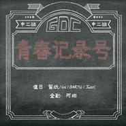

青春记录号
============================

|  |  |
| :--: | :-- |
| [ 青春记录号](https://emumo.xiami.com/album/2105753627) | **艺人**: [阿细](../index.md) **语种**: 粤语 **唱片公司**: 独立发行 **发行时间**: 2020年01月04日 **专辑类别**: EP, 单曲 **专辑风格**:  **播放数**: 41 **收藏数**: 2 **评论数**: 0  |

## 简介

当我遥想未来的时候，我会跟天边说话。   
当我回忆过去的时候，我会跟星空说话。   
  
我是如此的怀念，   
那一段不知时日的岁月，你还记得吗？   
  
致天下所有无不散的筵席。

## 曲目

## 评论

