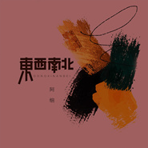
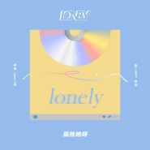

阿细
============================

|  |  |
| :--: | :-- |
| [ 阿细](https://i.xiami.com/axicheung) | **播放数**: 14033958 **粉丝数**: 7599 **评论数**: 165 **地区**: China 中国大陆 **风格**: 流行 Pop, 国语流行 Mandarin Pop, 粤语流行 Cantopop  |

## 档案

阿细，1996年8月18日出生于广东省广州市，独立唱作人，《细之声》电台主持人。具备音乐天赋，没有学习过音乐的情况下，自学改编或者吉他弹唱，改编粤语版《好想你》、《always》、《简单爱》等歌曲蹿红网络。个人网络平台破百万粉丝总量，歌曲收听总量破一忆。2013年16岁时发布第一首原创粤语作品《还好有你》，深受许多年轻人的喜爱。2016年7月发行原创新歌《回忆广州》，引起不少当地人的共鸣。

## 专辑

| 名称 | 语种 | 唱片公司 | 发行时间 | 专辑类别 | 专辑风格 |
| :--: | :-- | :-- | :-- | :-- | :-- |
| [ 教训](./albums/5020993376.md) | 粤语 | 数聚变换 | 2020年06月29日 | EP, 单曲 | 粤语流行 Cantopop |
| [ 野孩子](./albums/2105746028.md) | 粤语 | 独立发行 | 2020年01月16日 | EP, 单曲 | 粤语流行 Cantopop |
| [ 青春记录号](./albums/2105753627.md) | 粤语 | 独立发行 | 2020年01月04日 | EP, 单曲 |  |
| [ 陪着你唱着歌](./albums/2105753618.md) | 国语 | 独立发行 | 2019年12月27日 | EP, 单曲 |  |
| [ 东西南北](./albums/2105753604.md) | 国语 | 乐淘文化 | 2019年12月11日 | EP, 单曲 |  |
| [ 三字经与我](./albums/2105753591.md) | 粤语 | 禾信科技 | 2019年11月02日 | EP, 单曲 | 粤语流行 Cantopop |
| [ 猫先生与猫小姐](./albums/2108244672.md) | 粤语 | 禾信科技 | 2019年09月03日 | EP, 单曲 | 国语流行 Mandarin Pop |
| [ 灰尘](./albums/5022612603.md) | 国语 | 北京伯音时代文化传媒有限公司 | 2019年09月01日 | EP, 单曲 | 流行 Pop |
| [ 广州味道](./albums/2105753406.md) | 粤语 | 齐鼓文化 | 2019年05月20日 | EP, 单曲 | 粤语流行 Cantopop |
| [ 爱太远的人](./albums/2105753574.md) | 国语 | 齐鼓文化 | 2019年04月01日 | EP, 单曲 |  |
| [ 细界](./albums/2104941685.md) | 粤语 | 推星传媒 | 2018年12月11日 | EP, 单曲 | 华语唱作人 Chinese Singer-Songwriter, 粤语流行 Cantopop |
| [ 如果说](./albums/2105753477.md) | 国语 | 唐羽文化 | 2018年11月08日 | EP, 单曲 |  |
| [ 孤独她呀Lonely](./albums/2105753519.md) | 粤语 | 独立发行 | 2018年09月25日 | EP, 单曲 | 粤语流行 Cantopop |
| [ 流着泪说分手](./albums/2103755257.md) | 粤语 | 独立发行 | 2018年04月14日 | EP, 单曲 | 粤语流行 Cantopop |
| [ 就是爱你](./albums/2103755262.md) | 粤语 | 独立发行 | 2018年03月09日 | EP, 单曲 | 国语流行 Mandarin Pop, 粤语流行 Cantopop, 流行 Pop |
| [ 一双手](./albums/2103677231.md) | 粤语 | 独立发行 | 2018年03月07日 | EP, 单曲 | 粤语流行 Cantopop |
| [ 还好有你](./albums/2103755247.md) | 粤语 | 独立发行 | 2017年12月25日 | EP, 单曲 | 华语唱作人 Chinese Singer-Songwriter, 粤语流行 Cantopop |
| [ 原谅我太年轻](./albums/2102871760.md) | 粤语 | 独立发行 | 2017年08月26日 | EP, 单曲 | 华语唱作人 Chinese Singer-Songwriter, 粤语流行 Cantopop |
| [ 追光者](./albums/2102871756.md) | 粤语 | 独立发行 | 2017年08月10日 | EP, 单曲 | 粤语流行 Cantopop |
| [ 阿细  翻唱合集](./albums/2102871761.md) | 国语 |  | 2017年01月04日 | 合集, 杂锦 | 国语流行 Mandarin Pop |
| [ 回忆广州](./albums/2103755253.md) | 粤语 | 独立发行 | 2016年08月18日 | EP, 单曲 | 粤语流行 Cantopop, 华语唱作人 Chinese Singer-Songwriter |
| [ 阿细录音室合集阿细](./albums/2105269746.md) | 粤语 | 滚石唱片 | 2006年06月06日 | 录音室专辑 |  |
| [ 阿细 翻唱合集阿细](./albums/2105255713.md) | 粤语 |  | 2006年06月06日 | 录音室专辑 |  |
| [ 看不见](./albums/2104956089.md) | 国语 | 伯音时代 | 不详 | EP, 单曲 | 国语流行 Mandarin Pop |

## 评论

|  |  |  |  |
| :-- | :-- | :-- | :-- |
|  [虾米用户](https://emumo.xiami.com/u/10250562) 我还没想好要写什么... 2020-07-03 15:49 赞(1) 踩(0) | 
阿细给我噶feel，同薛凯琪好相似，希望比薛凯琪更火红，加油
 |
|  [虾米用户](https://emumo.xiami.com/u/6752140) Yฅ( ̳• ε • ̳... 2020-07-01 13:48 赞(3) 踩(0) | 
先把介绍里的错别字改了好吗
 |
|  [虾米用户](https://emumo.xiami.com/u/333672135)  2020-07-01 07:06 赞(3) 踩(0) | 
我从追光者认识的她，感觉很棒的一位创作歌手，加油！
 |
|  [虾米用户](https://emumo.xiami.com/u/434651773)  2020-03-24 12:46 赞(3) 踩(0) | 
女声来说，粤语角度，都是完美的。选歌很重要，声线很有磁性，很有音乐天赋
 |
|  [虾米用户](https://emumo.xiami.com/u/5810763) 心有林夕. 2020-02-08 00:04 赞(1) 踩(0) | 
广州骄傲
 |
|  [虾米用户](https://emumo.xiami.com/u/4028489) 醉生梦死是她和我开的一个... 2020-02-05 23:05 赞(2) 踩(0) | 
声音很酷，感觉上很好的女生呢
 |
|  [虾米用户](https://emumo.xiami.com/u/328037377)  2019-12-29 23:17 赞(1) 踩(0) | 
合作不?你写我唱。
 |
|  [虾米用户](https://emumo.xiami.com/u/243004743) 如烟 2019-09-12 22:09 赞(3) 踩(0) | 
上传高山低谷，够钟，还找不找你，天后丫，大大。
 |
|  [虾米用户](https://emumo.xiami.com/u/427668818)  2019-07-24 22:03 赞(0) 踩(0) | 
想听 天后  不知道，虾米什么时候出  
 |
|  [虾米用户](https://emumo.xiami.com/u/279998595)  2019-07-22 22:25 赞(0) 踩(0) | 
踩一踩 
 |
|  [虾米用户](https://emumo.xiami.com/u/425546268) 我还没想好要写什么... 2019-07-07 10:47 赞(0) 踩(0) | 
AV
 |
|  [虾米用户](https://emumo.xiami.com/u/16075089)  2019-06-25 22:08 赞(0) 踩(0) | 
真好
 |
|  [虾米用户](https://emumo.xiami.com/u/10353205) 音乐 2019-05-20 21:54 赞(2) 踩(0) | 
不知哪有正版CD卖？所有歌曲的
 |
|  [虾米用户](https://emumo.xiami.com/u/288284476)  2019-05-17 12:41 赞(3) 踩(0) | 
要是唱首《只是太爱你》粤语版就好了
 |
|  [虾米用户](https://emumo.xiami.com/u/339578281)  2019-05-10 08:59 赞(0) 踩(0) | 
什么时候出新专辑哇
 |
|  [虾米用户](https://emumo.xiami.com/u/261926941) 青春不止矫健的身姿和漂亮... 2019-05-01 21:04 赞(3) 踩(0) | 
哇，声线那么好
 |
|  [虾米用户](https://emumo.xiami.com/u/85293550) 嗯，我还是喜欢你 2019-04-17 09:36 赞(4) 踩(0) | 
知足原曲作者是阿信，您可做个人吧，我谢谢您嘞举报了
 |
| ⇒ |  [虾米用户](https://emumo.xiami.com/u/313548111)  2019-05-01 09:55 赞(0) 踩(0) | 
你可真睿智 还是瞎 还是不把你自己当人?
 |
| ⇒ |  [虾米用户](https://emumo.xiami.com/u/85293550) 嗯，我还是喜欢你 2019-05-01 23:10 赞(0) 踩(0) | 
<q><b>大不了唱首歌说：</b></q>
 |
| ⇒ |  [虾米用户](https://emumo.xiami.com/u/313548111)  2019-05-01 23:12 赞(0) 踩(0) | 
<q><b>二毛八的草莓酱说：</b></q>
 |
| ⇒ |  [虾米用户](https://emumo.xiami.com/u/85293550) 嗯，我还是喜欢你 2019-05-01 23:28 赞(0) 踩(0) | 
<q><b>大不了唱首歌说：</b></q>
 |
| ⇒ |  [虾米用户](https://emumo.xiami.com/u/9252846) 摇滚是沉默的。 2019-05-06 18:41 赞(0) 踩(0) | 
歌词不一定是歌手上传的。所以歌词中的描述不一定是歌手写的。
 |
|  [虾米用户](https://emumo.xiami.com/u/322498584) 谁不眷恋这一词一曲的光辉 2019-04-15 12:18 赞(0) 踩(0) | 
支持
 |
|  [虾米用户](https://emumo.xiami.com/u/116625604) 仁爱 谦和 礼仪 爱国。 2019-04-03 20:21 赞(0) 踩(0) | 
长得好可爱
 |
|  [虾米用户](https://emumo.xiami.com/u/302521682) 哈哈哈哈哈哈哈哈哈哈哈哈... 2019-04-01 09:26 赞(0) 踩(0) | 
中意你唱滴歌，加油，期待你更好葛作品
 |
|  [虾米用户](https://emumo.xiami.com/u/402231050)  2019-03-16 21:56 赞(0) 踩(0) | 
人美歌好听，加油
 |
|  [虾米用户](https://emumo.xiami.com/u/156856338)  2019-03-14 14:37 赞(0) 踩(0) | 
吐字都不清。。。
 |
|  [虾米用户](https://emumo.xiami.com/u/377905815)  2019-03-14 02:58 赞(1) 踩(0) | 
阿细：很喜欢你的歌曲！加油↖(^ω^)↗↖(^ω^)↗↖(^ω^)↗↖(^ω^)↗↖(^ω^)↗↖(^ω^)↗    希望看到你出更好听你新作品……
 |
|  [虾米用户](https://emumo.xiami.com/u/274687523) 我还没想好要写什么... 2019-03-10 21:48 赞(0) 踩(0) | 
好少歌喺线上。好难稳
 |
|  [虾米用户](https://emumo.xiami.com/u/160115082)  2019-03-05 04:59 赞(0) 踩(0) | 
能不能让我帮你改词
 |
|  [虾米用户](https://emumo.xiami.com/u/16388763)  2019-02-17 07:47 赞(0) 踩(0) | 
知足作曲是五月天是阿信啊～拜托，认真点，音乐创作啊！
 |
|  [虾米用户](https://emumo.xiami.com/u/157774822) 卸掉了陪我多年的酷我音乐... 2019-02-09 19:36 赞(2) 踩(0) | 
知足作曲？？？
 |
| ⇒ |  [虾米用户](https://emumo.xiami.com/u/19743829) 我喜欢他，想象中的他。 2019-02-16 11:10 赞(0) 踩(0) | 
是阿信!!!!!
 |
|  [虾米用户](https://emumo.xiami.com/u/49039287)  2019-01-28 23:38 赞(0) 踩(0) | 
声音好像卫兰
 |
| ⇒ |  [虾米用户](https://emumo.xiami.com/u/345698167)   2019-09-23 13:11 赞(0) 踩(0) | 
不像啊
 |
|  [虾米用户](https://emumo.xiami.com/u/334066716)  2019-01-08 03:11 赞(0) 踩(0) | 
好掂
 |
|  [虾米用户](https://emumo.xiami.com/u/314398782)   2019-01-05 00:38 赞(0) 踩(0) | 
好好听
 |
|  [虾米用户](https://emumo.xiami.com/u/376169534) 所有的酒都不如你， 2019-01-01 21:54 赞(1) 踩(0) | 
听了你唱的很多作品感受到你的才华
 |
|  [虾米用户](https://emumo.xiami.com/u/265333074)  2018-12-11 10:46 赞(1) 踩(0) | 
加油
 |
|  [虾米用户](https://emumo.xiami.com/u/409621775)  2018-11-30 01:30 赞(0) 踩(0) | 
怎么没有【等你下课】
 |
|  [虾米用户](https://emumo.xiami.com/u/263886160)  2018-11-20 00:27 赞(1) 踩(0) | 
快多出一点新作品，好听
 |
|  [虾米用户](https://emumo.xiami.com/u/408437142) 【搜索我的名字试试看】 2018-11-18 00:18 赞(0) 踩(0) | 
Music is beautiful and Sound is also beautiful！
 |
|  [虾米用户](https://emumo.xiami.com/u/27079045) 我还没想好要写什么... 2018-11-04 12:10 赞(1) 踩(0) | 
好中意你嘅声线~加油！
 |
|  [虾米用户](https://emumo.xiami.com/u/375772114)  2018-10-31 10:04 赞(0) 踩(0) | 
可以试下骚灵情歌嘛？
 |
|  [虾米用户](https://emumo.xiami.com/u/89221664)  2018-10-27 13:59 赞(1) 踩(0) | 
中低音听起来很舒服，如果再锻炼一下技巧就更完美了，加油 
 |
|  [虾米用户](https://emumo.xiami.com/u/403640408) 好的东西要坚持。 明天不... 2018-10-26 11:19 赞(0) 踩(0) | 
长的真美
 |
|  [虾米用户](https://emumo.xiami.com/u/406566346)  2018-10-25 09:22 赞(0) 踩(0) | 
什么时候有见面会与演出呢
 |
|  [虾米用户](https://emumo.xiami.com/u/28776531) 忘情水 2018-10-22 10:52 赞(0) 踩(0) | 
我不是音乐专业、你唱那首你过分美丽、似乎差点什么、听取意见会有进步 
 |
|  [虾米用户](https://emumo.xiami.com/u/15271788)  2018-10-17 15:36 赞(1) 踩(0) | 
词写得一塌糊涂
 |
|  [虾米用户](https://emumo.xiami.com/u/351855040)  2018-09-27 06:43 赞(1) 踩(0) | 
我最喜欢你的歌曲了
 |
|  [虾米用户](https://emumo.xiami.com/u/253923213) 洪清 2018-09-24 03:58 赞(0) 踩(0) | 
很喜欢你，哪里人
 |
| ⇒ |  [虾米用户](https://emumo.xiami.com/u/264971748) 潮落终究会潮起。 2018-09-30 08:19 赞(0) 踩(0) | 
广州人
 |
|  [虾米用户](https://emumo.xiami.com/u/124984724) 或许你也喜欢吃田鸡 2018-09-14 09:06 赞(1) 踩(0) | 
很好听，就是希望音质可以提高一点...
 |
|  [虾米用户](https://emumo.xiami.com/u/260505966)  2018-09-13 21:47 赞(3) 踩(0) | 
听到追光者的第一声就喜欢上的声音，看到第一眼就喜欢上的人
 |
|  [虾米用户](https://emumo.xiami.com/u/37372186)  2018-08-31 09:19 赞(3) 踩(0) | 
很认真听了。很一般，很平淡，全部都是一个调。。没惊喜。
 |
| ⇒ |  [虾米用户](https://emumo.xiami.com/u/234343454)  2019-02-06 08:11 赞(0) 踩(0) | 
你这么会说你怎么不去唱，就跟你唱的有多厉害，有多天籁似的！渣渣(﹁"﹁)
 |
|  [虾米用户](https://emumo.xiami.com/u/178687232)   2018-08-30 00:40 赞(1) 踩(0) | 
很幸运没有错过这样温暖而坚韧的声音。
 |
|  [虾米用户](https://emumo.xiami.com/u/379616783)  2018-08-27 20:47 赞(0) 踩(0) | 
风声音有点像胡琳
 |
|  [虾米用户](https://emumo.xiami.com/u/10814187) 大概今生是有些东西 是提... 2018-08-27 14:51 赞(0) 踩(0) | 
同月同日出生唉
 |
|  [虾米用户](https://emumo.xiami.com/u/278698970)  2018-08-23 19:46 赞(1) 踩(0) | 
新粉 也。。
 |
|  [虾米用户](https://emumo.xiami.com/u/15357820)  2018-08-23 19:10 赞(2) 踩(0) | 
声线好～如果修饰一下，可成大器
 |
| ⇒ |  [虾米用户](https://emumo.xiami.com/u/335040799) 喜歡你微笑的時候眼裡藏不... 2018-09-05 16:18 赞(0) 踩(0) | 
唱歌靠實力吧，靠修飾能走得多遠？ 
 |
| ⇒ |  [虾米用户](https://emumo.xiami.com/u/15357820)  2018-09-06 12:02 赞(0) 踩(0) | 
<q><b>Chingyans说：</b></q>
 |
|  [虾米用户](https://emumo.xiami.com/u/32670970)  2018-08-21 12:39 赞(0) 踩(0) | 
啊细你的歌听起来很舒服，希望你选择音乐这条路，会走得越来越远。            
 |
|  [虾米用户](https://emumo.xiami.com/u/92373288)   2018-08-14 15:46 赞(0) 踩(0) | 
我觉得你好犀利啊！！！！阿细，加油！真系90后的骄傲啊    
 |
|  [虾米用户](https://emumo.xiami.com/u/143401552) 我没有能力我有野心 2018-08-11 23:46 赞(3) 踩(0) | 
听了她的歌，突然想学广东话
 |
|  [虾米用户](https://emumo.xiami.com/u/323836192)  2018-08-11 10:52 赞(0) 踩(0) | 
好听
 |
|  [虾米用户](https://emumo.xiami.com/u/333546705)  2018-08-11 08:39 赞(0) 踩(0) | 
加油(ง &amp;bull;̀_&amp;bull;́)ง！
 |
|  [虾米用户](https://emumo.xiami.com/u/280869900) 我还没想好要写什么... 2018-08-10 09:25 赞(0) 踩(0) | 
阿细要加油，因为我们会一直支持你！ 
 |
|  [虾米用户](https://emumo.xiami.com/u/378014168)  2018-08-04 01:18 赞(2) 踩(0) | 
想听你唱  Janice和张敬轩的歌
 |
|  [虾米用户](https://emumo.xiami.com/u/370225874)  2018-07-28 19:04 赞(0) 踩(0) | 
如果可以 爱的故事上集 糟糕 是心动的感觉.
 |
|  [虾米用户](https://emumo.xiami.com/u/309655839)  2018-07-27 10:02 赞(0) 踩(0) | 
感谢你为广州而唱，支持你，支持本土制作。2004年有阿肖，2018年有阿细，希望未来有更多呢D歌手，粤语文化好需要你地既传承，加油！
 |
|  [虾米用户](https://emumo.xiami.com/u/318250140) 人生如歌，作曲的、歌唱的... 2018-07-27 09:25 赞(0) 踩(0) | 
声音好听，很喜欢
 |
|  [虾米用户](https://emumo.xiami.com/u/377867915)  2018-07-26 09:26 赞(0) 踩(0) | 
非常喜欢
 |
|  [虾米用户](https://emumo.xiami.com/u/38489815) 暂无签名~ 2018-07-20 23:20 赞(0) 踩(0) | 
欢迎来到虾米
 |
|  [虾米用户](https://emumo.xiami.com/u/148685066) 你最珍贵 2018-07-17 22:09 赞(0) 踩(0) | 
小姐姐比我大4天
 |
|  [虾米用户](https://emumo.xiami.com/u/378183459) 我还没想好要写什么... 2018-07-17 00:29 赞(0) 踩(0) | 
小姐姐可以试一下张敬轩的歌吗 
 |
|  [虾米用户](https://emumo.xiami.com/u/378817216)  2018-07-16 23:32 赞(0) 踩(0) | 
喜欢你的歌，很有感觉，小姐姐，我会一直关注你的 
 |
|  [虾米用户](https://emumo.xiami.com/u/375828475) 我是甚么，在十个当中只得... 2018-07-13 19:38 赞(0) 踩(0) | 
就是爱你爱你爱着你。 
 |
|  [虾米用户](https://emumo.xiami.com/u/377849436)  2018-07-07 10:27 赞(0) 踩(0) | 
希望你能唱出每个人的心声
 |
|  [虾米用户](https://emumo.xiami.com/u/139015666) 我还没想好要写什么... 2018-07-07 01:24 赞(0) 踩(0) | 
加油
 |
|  [虾米用户](https://emumo.xiami.com/u/303512406)  2018-06-27 11:34 赞(2) 踩(0) | 
快快去中国新歌声，让更多人发现耳朵的享受
 |
|  [虾米用户](https://emumo.xiami.com/u/230811204) 咪咪咪咪咪 2018-06-07 17:17 赞(1) 踩(0) | 
能不能传迷雾抖音很火的等你下课？！
 |
| ⇒ |  [虾米用户](https://emumo.xiami.com/u/28526046)   2018-06-24 19:29 赞(0) 踩(0) | 
是的 坐等这一首
 |
|  [虾米用户](https://emumo.xiami.com/u/323041941)  2018-05-28 08:53 赞(2) 踩(0) | 
粵語歌一定要大大大大大大力支持，繼續加油，為我們帶來更多回憶   
 |
|  [虾米用户](https://emumo.xiami.com/u/334703194) 我还没想好要写什么... 2018-05-11 20:01 赞(4) 踩(0) | 
求 就是爱你 粤语版啊
 |
|  [虾米用户](https://emumo.xiami.com/u/51766400) I swore Id a... 2018-05-07 16:29 赞(0) 踩(0) | 
唱得几自然，俾。《追光者》我只听得呢一版，可惜副歌编曲差滴少少。加油～
 |
|  [虾米用户](https://emumo.xiami.com/u/51980959) 我还没想好要写什么... 2018-05-07 11:47 赞(0) 踩(0) | 
虾米什么时候才有《流着泪说分手》 羡慕隔壁qq音乐
 |
| ⇒ |  [虾米用户](https://emumo.xiami.com/u/266073513) cracker 2018-07-08 13:05 赞(0) 踩(0) | 
现在有了
 |
|  [虾米用户](https://emumo.xiami.com/u/281058030) 每个认真生活的人，都值得... 2018-05-06 23:31 赞(0) 踩(0) | 
就是爱你怎么没有
 |
|  [虾米用户](https://emumo.xiami.com/u/245474085)  2018-05-06 01:03 赞(1) 踩(0) | 
支持老婆
 |
|  [虾米用户](https://emumo.xiami.com/u/346510801)   2018-05-03 01:34 赞(0) 踩(0) | 
就是爱你怎么没有
 |
|  [虾米用户](https://emumo.xiami.com/u/337748433) 我还没想好要写什么... 2018-05-01 20:55 赞(3) 踩(0) | 
怎么没有就是爱你粤语版 
 |
|  [虾米用户](https://emumo.xiami.com/u/356668212)  2018-04-30 01:42 赞(0) 踩(0) | 
8/18生日，居然和我一样 
 |
|  [虾米用户](https://emumo.xiami.com/u/360468997)  2018-04-29 22:49 赞(1) 踩(0) | 
一亿，哥
 |
|  [虾米用户](https://emumo.xiami.com/u/356480522)  2018-04-27 22:35 赞(0) 踩(0) | 
有吉他谱吗 哪位大神发来
 |
|  [虾米用户](https://emumo.xiami.com/u/10307659)  2018-04-27 13:54 赞(0) 踩(0) | 
怎么找她的就是爱你啊，唱得好好
 |
|  [虾米用户](https://emumo.xiami.com/u/236379026) 00... 2018-04-27 09:20 赞(0) 踩(0) | 
nice
 |
|  [虾米用户](https://emumo.xiami.com/u/83280074)   2018-04-26 22:01 赞(2) 踩(0) | 
阿细  听你的歌  总有总莫名的感觉  又想笑笑不出、想哭又没理由   爱你
 |
|  [虾米用户](https://emumo.xiami.com/u/347973552)  2018-04-23 23:28 赞(3) 踩(0) | 
求粤语版《流着泪说分手》
 |
|  [虾米用户](https://emumo.xiami.com/u/337274361)  2018-04-18 21:34 赞(0) 踩(0) | 
求！！！就是爱你
 |
|  [虾米用户](https://emumo.xiami.com/u/268861711) 愿您的梦，醒来一片辉煌。 2018-04-16 17:58 赞(1) 踩(0) | 
同是广东人，关注你，你的《追光者》真好听 ✧*｡
 |
| ⇒ |  [虾米用户](https://emumo.xiami.com/u/5659296)  2018-07-04 00:30 赞(0) 踩(0) | 

 |
|  [虾米用户](https://emumo.xiami.com/u/7029232) 像一擊即中Post-ro... 2018-04-15 22:30 赞(0) 踩(0) | 
好喜欢
 |
|  [虾米用户](https://emumo.xiami.com/u/133055690)  2018-04-15 16:48 赞(2) 踩(0) | 
想听粤语版的就是爱你
 |
|  [虾米用户](https://emumo.xiami.com/u/17939910) 我还没想好要写什么... 2018-04-15 14:46 赞(1) 踩(0) | 
粤语版的&amp;ldquo;就是爱你&amp;rdquo;这里没有收录吗？
 |
|  [虾米用户](https://emumo.xiami.com/u/26579731) 这家伙很聪明什么也没留下... 2018-04-13 23:20 赞(0) 踩(0) | 
声线完美
 |
|  [虾米用户](https://emumo.xiami.com/u/251856363) 一條有夢想的鹹魚ㄟ( ▔... 2018-04-05 16:49 赞(1) 踩(0) | 
好塞雷 我愛才女 
 |
|  [虾米用户](https://emumo.xiami.com/u/260847368) 爱过。 2018-03-26 13:36 赞(1) 踩(0) | 
正哦！  
 |
|  [虾米用户](https://emumo.xiami.com/u/289006029)  2018-03-13 18:17 赞(3) 踩(0) | 
2014年，刚注册美拍，随便点了一个进去，听到你在寝室弹唱nothing gonna change my love for you，打动我了。后来把那段剪下来做了手机铃声。没想到，现在可以在虾米上直接下载你的歌了！加油，希望能听到你更多的作品！ 
 |
|  [虾米用户](https://emumo.xiami.com/u/46380901) 张家界旅游找我 2018-03-08 23:55 赞(2) 踩(0) | 
一双手，别的播放器已经有了哦
 |
| ⇒ |  [虾米用户](https://emumo.xiami.com/u/325104208)   2018-03-09 23:07 赞(0) 踩(0) | 
什么播放器？
 |
| ⇒ |  [虾米用户](https://emumo.xiami.com/u/46380901) 张家界旅游找我 2018-03-10 22:33 赞(0) 踩(0) | 
<q><b>Merry说：</b></q>
 |
|  [虾米用户](https://emumo.xiami.com/u/332202225)  2018-03-08 23:15 赞(2) 踩(0) | 
听你的歌，我深深感受到自己作为一个广东人的优越感了，粤语歌真的太好听了！
 |
|  [虾米用户](https://emumo.xiami.com/u/211088542)  2018-03-02 08:31 赞(0) 踩(0) | 
为何没有天后？
 |
|  [虾米用户](https://emumo.xiami.com/u/332035981)  2018-02-27 12:48 赞(2) 踩(0) | 
加油！广州
 |
|  [虾米用户](https://emumo.xiami.com/u/46825185)   2018-02-26 10:34 赞(0) 踩(0) | 
好听航~
 |
|  [虾米用户](https://emumo.xiami.com/u/334837674)  2018-02-24 13:07 赞(1) 踩(0) | 
加油！阿细
 |
|  [虾米用户](https://emumo.xiami.com/u/259360414)  2018-02-21 00:34 赞(0) 踩(0) | 
加油。
 |
|  [虾米用户](https://emumo.xiami.com/u/335885835) 帮忙黑一下童可可这个绿茶... 2018-02-17 10:21 赞(1) 踩(0) | 
钟意你把声 
 |
|  [虾米用户](https://emumo.xiami.com/u/350752991)  2018-02-15 21:13 赞(2) 踩(0) | 
嘿饭嘞，啊涩
 |
|  [虾米用户](https://emumo.xiami.com/u/37863570)  你我他她它。 2018-02-09 09:53 赞(2) 踩(0) | 
想听微博所有歌曲！能发吗？
 |
|  [虾米用户](https://emumo.xiami.com/u/333293043) 我待生活如初恋丶 2018-02-06 19:17 赞(0) 踩(0) | 
细细，好耐无见
 |
|  [虾米用户](https://emumo.xiami.com/u/228858344)  2018-01-31 18:29 赞(0) 踩(0) | 
很喜欢阿细，希望她能越来越火2018.1.31
 |
|  [虾米用户](https://emumo.xiami.com/u/346658042)  2018-01-29 09:52 赞(1) 踩(0) | 
我想娶阿细 
 |
|  [虾米用户](https://emumo.xiami.com/u/346771739)  2018-01-28 21:45 赞(2) 踩(0) | 
为左听阿细下载虾米 把声好正阿而且翻唱改词得超好 无霖到系广州人 一开始以为系香港人 觉得把声有少少似郑安琪 继续翻唱阿！比好多个赞你！ 
 |
|  [虾米用户](https://emumo.xiami.com/u/345739185)  2018-01-28 20:23 赞(1) 踩(0) | 
厉害了！继续更新 是阿细的都赞我是你的粉
 |
|  [虾米用户](https://emumo.xiami.com/u/265199608)  2018-01-26 03:27 赞(1) 踩(0) | 
钟意阿细 ，
 |
|  [虾米用户](https://emumo.xiami.com/u/217796469) 一颗心在尘世徘徊，一颗固... 2018-01-24 20:07 赞(1) 踩(0) | 
好想听你唱冠希的极爱自己喔 单恋高校唱的真好听
 |
|  [虾米用户](https://emumo.xiami.com/u/345780220) 虽然我只是初中生但想对一... 2018-01-22 10:05 赞(1) 踩(0) | 
    
 |
|  [虾米用户](https://emumo.xiami.com/u/9065650)   2018-01-18 02:14 赞(1) 踩(0) | 
虾米点解仲未有《还好有你》
 |
|  [虾米用户](https://emumo.xiami.com/u/214337256)  2018-01-15 01:09 赞(1) 踩(0) | 
海绵宝宝
 |
|  [虾米用户](https://emumo.xiami.com/u/15839745)  2018-01-10 21:38 赞(3) 踩(0) | 
小姐姐求翻唱粤语版 志明与春娇！余文乐未出录音室版本。
 |
|  [虾米用户](https://emumo.xiami.com/u/257692640)  2018-01-10 15:22 赞(1) 踩(0) | 
真心喜欢你，加油！
 |
|  [虾米用户](https://emumo.xiami.com/u/316984092)  2018-01-05 20:27 赞(1) 踩(0) | 
很好听的声音，唱得也好
 |
|  [虾米用户](https://emumo.xiami.com/u/342246103)  2018-01-03 12:27 赞(0) 踩(0) | 
才比我大一岁 
 |
|  [虾米用户](https://emumo.xiami.com/u/11515590) moigoo 2017-12-31 05:23 赞(0) 踩(0) | 
喜歡你 加油
 |
|  [虾米用户](https://emumo.xiami.com/u/46863835) 我还没想好要写什么... 2017-12-24 16:12 赞(0) 踩(0) | 
什么歌都可以改成粤语，而且真的很好听
 |
|  [虾米用户](https://emumo.xiami.com/u/283950279) 世界是什么颜色 2017-12-21 23:11 赞(0) 踩(0) | 
喜欢小姐姐
 |
|  [虾米用户](https://emumo.xiami.com/u/339681541)  2017-12-12 20:07 赞(0) 踩(0) | 
为什么没有456wing？
 |
|  [虾米用户](https://emumo.xiami.com/u/339375431)  2017-12-10 14:45 赞(0) 踩(0) | 
初中开始关注你宜家大二了！！！
 |
|  [虾米用户](https://emumo.xiami.com/u/339222453)  2017-12-09 15:37 赞(0) 踩(0) | 
好听，声音好纯，粉丝加一
 |
|  [虾米用户](https://emumo.xiami.com/u/251536079) Red And Blac... 2017-12-05 23:23 赞(0) 踩(0) | 
很喜欢
 |
|  [虾米用户](https://emumo.xiami.com/u/314322464)  2017-12-03 09:10 赞(0) 踩(0) | 
之前网易云就听你，后来为了李宗盛下了虾米，⊙&amp;forall;⊙！还是听你。  
 |
|  [虾米用户](https://emumo.xiami.com/u/280690813) 音乐的鼓点像小拳头敲击我... 2017-11-30 11:49 赞(0) 踩(0) | 
喜欢喜欢
 |
|  [虾米用户](https://emumo.xiami.com/u/16727141)   2017-11-16 15:15 赞(0) 踩(0) | 
开始喜欢你
 |
|  [虾米用户](https://emumo.xiami.com/u/157311464) 感谢永远有歌把心境道破 2017-11-13 12:40 赞(0) 踩(0) | 
打call！
 |
|  [虾米用户](https://emumo.xiami.com/u/9065650)   2017-11-12 12:09 赞(1) 踩(0) | 
终于来到虾米了  
 |
|  [虾米用户](https://emumo.xiami.com/u/263406761) 音乐，让生活更美好 2017-11-11 18:43 赞(1) 踩(0) | 
好清澈啊，好纯净啊，听着你的歌觉得真的是岁月静好啊 
 |
|  [虾米用户](https://emumo.xiami.com/u/332781880)  2017-11-09 19:04 赞(0) 踩(0) | 
声音好听 加油
 |
|  [虾米用户](https://emumo.xiami.com/u/284838785) 感謝永遠有歌，把心境道破... 2017-11-08 20:27 赞(0) 踩(0) | 
喜欢出多点粤语歌 ❤
 |
|  [虾米用户](https://emumo.xiami.com/u/284838785) 感謝永遠有歌，把心境道破... 2017-11-08 20:23 赞(0) 踩(0) | 
好喜欢这声音
 |
|  [虾米用户](https://emumo.xiami.com/u/257927068) 千江有水千江月，万里无云... 2017-11-02 18:27 赞(1) 踩(0) | 
你的声音很好听 很干净  加油   
 |
|  [虾米用户](https://emumo.xiami.com/u/257927068) 千江有水千江月，万里无云... 2017-11-02 18:26 赞(0) 踩(0) | 
加油！
 |
|  [虾米用户](https://emumo.xiami.com/u/326251894)  2017-10-31 11:03 赞(0) 踩(0) | 
好棒啊，好喜欢听啊
 |
|  [虾米用户](https://emumo.xiami.com/u/285224681)  2017-10-30 03:51 赞(0) 踩(0) | 
好听哎
 |
|  [虾米用户](https://emumo.xiami.com/u/325410331)  2017-10-25 18:06 赞(0) 踩(0) | 
真的不错，我相信你可以改出最好的歌
 |
|  [虾米用户](https://emumo.xiami.com/u/329112124)  2017-10-23 23:52 赞(1) 踩(0) | 
给你打call
 |
|  [虾米用户](https://emumo.xiami.com/u/294470936)  2017-10-23 21:39 赞(0) 踩(0) | 
真的很不错，在这杂乱的音乐中是一束清流
 |
|  [虾米用户](https://emumo.xiami.com/u/330553336)  2017-10-22 19:56 赞(0) 踩(0) | 
漂亮 歌美人美
 |
|  [虾米用户](https://emumo.xiami.com/u/12459835) live 4 nothi... 2017-10-20 23:56 赞(0) 踩(0) | 
阿细加油！！
 |
|  [虾米用户](https://emumo.xiami.com/u/330476175)  2017-10-17 13:07 赞(0) 踩(0) | 
喜欢你的歌声
 |
|  [虾米用户](https://emumo.xiami.com/u/265162486)  2017-10-17 00:00 赞(0) 踩(0) | 
  
 |
|  [虾米用户](https://emumo.xiami.com/u/37178261) 一蓑烟雨任平生~ 2017-10-16 20:43 赞(0) 踩(0) | 
中意你呀 
 |
|  [虾米用户](https://emumo.xiami.com/u/96493362)  2017-10-15 23:59 赞(2) 踩(0) | 
喜欢阿细
 |
