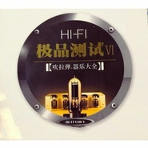
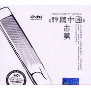
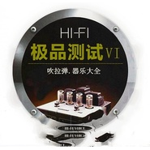
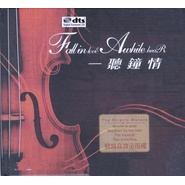

许双海
============================

|  |  |
| :--: | :-- |
| [ 许双海](https://i.xiami.com/xushuangshuang) | **地区**: China 中国大陆 **风格**: 国语流行 Mandarin Pop, 器乐流行 Instrumental Pop, 轻音乐流行 Light Pop, 当代唱作人 Contemporary Singer-Songwriter, 轻音乐 Easy Listening **播放数**: 5629489 **粉丝数**: 967 **评论数**: 34  |

## 档案

禅意歌者/音乐唱作人！  擅长轻音乐/古风音乐词曲唱作，曾给多位知名歌手担任幕后创作；有自己独特的音乐创作风格！  并一直在钻研学习民乐/钢琴等多种器乐。  传递正能量！用真情，情感，心灵去诠释音乐！

## 专辑

| 名称 | 语种 | 唱片公司 | 发行时间 | 专辑类别 | 专辑风格 |
| :--: | :-- | :-- | :-- | :-- | :-- |
| [ 【往日琴怀】钢琴](./albums/2104402899.md) | 国语 | 独立发行 | 2018年12月19日 | 精选集 | 轻音乐流行 Light Pop, 沙发音乐 Lounge, 器乐独奏 Solo Instrumental |
| [ 【吹拉弹器乐大全】古筝](./albums/2103851997.md) | 国语 | 独立发行 | 2018年07月16日 | EP, 单曲 | 轻音乐流行 Light Pop, 沙发音乐 Lounge, 轻音乐 Easy Listening |
| [ 【吹拉弹唱器乐大全】二胡](./albums/2103853761.md) | 国语 | 独立发行 | 2018年07月10日 | EP, 单曲 | 器乐流行 Instrumental Pop, 沙发音乐 Lounge, 轻音乐 Easy Listening |
| [ 【吹拉弹器乐大全】](./albums/2103752412.md) | 国语 | 独立发行 | 2018年06月06日 | 精选集 | 器乐流行 Instrumental Pop, 轻音乐流行 Light Pop, 轻音乐 Easy Listening |
| [ 【聆听筝语】古筝](./albums/2103499632.md) | 国语 | 独立发行 | 2018年01月24日 | 精选集 | 器乐流行 Instrumental Pop, 轻音乐流行 Light Pop, 沙发音乐 Lounge |
| [ 【吹拉弹器乐大全】](./albums/2103946973.md) | 国语 | 独立发行 | 2017年08月17日 | EP, 单曲 | 器乐流行 Instrumental Pop, 轻音乐流行 Light Pop, 沙发音乐 Lounge |
| [ 【吹拉弹器乐大全】](./albums/2103944257.md) | 国语 | 独立发行 | 2016年08月09日 | EP, 单曲 | 轻音乐流行 Light Pop, 沙发音乐 Lounge, 轻音乐 Easy Listening |
| [ 【一听钟情】](./albums/2103922314.md) | 国语 | 独立发行 | 2014年08月05日 | EP, 单曲 | 轻音乐流行 Light Pop, 沙发音乐 Lounge, 轻音乐 Easy Listening |
| [ 往事如昔](./albums/2104947409.md) | 国语 | 独立发行 | 2012年06月16日 | EP, 单曲 | 国语流行 Mandarin Pop |
| [ 【吹拉弹器乐大全】二胡](./albums/2103752273.md) | 国语 | 独立发行 | 2010年06月10日 | 精选集 | 器乐流行 Instrumental Pop, 轻音乐流行 Light Pop, 沙发音乐 Lounge |

## 评论

|  |  |  |
| :-- | :-- | :-- |
|  [虾米用户](https://emumo.xiami.com/u/243612528)  2020-12-13 21:27 赞(0) 踩(0) | 
优秀
 |
|  [虾米用户](https://emumo.xiami.com/u/353538493)  2020-05-29 22:19 赞(0) 踩(0) | 
不错
 |
|  [虾米用户](https://emumo.xiami.com/u/15306609)  2020-03-15 08:15 赞(2) 踩(0) | 
你好，我提个建议，古筝歌曲的背景配音音量减少一点，失去清爽平淡的感觉，许多弹古筝的作者几乎每句末尾都要5连击，太恶心，这是民族古典的悲哀，很假。多发表些熟悉经典歌曲，还是有人喜欢你这个类型的歌曲。即使不为挣钱，也能流传下来。
 |
|  [虾米用户](https://emumo.xiami.com/u/8337431) 以乐会友 2020-03-14 09:17 赞(0) 踩(0) | 
31
 |
|  [虾米用户](https://emumo.xiami.com/u/434152246) 聪明少一些大智慧多一些，... 2020-02-11 19:26 赞(0) 踩(0) | 

 |
|  [虾米用户](https://emumo.xiami.com/u/434152246) 聪明少一些大智慧多一些，... 2020-02-10 07:35 赞(0) 踩(0) | 

 |
|  [虾米用户](https://emumo.xiami.com/u/434152246) 聪明少一些大智慧多一些，... 2020-02-09 07:58 赞(0) 踩(0) | 

 |
|  [虾米用户](https://emumo.xiami.com/u/248348743)  2020-01-22 12:28 赞(1) 踩(0) | 
悠悠时光琴声扬，步步飞花心中藏…
 |
|  [虾米用户](https://emumo.xiami.com/u/328182019)  2019-08-31 21:56 赞(0) 踩(0) | 
分享  田园 的歌曲《心手相牵》<a href="https://www.xiami.com/song/1773860482" target="_blank" rel="nofollow noreferrer noopener">https://www.xiami.com/song/1773860482</a> (分享自@虾米音乐) 推荐首钢琴曲，《二炮手》的配乐，原声里带没有。
 |
|  [虾米用户](https://emumo.xiami.com/u/423723468)  2019-08-05 13:10 赞(0) 踩(0) | 
******
 |
|  [虾米用户](https://emumo.xiami.com/u/357752578) 燕:  片叶寄思迎风飘，... 2019-07-27 16:11 赞(1) 踩(0) | 
委婉温柔真心声，传唱千年歌中经。
 |
|  [虾米用户](https://emumo.xiami.com/u/425670808)  2019-07-18 19:21 赞(0) 踩(0) | 
会长期关注的
 |
|  [虾米用户](https://emumo.xiami.com/u/9003931) 千淘万漉虽辛苦 2019-07-14 20:37 赞(1) 踩(0) | 
烟花易冷古筝版弹得不错，加油呀！~
 |
|  [虾米用户](https://emumo.xiami.com/u/358104299) 悲观的唯心存在现实解构虚... 2019-06-25 13:21 赞(0) 踩(0) | 
12212
 |
|  [虾米用户](https://emumo.xiami.com/u/402434935)  2019-06-04 21:36 赞(0) 踩(0) | 
您那首小提琴的I believe我想买个无损的版本，只自己听，不做商用，请问出售吗？
 |
| ⇒ |  [虾米用户](https://emumo.xiami.com/u/328911428) 把最好的音乐带给你。 2019-06-05 15:40 赞(0) 踩(0) | 
嗯嗯
 |
| ⇒ |  [虾米用户](https://emumo.xiami.com/u/402434935)  2019-06-05 18:36 赞(0) 踩(0) | 
<q><b>许双海说：</b></q>
 |
| ⇒ |  [虾米用户](https://emumo.xiami.com/u/285457396)  2019-06-23 23:11 赞(0) 踩(0) | 
那么好听的歌，你居然一个人听。 
 |
|  [虾米用户](https://emumo.xiami.com/u/73034242) 听雨心境 2019-04-23 20:29 赞(0) 踩(0) | 
赏心悦耳
 |
|  [虾米用户](https://emumo.xiami.com/u/247396070)  2019-04-18 23:07 赞(0) 踩(0) | 
才女 
 |
|  [虾米用户](https://emumo.xiami.com/u/419660569)  2019-04-01 13:26 赞(0) 踩(0) | 
你好，这些曲目的伴奏，出售吗？
 |
| ⇒ |  [虾米用户](https://emumo.xiami.com/u/328911428) 把最好的音乐带给你。 2019-04-19 17:35 赞(0) 踩(0) | 
可以
 |
|  [虾米用户](https://emumo.xiami.com/u/334500381)  2019-03-19 18:34 赞(0) 踩(0) | 
很不错
 |
|  [虾米用户](https://emumo.xiami.com/u/401938140)   2019-03-10 03:05 赞(0) 踩(0) | 
多才多艺不可多️！扣人心弦。
 |
|  [虾米用户](https://emumo.xiami.com/u/286752702)  2019-01-21 00:33 赞(0) 踩(0) | 
希望能出首万里长城永不倒的古筝版
 |
|  [虾米用户](https://emumo.xiami.com/u/285748946)  2018-10-18 21:16 赞(1) 踩(0) | 
个人听了几个版本，感觉还是这个舒服
 |
|  [虾米用户](https://emumo.xiami.com/u/251532212)  2018-10-05 21:15 赞(1) 踩(0) | 
      
 |
|  [虾米用户](https://emumo.xiami.com/u/251532212)  2018-10-05 21:15 赞(0) 踩(0) | 
  
 |
|  [虾米用户](https://emumo.xiami.com/u/251532212)  2018-10-05 21:15 赞(0) 踩(0) | 
棒棒哒
 |
|  [虾米用户](https://emumo.xiami.com/u/343658749) 心晴朗 就看得到永远 因... 2018-09-26 10:47 赞(0) 踩(0) | 
不错(*๓&amp;acute;╰╯`๓)♡么么哒～(^з^)-☆
 |
|  [虾米用户](https://emumo.xiami.com/u/364643710)  2018-09-05 07:43 赞(0) 踩(0) | 
棒棒的&amp;prime;双海
 |
|  [虾米用户](https://emumo.xiami.com/u/328911428) 把最好的音乐带给你。 2017-10-16 18:26 赞(22) 踩(0) | 
我刚入驻了虾米音乐人，欢迎大家来我的个人主页，收听我的最新音乐
 |
| ⇒ |  [虾米用户](https://emumo.xiami.com/u/423545254)  2019-04-25 13:40 赞(0) 踩(0) | 
好喜欢听你拉的二胡，《一壶老酒》百听不厌。
 |
| ⇒ |  [虾米用户](https://emumo.xiami.com/u/409497561) 美好 2019-05-03 10:01 赞(0) 踩(0) | 

 |
