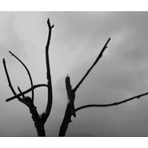

小林
============================

|  |  |
| :--: | :-- |
| [ 小林](https://i.xiami.com/tang100) | **地区**: China 中国大陆 **风格**: 管弦乐 Orchestral, 室内乐 / 重奏 Chamber Music, 独奏 Recital, 现代古典 Modern Classical **播放数**: 1241238 **粉丝数**: 197 **评论数**: 20  |

## 档案

## 专辑

| 名称 | 语种 | 唱片公司 | 发行时间 | 专辑类别 | 专辑风格 |
| :--: | :-- | :-- | :-- | :-- | :-- |
| [ 那个夏天](./albums/5020847762.md) | 纯音乐 | 独立发行 | 2020年06月09日 | 合集, 杂锦 | 轻音乐 Easy Listening, 独奏 Recital |
| [ Let's Dance](./albums/5020538932.md) | 纯音乐 | 独立发行 | 2020年05月08日 | 合集, 杂锦 | 轻音乐 Easy Listening, 室内乐 / 重奏 Chamber Music |
| [ 童年](./albums/2104423250.md) | 纯音乐 | 独立发行 | 2018年12月28日 | 合集, 杂锦 | 轻音乐 Easy Listening |

## 评论

|  |  |  |
| :-- | :-- | :-- |
|  [虾米用户](https://emumo.xiami.com/u/7627013) 考古，深度挖掘华语音乐 2020-06-22 13:54 赞(0) 踩(0) | 
自娱自乐
 |
|  [虾米用户](https://emumo.xiami.com/u/50093825) 。 2020-04-15 00:58 赞(0) 踩(0) | 
: )
 |
|  [虾米用户](https://emumo.xiami.com/u/92338104)   2019-09-18 01:19 赞(0) 踩(0) | 
这是什么神仙小可爱才能写出来的音乐呀
 |
|  [虾米用户](https://emumo.xiami.com/u/410396468)  2019-08-15 23:53 赞(0) 踩(0) | 
太厉害了。水墨画一般的展开，个体展开形象丰满
 |
|  [虾米用户](https://emumo.xiami.com/u/427385278) 只七 2019-07-16 21:59 赞(0) 踩(0) | 
期待下一个作品
 |
|  [虾米用户](https://emumo.xiami.com/u/427385278) 只七 2019-07-16 21:46 赞(0) 踩(0) | 
我是第96个点赞的哦
 |
|  [虾米用户](https://emumo.xiami.com/u/427385278) 只七 2019-07-16 21:45 赞(1) 踩(0) | 
谢谢你的音乐，让我听了心里难得的平静。从头到尾听了遍，感谢。
 |
|  [虾米用户](https://emumo.xiami.com/u/324879742)   2019-07-10 06:26 赞(0) 踩(0) | 
.
 |
|  [虾米用户](https://emumo.xiami.com/u/248267745) 你走出千万人群独行…… 2019-07-03 15:27 赞(0) 踩(0) | 
封面好熟悉 是几米童话吗
 |
| ⇒ |  [虾米用户](https://emumo.xiami.com/u/292981665)  2019-09-01 17:44 赞(0) 踩(0) | 
应该是几米的《微笑的鱼》
 |
|  [虾米用户](https://emumo.xiami.com/u/421150123)  2019-06-22 08:47 赞(0) 踩(0) | 
每首都很舒服 喜欢这样的曲子
 |
|  [虾米用户](https://emumo.xiami.com/u/256479516) 信则有。 2019-05-05 10:46 赞(0) 踩(0) | 
真棒加油呀～
 |
|  [虾米用户](https://emumo.xiami.com/u/345089981)  2019-04-12 15:05 赞(1) 踩(0) | 
虽然没收曲子都很简单，听后有被打动！
 |
|  [虾米用户](https://emumo.xiami.com/u/9693054) 3.1415926535 2019-03-23 07:05 赞(0) 踩(0) | 
真好
 |
|  [虾米用户](https://emumo.xiami.com/u/226778) 叩问圣谛真义，胸中万语千... 2019-02-25 08:25 赞(1) 踩(0) | 
可爱 真切 舒服
 |
|  [虾米用户](https://emumo.xiami.com/u/119903842) 声无哀乐 2017-10-22 21:58 赞(2) 踩(0) | 
我刚入驻了虾米音乐人，欢迎大家来我的个人主页，收听我的最新音乐
 |
| ⇒ |  [虾米用户](https://emumo.xiami.com/u/406693733)  2019-03-12 17:46 赞(0) 踩(0) | 
请问童年六首是谁的作品?
 |
| ⇒ |  [虾米用户](https://emumo.xiami.com/u/119903842) 声无哀乐 2019-03-13 10:57 赞(0) 踩(0) | 
<q><b>kelin说：</b></q>
 |
| ⇒ |  [虾米用户](https://emumo.xiami.com/u/406693733)  2019-03-13 22:58 赞(0) 踩(0) | 
<q><b>小林说：</b></q>
 |
| ⇒ |  [虾米用户](https://emumo.xiami.com/u/5752156) horse with n... 2019-07-02 14:51 赞(0) 踩(0) | 
好棒噢
 |
