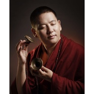
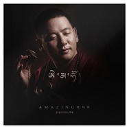
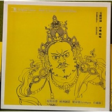
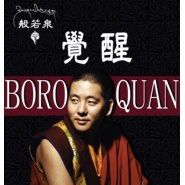
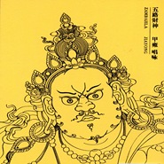

甲雍喇嘛
============================

|  |  |
| :--: | :-- |
| [ 甲雍喇嘛](https://i.xiami.com/jiayong) | **地区**: China 中国大陆 **风格**: 世界音乐 World Music, 宗教新世纪 Religionary New Age **播放数**: 862872 **粉丝数**: 421 **评论数**: 10  |

## 档案

甲雍  生于1982年。四川甘孜州道孚县玉科草原人。12岁时跟随恩师进行系统的佛学学习。1997年在恩师的亲自带领下前往四川德格佐钦五明佛学院学习佛学文化。 
2005年毕业于佐钦五明佛学院。 
2006年进入北京民族大学学习。 
2009年佛乐专辑《心灵的甘露》《菩提道》 
2010年佛乐专辑《觉醒》 
2014年佛乐专辑《五路财神》 
2017年佛乐专辑《哎玛吙》 
2016年认证为四川省甘孜州非物质文化遗产“梵音唱诵”者传承人 
2017年获得了美国The Akademia Music Awards 最佳唱诵歌曲奖 
Brief Introduction of Jia Yong 
Jia Yong was born in the Yuke grassland, Daofu County, Ganzi State, Sichuan Province of China in 1982. 
He followed his respected master and started the systematic learning of the Buddhism from the age of 12 years. 
Guided by his respecting master, Jia Yong studied Buddhist culture at Zuoqin Five Ming Buddhist College in Dege, Sichuan Province from 1997 to 2005. 
Jia Yong pursued advanced studies in Beijing University for Nationalities in 2006. 
Major works: 
The Buddhist music album in 2009 :《The Dew of the Mind》、《Lime Road》 
The Buddhist music album in 2010 :《Awakening》 
The Buddhist music album in 2014 :《The Five Jambhalas》 
Jia Yong was identified as the representative successor of Ganzi State, Sichuan Province Intangible Culture Heritage” Sanskrit Chanting” in 2016. 
《Heart Sutra》 in his new album, won the Best Chanting Song of the Akademia Music Awards of America in 2017.

## 专辑

| 名称 | 语种 | 唱片公司 | 发行时间 | 专辑类别 | 专辑风格 |
| :--: | :-- | :-- | :-- | :-- | :-- |
| [ 祈祷甲雍](./albums/2103460371.md) | 国语 | 独立发行 | 2017年12月19日 | 录音室专辑 | 流行 Pop |
| [ 莲师净土祈愿文佛乐](./albums/2102963136.md) | 藏语 | 独立发行 | 2017年11月16日 | 录音室专辑 | 摇滚 Rock & Roll |
| [ 般若泉甲雍](./albums/2102879332.md) | 国语 | 独立发行 | 2017年10月23日 | 录音室专辑 |  |
| [ 哎玛吙](./albums/2102878844.md) | 国语 | 独立发行 | 2017年05月05日 | EP, 单曲 | 佛教音乐 Buddhist Music |
| [ 五路财神 ཛཾ་ལྷ་རིགས་ལྔ།佛乐](./albums/2102879601.md) | 国语 | 独立发行 | 2014年10月15日 | EP, 单曲 | 世界音乐 World Music |
| [ 觉醒](./albums/2102878350.md) | 国语 | 独立发行 | 2014年05月09日 | 录音室专辑 | 佛教音乐 Buddhist Music |
| [ 五路财神](./albums/5021346181.md) | 其他 | 广东龙源音像有限公司 | 2014年02月01日 | EP, 单曲 | 世界音乐 World Music |

## 评论

|  |  |  |
| :-- | :-- | :-- |
|  [虾米用户](https://emumo.xiami.com/u/358104299) 悲观的唯心存在现实解构虚... 2021-01-15 04:49 赞(0) 踩(0) | 
46408
 |
|  [虾米用户](https://emumo.xiami.com/u/350421519) 我还没想好要写什么... 2020-10-15 07:55 赞(0) 踩(0) | 
 
 |
|  [虾米用户](https://emumo.xiami.com/u/424135973)  2019-08-24 20:23 赞(0) 踩(0) | 
一代高僧
 |
|  [虾米用户](https://emumo.xiami.com/u/37004446)  2019-04-06 04:37 赞(2) 踩(0) | 
只要听到甲雍上师的歌曲，心里就特别的安静。现在的时间是早上4.点29分……在我心里一直住着一位佛，那就是大慈大悲的观音菩萨。   
 |
|  [虾米用户](https://emumo.xiami.com/u/259859106) 阿弥陀佛 2018-10-22 19:55 赞(0) 踩(0) | 
喇嘛千诺 
 |
|  [虾米用户](https://emumo.xiami.com/u/251195534)  2018-07-22 13:38 赞(0) 踩(0) | 
一听到这首歌曲，内心突然有种感动，眼泪一下就流了下来，感恩 
 |
|  [虾米用户](https://emumo.xiami.com/u/346046233)  2018-04-12 21:17 赞(0) 踩(0) | 
顶礼上师！
 |
|  [虾米用户](https://emumo.xiami.com/u/32031632)  2017-11-03 20:29 赞(0) 踩(0) | 
南无阿弥佗佛
 |
|  [虾米用户](https://emumo.xiami.com/u/32031632)  2017-11-03 20:29 赞(0) 踩(0) | 
南无阿弥佗佛
 |
