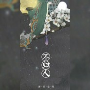

不归人
============================

|  |  |
| :--: | :-- |
| [ 不归人](https://emumo.xiami.com/album/2102884372) | **艺人**: [新乐尘符](../index.md) **语种**: 国语 **唱片公司**: 昌禾文化 **发行时间**: 2017年10月27日 **专辑类别**: EP, 单曲 **专辑风格**: 中国风 China-Wave **播放数**: 277266 **收藏数**: 174 **评论数**: 25  |

## 简介

  
一首抒情动人的中国风歌曲，整首歌曲讲述了女子苦等男子10年终于等到的故事。 女子的痴情绝恋让人感动，男子的弱水三千只取一瓢饮让人感慨，爱，便许你一生一世一双人。

## 曲目

## 评论

|  |  |  |  |
| :-- | :-- | :-- | :-- |
|  [虾米用户](https://emumo.xiami.com/u/276560484)  2019-12-09 11:21 赞(0) 踩(0) | 
大爱
 |
|  [虾米用户](https://emumo.xiami.com/u/341221401) 信念，一定要坚定，为了自... 2019-06-12 21:48 赞(0) 踩(0) | 
很深情
 |
|  [虾米用户](https://emumo.xiami.com/u/406694782)  2018-10-23 22:44 赞(0) 踩(0) | 
少司命的歌曲一直都是这么稳定的高质量
 |
|  [虾米用户](https://emumo.xiami.com/u/337145952)  2018-03-10 21:08 赞(0) 踩(0) | 
好听
 |
|  [虾米用户](https://emumo.xiami.com/u/339806280) 男神老婆♡ 2018-03-09 18:51 赞(0) 踩(0) | 
还好还好
 |
|  [虾米用户](https://emumo.xiami.com/u/333808180)  2018-03-04 11:30 赞(0) 踩(0) | 
好听
 |
|  [虾米用户](https://emumo.xiami.com/u/347598944)  2018-02-12 17:47 赞(0) 踩(0) | 
挺好听的啊
 |
|  [虾米用户](https://emumo.xiami.com/u/333904084)  2018-02-11 20:51 赞(0) 踩(0) | 
好听
 |
|  [虾米用户](https://emumo.xiami.com/u/11804174)  2018-01-28 23:27 赞(0) 踩(0) | 
很一般的古风歌，基本上听不会记在心上
 |
|  [虾米用户](https://emumo.xiami.com/u/345440727)  2018-01-19 16:05 赞(0) 踩(0) | 
还好。
 |
| ⇒ |  [虾米用户](https://emumo.xiami.com/u/346406107)  2018-01-26 12:29 赞(0) 踩(0) | 
好好听
 |
|  [虾米用户](https://emumo.xiami.com/u/345440727)  2018-01-19 16:04 赞(0) 踩(0) | 
不怎么好听。
 |
|  [虾米用户](https://emumo.xiami.com/u/285807736) 莫名其妙 2018-01-11 21:06 赞(0) 踩(0) | 
一般般
 |
|  [虾米用户](https://emumo.xiami.com/u/280087327) 人生的两种境界，痛而不言... 2017-11-28 08:22 赞(0) 踩(0) | 
真的处理的愈来愈好了
 |
|  [虾米用户](https://emumo.xiami.com/u/286687781) 混文圈和语C圈。QQ：1... 2017-11-25 16:51 赞(0) 踩(0) | 
虽然不高产了却很好听
 |
|  [虾米用户](https://emumo.xiami.com/u/240885407)  2017-11-05 23:21 赞(1) 踩(0) | 
      
 |
|  [虾米用户](https://emumo.xiami.com/u/280765846)  2017-11-04 19:28 赞(1) 踩(0) | 
                                   
 |
|  [虾米用户](https://emumo.xiami.com/u/34975588)  2017-11-04 10:17 赞(0) 踩(0) | 
已经迷上了小司的歌 
 |
|  [虾米用户](https://emumo.xiami.com/u/49930639)   2017-11-04 10:14 赞(0) 踩(0) | 
报个到
 |
|  [虾米用户](https://emumo.xiami.com/u/298352937)  2017-11-03 20:37 赞(0) 踩(0) | 
小司的歌，百听不厌  
 |
|  [虾米用户](https://emumo.xiami.com/u/307666004) 余音尽逸，乱我岿然。 2017-11-03 08:43 赞(0) 踩(0) | 
&amp;ldquo;悲欢不随己愿，随尔也。道是岁月蹉跎，你终不归，我终未醒矣。&amp;rdquo;个中意味，由人自悟，很喜欢这首歌。
 |
|  [虾米用户](https://emumo.xiami.com/u/294717220) 经过一些秋与冬… 2017-11-03 07:01 赞(0) 踩(0) | 
       
 |
|  [虾米用户](https://emumo.xiami.com/u/225219475) 喜欢 VR ,VR和風 ... 2017-11-03 00:33 赞(0) 踩(0) | 
 
 |
|  [虾米用户](https://emumo.xiami.com/u/223453997) 原来山海皆可平，难平是人... 2017-11-03 00:30 赞(0) 踩(0) | 
青衫竹簪一尘不染
 |
|  [虾米用户](https://emumo.xiami.com/u/47391339) 不经意等到心中爱情主角 2017-11-03 00:07 赞(0) 踩(0) | 
爱小司爱生活❤️
 |
