艾今口琴
============================

|  |  |
| :--: | :-- |
| [ 艾今口琴](https://i.xiami.com/aijin) | **地区**: China 中国大陆 **风格**: 器乐独奏 Solo Instrumental, 流行 Pop, 日本动漫游戏 Japanese ACG **播放数**: 426145 **粉丝数**: 190 **评论数**: 9  |

## 档案

B站/头条/好看视频：艾今口琴  第三届华夏口琴节半音阶冠军  学口琴关注人人讲：艾今口琴

## 专辑

| 名称 | 语种 | 唱片公司 | 发行时间 | 专辑类别 | 专辑风格 |
| :--: | :-- | :-- | :-- | :-- | :-- |
| [ 圣诞快乐劳伦斯先生口琴](./albums/5022272755.md) | 纯音乐 | 独立发行 | 2020年12月23日 | 录音室专辑 | 流行 Pop |
| [ 可可托海的牧羊人（纯音乐）口琴](./albums/5022220081.md) | 纯音乐 | 独立发行 | 2020年12月17日 | 录音室专辑 | 流行 Pop |
| [ 永远的满月](./albums/5022115230.md) | 纯音乐 | 独立发行 | 2020年12月06日 | 录音室专辑 | 同人音乐 DouJin |
| [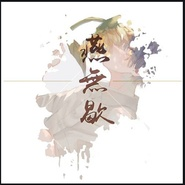 燕无歇](./albums/5022318023.md) | 纯音乐 | 独立发行 | 2020年12月01日 | 录音室专辑 | 流行 Pop |
| [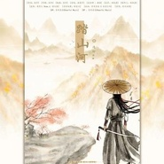 踏山河（口琴版）口琴](./albums/5022320515.md) | 纯音乐 | 独立发行 | 2020年11月01日 | 录音室专辑 | 流行 Pop |
| [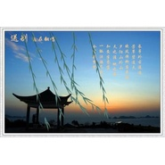 送别](./albums/5021274783.md) | 纯音乐 | 独立发行 | 2020年08月12日 | 录音室专辑 | 流行 Pop |
| [ memento 从零开始的异世界生活第二季2020七月动漫新番歌曲](./albums/5021279751.md) | 纯音乐 | 独立发行 | 2020年08月12日 | 录音室专辑 | 日本动漫游戏 Japanese ACG |
| [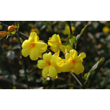 十送红军口琴](./albums/5021272603.md) | 纯音乐 | 独立发行 | 2020年08月11日 | 录音室专辑 | 流行 Pop |
| [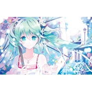 口琴 美丽之物美しきもの](./albums/5020904375.md) | 纯音乐 | 独立发行 | 2020年06月19日 | 录音室专辑 | 日本动漫游戏 Japanese ACG |
| [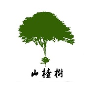 山楂树 口琴](./albums/5020906726.md) | 纯音乐 | 独立发行 | 2020年06月17日 | 录音室专辑 | 流行 Pop |
| [ 口琴 贝加尔湖畔](./albums/5020890117.md) | 纯音乐 | 独立发行 | 2020年06月12日 | 录音室专辑 | 流行 Pop |
| [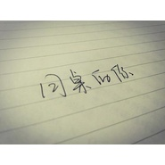 口琴 同桌的你](./albums/5020857449.md) | 纯音乐 | 独立发行 | 2020年06月11日 | 录音室专辑 | 校园民谣 Campus Folk |
| [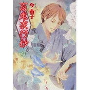 口琴 百鬼夜行抄](./albums/5020880556.md) | 纯音乐 | 独立发行 | 2020年06月11日 | 录音室专辑 | 轻音乐 Easy Listening |
| [ 口琴 500 miles](./albums/5020855916.md) | 纯音乐 | 独立发行 | 2020年06月10日 | 录音室专辑 | 欧美流行 Western Pop |
| [ 口琴 口琴 DANDAN心魅かれてく（渐渐被你吸引）](./albums/5020852207.md) | 纯音乐 | 独立发行 | 2020年06月09日 | 录音室专辑 | 日本动漫游戏 Japanese ACG |
| [ 口琴 一剪梅](./albums/5020862603.md) | 纯音乐 | 独立发行 | 2020年06月08日 | 录音室专辑 | 流行 Pop |
| [ 口琴 斯卡布罗集市](./albums/5020841615.md) | 纯音乐 | 独立发行 | 2020年06月07日 | 录音室专辑 | 流行 Pop |
| [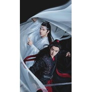 口琴 无羁](./albums/5020850057.md) | 纯音乐 | 独立发行 | 2020年06月07日 | 录音室专辑 | 流行 Pop |
| [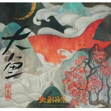 口琴 大鱼](./albums/5020838004.md) | 纯音乐 | 独立发行 | 2020年06月06日 | 录音室专辑 | 轻音乐 Easy Listening |
| [ 口琴 镇命歌](./albums/5020812961.md) | 纯音乐 | 独立发行 | 2020年06月06日 | 录音室专辑 | 日本动漫游戏 Japanese ACG |
| [ 口琴未闻花名secert base](./albums/5020814502.md) | 纯音乐 | 独立发行 | 2020年06月04日 | 录音室专辑 | 日本动漫游戏 Japanese ACG |
| [ paper hearts口琴版半音阶口琴](./albums/5020792475.md) | 纯音乐 | 独立发行 | 2020年06月04日 | 现场专辑 | 欧美流行 Western Pop |
| [ 星之所在 口琴半音阶口琴](./albums/5020793952.md) | 纯音乐 | 独立发行 | 2020年06月03日 | 录音室专辑 | 日本动漫游戏 Japanese ACG |
| [ 与你永在Always半音阶口琴](./albums/5020800793.md) | 纯音乐 | 独立发行 | 2020年06月03日 | 录音室专辑 | 日本动漫游戏 Japanese ACG |
| [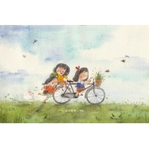 童年 口琴版半音阶口琴](./albums/5020795747.md) | 纯音乐 | 独立发行 | 2020年06月02日 | 录音室专辑 | 流行 Pop |
| [ 漫步人生路 口琴版半音阶口琴](./albums/5020791284.md) | 纯音乐 | 独立发行 | 2020年06月02日 | 录音室专辑 | 国语流行 Mandarin Pop |
| [ 千本樱 口琴版口琴](./albums/5020790679.md) | 纯音乐 | 独立发行 | 2020年06月01日 | 现场专辑 | 日本动漫游戏 Japanese ACG |
| [ 青鸟 口琴版半音阶口琴](./albums/5020795152.md) | 纯音乐 | 独立发行 | 2020年06月01日 | 现场专辑 | 日本动漫游戏 Japanese ACG |
| [ 掷弹兵进行曲半音阶口琴](./albums/5020584563.md) | 国语 | 独立发行 | 2020年05月11日 | EP, 单曲 | 流行 Pop |
| [ 你莫走（口琴版）口琴](./albums/5021470292.md) | 纯音乐 | 独立发行 | 2019年03月01日 | 录音室专辑 | 流行 Pop |
| [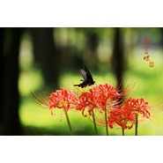 酒醉的蝴蝶](./albums/5021435654.md) | 国语 | 独立发行 | 不详 | 录音室专辑 | 流行 Pop |
| [ 钢铁洪流进行曲](./albums/5021569800.md) | 纯音乐 | 独立发行 | 不详 | 录音室专辑 | 流行 Pop |
| [ 喀秋莎 口琴](./albums/5020904176.md) | 纯音乐 | 独立发行 | 不详 | 录音室专辑 | 流行 Pop |
| [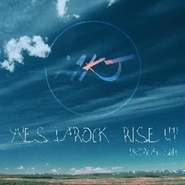 Time(official)-MKJ半音阶口琴](./albums/5020638672.md) | 国语 | 独立发行 | 不详 | EP, 单曲 | 轻音乐 Easy Listening |
| [ 漂洋过海来看你口琴](./albums/5021302026.md) | 纯音乐 | 独立发行 | 不详 | 录音室专辑 | 流行 Pop |
| [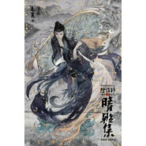 痴情冢](./albums/5022351000.md) | 纯音乐 | 独立发行 | 不详 | 录音室专辑 | 流行 Pop |
| [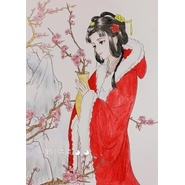 女儿情口琴](./albums/5021232888.md) | 纯音乐 | 独立发行 | 不详 | 录音室专辑 | 流行 Pop |
| [ 站在草原望北京口琴](./albums/5021958584.md) | 纯音乐 | 独立发行 | 不详 | 录音室专辑 | 流行 Pop |
| [ 捉泥鳅口琴](./albums/5021286330.md) | 纯音乐 | 独立发行 | 不详 | 录音室专辑 | 流行 Pop |
| [ 爱尔兰画眉](./albums/5021754586.md) | 纯音乐 | 独立发行 | 不详 | 录音室专辑 | 流行 Pop |
| [ 好汉歌](./albums/5021263587.md) | 纯音乐 | 独立发行 | 不详 | 录音室专辑 | 流行 Pop |
| [ 友谊地久天长](./albums/5021327492.md) | 纯音乐 | 独立发行 | 不详 | 录音室专辑 | 流行 Pop |
| [ 歌唱祖国](./albums/5021571822.md) | 纯音乐 | 独立发行 | 不详 | 录音室专辑 | 流行 Pop |
| [ 雨碎江南半音阶口琴](./albums/5020607549.md) | 国语 | 独立发行 | 不详 | EP, 单曲 | 轻音乐 Easy Listening |
| [ 泪蛋蛋掉在酒杯杯里口琴](./albums/5022224510.md) | 纯音乐 | 独立发行 | 不详 | 录音室专辑 | 流行 Pop |
| [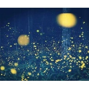 口琴 虫儿飞](./albums/5020959405.md) | 纯音乐 | 独立发行 | 不详 | 录音室专辑 | 流行 Pop |
| [ 青城山下白素贞口琴](./albums/5022268779.md) | 纯音乐 | 独立发行 | 不详 | 录音室专辑 | 流行 Pop |
| [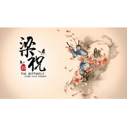 梁祝](./albums/5021819499.md) | 纯音乐 | 独立发行 | 不详 | 录音室专辑 | 流行 Pop |
| [ 口琴 莫斯科郊外的晚上](./albums/5020903669.md) | 纯音乐 | 独立发行 | 不详 | 录音室专辑 | 流行 Pop |
| [ 梦中的额吉口琴](./albums/5021237894.md) | 纯音乐 | 独立发行 | 不详 | 录音室专辑 | 流行 Pop |
| [ 渡月桥思君 口琴](./albums/5021163229.md) | 纯音乐 | 独立发行 | 不详 | 录音室专辑 | 日本动漫游戏 Japanese ACG |
| [ 口琴 上海滩](./albums/5020967833.md) | 纯音乐 | 独立发行 | 不详 | 录音室专辑 | 流行 Pop |
| [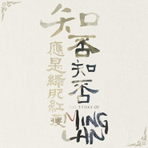 口琴 知否知否](./albums/5020999874.md) | 纯音乐 | 独立发行 | 不详 | 录音室专辑 | 流行 Pop |
| [ 但愿人长久](./albums/5021609965.md) | 纯音乐 | 独立发行 | 不详 | 录音室专辑 | 流行 Pop |
| [ 军中绿花 口琴](./albums/5021089183.md) | 纯音乐 | 独立发行 | 不详 | 录音室专辑 | 流行 Pop |
| [ 众神眷恋的幻想乡 口琴 东方project](./albums/5021042605.md) | 纯音乐 | 独立发行 | 不详 | 录音室专辑 | 流行 Pop |
| [ 在水一方](./albums/5021333916.md) | 纯音乐 | 独立发行 | 不详 | 录音室专辑 | 流行 Pop |
| [ 口琴 万水千山总是情](./albums/5020973616.md) | 纯音乐 | 独立发行 | 不详 | 录音室专辑 | 流行 Pop |
| [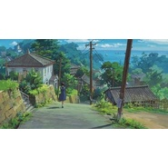 口琴 别了夏天](./albums/5020848900.md) | 纯音乐 | 独立发行 | 不详 | 录音室专辑 | 日本动漫游戏 Japanese ACG |
| [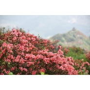 映山红 口琴](./albums/5021168505.md) | 纯音乐 | 独立发行 | 不详 | 录音室专辑 | 流行 Pop |
| [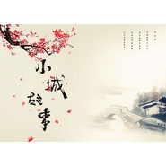 小城故事口琴](./albums/5021184575.md) | 纯音乐 | 独立发行 | 不详 | 录音室专辑 | 流行 Pop |
| [ 夕阳红](./albums/5021745406.md) | 纯音乐 | 独立发行 | 不详 | 录音室专辑 | 流行 Pop |
| [ 口琴 乡间的小路](./albums/5020980590.md) | 纯音乐 | 独立发行 | 不详 | 录音室专辑 | 民谣 Folk |
| [ Jingle bell口琴](./albums/5022286725.md) | 纯音乐 | 独立发行 | 不详 | 录音室专辑 | 流行 Pop |
| [ 南屏晚钟 口琴](./albums/5021065638.md) | 纯音乐 | 独立发行 | 不详 | 录音室专辑 | 流行 Pop |
| [ 口琴 三套车](./albums/5020905181.md) | 纯音乐 | 独立发行 | 不详 | 录音室专辑 | 流行 Pop |
| [ 十五的月亮口琴](./albums/5021297707.md) | 纯音乐 | 独立发行 | 不详 | 录音室专辑 | 流行 Pop |
| [ 青春舞曲](./albums/5021337827.md) | 纯音乐 | 独立发行 | 不详 | 录音室专辑 | 流行 Pop |
| [ 口琴 碎月](./albums/5020950605.md) | 纯音乐 | 独立发行 | 不详 | 录音室专辑 | 流行 Pop |
| [ 口琴 月亮代表我的心](./albums/5020934436.md) | 纯音乐 | 独立发行 | 不详 | 录音室专辑 | 流行 Pop |
| [ Anima 刀剑神域OP口琴](./albums/5021072987.md) | 纯音乐 | 独立发行 | 不详 | 录音室专辑 | 日本动漫游戏 Japanese ACG |
| [ 口琴 小螺号](./albums/5020963838.md) | 纯音乐 | 独立发行 | 不详 | 录音室专辑 | 流行 Pop |
| [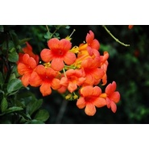 红莓花儿开口琴](./albums/5021302520.md) | 纯音乐 | 独立发行 | 不详 | 录音室专辑 | 流行 Pop |
| [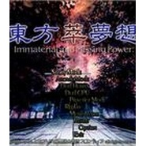 东方萃梦想口琴](./albums/5021317129.md) | 纯音乐 | 独立发行 | 不详 | 录音室专辑 | 日本动漫游戏 Japanese ACG |
| [ 口琴 我只在乎你](./albums/5020936910.md) | 纯音乐 | 独立发行 | 不详 | 录音室专辑 | 轻音乐 Easy Listening |
| [ 花儿与少年](./albums/5021344939.md) | 纯音乐 | 独立发行 | 不详 | 录音室专辑 | 中国民乐 Chinese Folk Music |
| [ 野蜂飞舞 口琴](./albums/5021010288.md) | 纯音乐 | 独立发行 | 不详 | 录音室专辑 | 古典音乐 Classical |
| [ 千年幻想乡 口琴](./albums/5021080763.md) | 纯音乐 | 独立发行 | 不详 | 录音室专辑 | 同人音乐 DouJin |
| [ 少女绮想曲东方project](./albums/5022045252.md) | 纯音乐 | 独立发行 | 不详 | 录音室专辑 | 同人音乐 DouJin |
| [ i will 刀剑神域ED口琴](./albums/5021078383.md) | 纯音乐 | 独立发行 | 不详 | 录音室专辑 | 日本动漫游戏 Japanese ACG |
| [ 毛委员和我们在一起](./albums/5021458992.md) | 纯音乐 | 独立发行 | 不详 | 录音室专辑 | 流行 Pop |
| [ 口琴 甜蜜蜜](./albums/5020979533.md) | 纯音乐 | 独立发行 | 不详 | 录音室专辑 | 流行 Pop |
| [ bad apple 口琴东方project](./albums/5021042712.md) | 纯音乐 | 独立发行 | 不详 | 录音室专辑 | 同人音乐 DouJin |
| [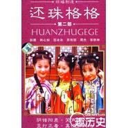 口琴 雨蝶](./albums/5020970669.md) | 纯音乐 | 独立发行 | 不详 | 录音室专辑 | 流行 Pop |
| [ 暮色苍然东方project](./albums/5021940936.md) | 纯音乐 | 独立发行 | 不详 | 录音室专辑 | 日本动漫游戏 Japanese ACG |
| [ 竹取飞翔 口琴东方永夜抄](./albums/5021125530.md) | 纯音乐 | 独立发行 | 不详 | 录音室专辑 | 同人音乐 DouJin |
| [ 虽然歌声无形 口琴歌に形はないけれど口琴](./albums/5021054342.md) | 纯音乐 | 独立发行 | 不详 | 录音室专辑 | 日本动漫游戏 Japanese ACG |
| [ 音乐之声do re mi](./albums/5021763513.md) | 纯音乐 | 独立发行 | 不详 | 录音室专辑 | 流行 Pop |
| [ 飘上月球，不死之烟 口琴东方project](./albums/5021122482.md) | 纯音乐 | 独立发行 | 不详 | 录音室专辑 | 同人音乐 DouJin |
| [ 口琴 送我一支玫瑰花](./albums/5021042733.md) | 纯音乐 | 独立发行 | 不详 | 录音室专辑 | 流行 Pop |
| [ 红楼 Eastern Dream口琴](./albums/5021225226.md) | 纯音乐 | 独立发行 | 不详 | 录音室专辑 | 日本动漫游戏 Japanese ACG |
| [ letter song 口琴](./albums/5021049757.md) | 纯音乐 | 独立发行 | 不详 | 录音室专辑 | 日本动漫游戏 Japanese ACG |
| [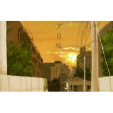 夕日坂 口琴](./albums/5021053076.md) | 纯音乐 | 独立发行 | 不详 | 录音室专辑 | 日本动漫游戏 Japanese ACG |
| [ 稲田姫様に叱られるから 东方project口琴](./albums/5021294936.md) | 纯音乐 | 独立发行 | 不详 | 录音室专辑 | 同人音乐 DouJin |
| [ 童祭 口琴](./albums/5021060572.md) | 纯音乐 | 独立发行 | 不详 | 录音室专辑 | 同人音乐 DouJin |
| [ 梦消失口琴](./albums/5022311898.md) | 纯音乐 | 独立发行 | 不详 | 录音室专辑 | 同人音乐 DouJin |
| [ 墨染的樱 东方project](./albums/5021347295.md) | 纯音乐 | 独立发行 | 不详 | 录音室专辑 | 同人音乐 DouJin |
| [ 心之所在 东方project](./albums/5021507818.md) | 纯音乐 | 独立发行 | 不详 | 录音室专辑 | 同人音乐 DouJin |
| [ 月明かりの宴口琴](./albums/5021312185.md) | 纯音乐 | 独立发行 | 不详 | 录音室专辑 | 日本动漫游戏 Japanese ACG |
| [ 口琴 天狗舞踏会东方project](./albums/5021044216.md) | 纯音乐 | 独立发行 | 不详 | 录音室专辑 | 流行 Pop |
| [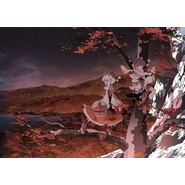 绯想天 东方project](./albums/5021836545.md) | 纯音乐 | 独立发行 | 不详 | 录音室专辑 | 同人音乐 DouJin |
| [ 狂气之瞳 口琴](./albums/5021179720.md) | 纯音乐 | 独立发行 | 不详 | 录音室专辑 | 同人音乐 DouJin |
| [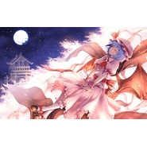 故乡之星，倒映之海](./albums/5021662473.md) | 纯音乐 | 独立发行 | 不详 | 录音室专辑 | 同人音乐 DouJin |
| [ 康定情歌](./albums/5021339279.md) | 纯音乐 | 独立发行 | 不详 | 录音室专辑 | 流行 Pop |

## 评论

|  |  |  |
| :-- | :-- | :-- |
|  [虾米用户](https://emumo.xiami.com/u/347793445) 爱玩mc的90后晚期病娇... 2020-10-25 16:05 赞(1) 踩(0) | 
有好多东方的【激动(&amp;gt;^&amp;omega;^&amp;lt;)】
 |
|  [虾米用户](https://emumo.xiami.com/u/320344079) 想你 2020-10-23 22:12 赞(0) 踩(0) | 
来首寂静之声 谢谢
 |
|  [虾米用户](https://emumo.xiami.com/u/282637250)  2020-10-11 17:46 赞(1) 踩(0) | 
都很好听！加油 
 |
|  [虾米用户](https://emumo.xiami.com/u/444831445)  2020-09-05 17:26 赞(2) 踩(0) | 
伴奏怎么弄得，姐姐，我也想要
 |
|  [虾米用户](https://emumo.xiami.com/u/222453402) 自命不凡 2019-10-26 15:44 赞(1) 踩(0) | 
很厉害
 |
|  [虾米用户](https://emumo.xiami.com/u/80910240) 这家伙更聪明，只留下了这... 2019-07-22 14:12 赞(1) 踩(0) | 
你好，很好听 
 |
|  [虾米用户](https://emumo.xiami.com/u/353491527) 狮子座的羔羊…… 2018-09-16 17:05 赞(0) 踩(0) | 
好听好听，支持你。
 |
| ⇒ |  [虾米用户](https://emumo.xiami.com/u/328626339) B站/今日头条：艾今口琴 2018-09-18 23:50 赞(0) 踩(0) | 
谢谢
 |
|  [虾米用户](https://emumo.xiami.com/u/328626339) B站/今日头条：艾今口琴 2017-11-04 17:59 赞(1) 踩(0) | 
我刚入驻了虾米音乐人，欢迎大家来我的个人主页，收听我的最新音乐
 |
