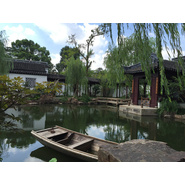

潇敏
============================

|  |  |
| :--: | :-- |
| [ 潇敏](https://i.xiami.com/xiaominmusic) | **播放数**: 643954 **粉丝数**: 52 **评论数**: 2 **地区**: China 中国大陆 **风格**: 国语流行 Mandarin Pop  |

## 档案

詹启敏，北京大学教授，医学专业，喜爱科学和艺术。人生体会：科学与艺术在巅握手。

## 专辑

| 名称 | 语种 | 唱片公司 | 发行时间 | 专辑类别 | 专辑风格 |
| :--: | :-- | :-- | :-- | :-- | :-- |
| [ 芳华岁月](./albums/2104840892.md) | 国语 | 青春繁花 | 2019年05月06日 | EP, 单曲 | 国语流行 Mandarin Pop |
| [ 今夜校园无眠](./albums/2104642325.md) | 国语 | 独立发行 | 2018年07月09日 | EP, 单曲 |  |
| [ 家乡灯光](./albums/2104642330.md) | 国语 | 独立发行 | 2018年02月11日 | EP, 单曲 |  |
| [ 天边（Cover 布仁巴雅尔）](./albums/2103499043.md) | 国语 | 独立发行 | 2018年01月23日 | 录音室专辑 | 流行 Pop, 国语流行 Mandarin Pop |
| [ 爱让星光璀璨](./albums/2104642322.md) | 国语 | 腾研国际 | 2018年01月07日 | EP, 单曲 |  |
| [ 再闻涛声](./albums/2102944275.md) | 国语 | 独立发行 | 2017年11月18日 | 录音室专辑 | 国语流行 Mandarin Pop |
| [ 伊人如水（Cover 汤非）](./albums/2102956240.md) | 国语 | 独立发行 | 2017年09月06日 | 录音室专辑 | 国语流行 Mandarin Pop |
| [ 鸿雁（Cover 呼斯楞）](./albums/2102956245.md) | 国语 | 独立发行 | 2017年08月18日 | 录音室专辑 | 国语流行 Mandarin Pop |
| [ 雁南飞（Cover 单秀荣）](./albums/2102956242.md) | 国语 | 独立发行 | 2017年08月18日 | 录音室专辑 | 国语流行 Mandarin Pop |
| [ 茉莉花](./albums/2102956247.md) | 国语 | 独立发行 | 2017年07月29日 | 录音室专辑 | 国语流行 Mandarin Pop |
| [ 城里的月光（Cover 许美静）](./albums/2102956248.md) | 国语 | 独立发行 | 2017年07月29日 | 录音室专辑 | 国语流行 Mandarin Pop |
| [ 问月（Cover 武艺）](./albums/2102956250.md) | 国语 | 独立发行 | 2017年07月19日 | 录音室专辑 | 国语流行 Mandarin Pop |
| [ 涛声依旧（Cover 毛宁）](./albums/2102956255.md) | 国语 | 独立发行 | 2017年07月11日 | 录音室专辑 | 国语流行 Mandarin Pop |
| [ 狼图腾（Cover 汤非）](./albums/2102956259.md) | 国语 | 独立发行 | 2017年07月11日 | 录音室专辑 | 国语流行 Mandarin Pop |
| [ 青春记忆](./albums/2102956192.md) | 国语 | 独立发行 | 2017年07月02日 | 录音室专辑 | 国语流行 Mandarin Pop |
| [ 医者之美](./albums/2102956195.md) | 国语 | 独立发行 | 2017年05月10日 | 录音室专辑 | 国语流行 Mandarin Pop |
| [ 天使的身影](./albums/2102956185.md) | 国语 | 独立发行 | 2016年11月22日 | 录音室专辑 | 国语流行 Mandarin Pop |
| [ 录取通知书](./albums/2102956189.md) | 国语 | 独立发行 | 2016年09月22日 | 录音室专辑 | 国语流行 Mandarin Pop |
| [ 同窗之谊是没有血缘的亲情](./albums/2102956228.md) | 国语 | 独立发行 | 2016年07月02日 | 录音室专辑 | 国语流行 Mandarin Pop |

## 评论

|  |  |  |  |
| :-- | :-- | :-- | :-- |
|  [虾米用户](https://emumo.xiami.com/u/319243709) 清新呼吸，云游霄外 2018-12-30 18:58 赞(3) 踩(0) | 
德才艺皆佳，人生赢家啊！
 |
