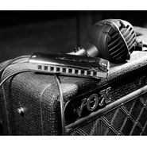
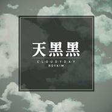

蓝馍馍
============================

|  |  |
| :--: | :-- |
| [ 蓝馍馍](https://i.xiami.com/myblues1314) | **地区**: China 中国大陆 **风格**: 流行 Pop, 摇滚 Rock & Roll, 硬摇滚 Hard Rock, 放克 Funk, 爵士 Jazz **播放数**: 1740551 **粉丝数**: 481 **评论数**: 43  |

## 档案

蓝馍馍(杜卜): 
18年获全亚洲十孔独奏总冠军 
19年华夏口琴节受邀评委 
布鲁斯口琴手,创作型乐手,有着丰富的即兴演奏经验,擅长蓝调,摇滚,放克,爵士,流行,民谣等各种音乐风格. 
2018年受邀湖南卫视歌手栏目组助演菲律宾女歌手kz谭定安. 
多次受邀电视台栏目组录制口琴伴奏. 
现于国内最大的口琴销售团队小海盗de口琴舰队中担任首席讲师及调琴师等职务.同时也在不断的创新自己的音乐风格及作品.

## 专辑

| 名称 | 语种 | 唱片公司 | 发行时间 | 专辑类别 | 专辑风格 |
| :--: | :-- | :-- | :-- | :-- | :-- |
| [ 2020圣诞快乐](./albums/5022182478.md) | 纯音乐 | 独立发行 | 2020年12月15日 | EP, 单曲 | 流行 Pop |
| [ 僕の戦争TV动画《进击的巨人 op我的战争》十孔口琴版](./albums/5022187020.md) | 纯音乐 | 独立发行 | 2020年12月13日 | EP, 单曲 | 日本动漫游戏 Japanese ACG |
| [ 海底（十孔口琴）](./albums/5022108927.md) | 纯音乐 | 独立发行 | 2020年12月06日 | EP, 单曲 | 流行 Pop |
| [ unravel（東京喰種op）口琴版](./albums/5022117105.md) | 纯音乐 | 独立发行 | 2020年12月05日 | EP, 单曲 | 日本动漫游戏 Japanese ACG |
| [ 幻化成风（小手拉大手）十孔口琴](./albums/5022048443.md) | 纯音乐 | 独立发行 | 2020年11月29日 | EP, 单曲 | 日本动漫游戏 Japanese ACG |
| [ Hotel California加州旅馆（十孔口琴）](./albums/5021768291.md) | 纯音乐 | 独立发行 | 2020年10月27日 | EP, 单曲 | 流行摇滚 Pop Rock |
| [ 星之所在（十孔口琴）](./albums/5021766147.md) | 纯音乐 | 独立发行 | 2020年10月26日 | EP, 单曲 | 日本动漫游戏 Japanese ACG |
| [ 深海少女（十孔口琴）](./albums/5021671778.md) | 纯音乐 | 独立发行 | 2020年10月14日 | EP, 单曲 | 同人音乐 DouJin |
| [ 往后余生（十孔口琴）](./albums/5021657611.md) | 国语 | 独立发行 | 2020年10月10日 | EP, 单曲 | 流行 Pop, 城市民谣 Urban Folk |
| [ One more time, One more chance十孔口琴秒速五厘米主题曲](./albums/5021624488.md) | 日语 | 独立发行 | 2020年10月07日 | EP, 单曲 | 流行 Pop, 同人音乐 DouJin |
| [ 小幸运（十孔口琴）我的少女时代口琴版](./albums/5021625178.md) | 国语 | 独立发行 | 2020年10月04日 | EP, 单曲 | 青少年流行 Teen Pop, 流行 Pop |
| [ 혜화동惠化洞（双门洞）口琴版请回答1988主题曲](./albums/5021610531.md) | 纯音乐 | 独立发行 | 2020年10月03日 | EP, 单曲 | 民谣流行 Folk Pop, 韩国流行 K-Pop |
| [ 海滩](./albums/5021597731.md) | 纯音乐 | 独立发行 | 2020年10月02日 | EP, 单曲 | 民谣流行 Folk Pop, 轻音乐 Easy Listening |
| [ 凯旋](./albums/5021441964.md) | 纯音乐 | 独立发行 | 2020年09月11日 | EP, 单曲 | 流行 Pop, 中国民乐 Chinese Folk Music |
| [ 《你的名字》口琴版合辑](./albums/2105628392.md) | 国语 | 独立发行 | 2019年12月25日 | 录音室专辑 | 同人音乐 DouJin, 器乐独奏 Solo Instrumental |
| [ steve baker口琴教程翻录(第三部)](./albums/2105381869.md) | 国语 |  | 2019年10月27日 | 录音室专辑 | 浩室舞曲 House, 灵魂乐 Soul, 当代蓝草 Contemporary Bluegrass |
| [ Blues Bun](./albums/2104844525.md) | 国语 | 独立发行 | 2019年05月06日 | 录音室专辑 | 布鲁斯 Blues |
| [ 过客](./albums/2103591955.md) | 国语 | 独立发行 | 2018年03月01日 | EP, 单曲 | 国语流行 Mandarin Pop, 当代民谣 Contemporary Folk, 城市民谣 Urban Folk |
| [ 谁说口琴不摇滚](./albums/2103591938.md) | 国语 | 独立发行 | 2018年03月01日 | 录音室专辑 | 摇滚 Rock & Roll, 流行摇滚 Pop Rock |
| [ Steve baker口琴教程翻录(第二部)](./albums/2103468210.md) | 国语 | 独立发行 | 2018年01月01日 | 录音室专辑 | 布鲁斯 Blues |
| [ First](./albums/2103503838.md) | 国语 | 独立发行 | 2018年01月01日 | 精选集 | 摇滚 Rock & Roll, 节奏布鲁斯 R&B |
| [ 流行口琴曲精选集](./albums/2102965997.md) | 国语 | 独立发行 | 2017年12月03日 | 录音室专辑 | 流行 Pop, 国语流行 Mandarin Pop, 欧美流行 Western Pop |
| [ ACG口琴动漫曲目集](./albums/2102966003.md) | 国语 | 独立发行 | 2017年12月03日 | 录音室专辑 | 日本动漫游戏 Japanese ACG, 轻音乐 Easy Listening |
| [ 电声口琴精选集最狂野,最炫酷的口琴声音在这里!](./albums/2102966018.md) | 国语 | 独立发行 | 2017年12月03日 | 录音室专辑 | 硬摇滚 Hard Rock, 电声布鲁斯 Electric Blues, 摇滚 Rock & Roll |
| [ 蓝调口琴手机短信铃声集属于你的个性口琴铃声](./albums/2102965811.md) | 国语 | 独立发行 | 2017年12月02日 | 录音室专辑 | 爵士流行 Jazz Pop, 原声布鲁斯 Acoustic Blues |
| [ Steve baker口琴教程翻录(第一部)致敬经典!](./albums/2102963115.md) | 其他 | 独立发行 | 2017年11月29日 | 录音室专辑 | 摇滚 Rock & Roll, 布鲁斯 Blues, 乡村 Country |
| [ Hard blues蓝调口琴原创专辑](./albums/2102961522.md) | 纯音乐 | 独立发行 | 2017年11月27日 | 录音室专辑 | 摇滚 Rock & Roll, 电声布鲁斯 Electric Blues, 爵士 Jazz |
| [ The Sound of Silence寂静之声（十孔口琴）](./albums/5021699188.md) | 纯音乐 | 独立发行 | 不详 | EP, 单曲 | 流行 Pop, 民谣 Folk |
| [ 左手指月（十孔口琴）](./albums/5021705093.md) | 纯音乐 | 独立发行 | 不详 | EP, 单曲 | 流行 Pop |
| [ 廻廻奇譚（TV动画《咒术回战》OP十孔口琴）](./albums/5021909244.md) | 纯音乐 | 独立发行 | 不详 | EP, 单曲 | 日本动漫游戏 Japanese ACG |
| [ 杀死那个石家庄人（十孔口琴）](./albums/5022224474.md) | 纯音乐 | 独立发行 | 不详 | EP, 单曲 | 民谣 Folk |
| [ 口是心非（十孔口琴）](./albums/5021725964.md) | 纯音乐 | 独立发行 | 不详 | EP, 单曲 | 流行 Pop |
| [ You Raise Me Up 你鼓舞了我（十孔口琴）](./albums/5021870681.md) | 纯音乐 | 独立发行 | 不详 | EP, 单曲 | 流行 Pop |
| [ 一生所爱（十孔口琴）](./albums/5022172945.md) | 纯音乐 | 独立发行 | 不详 | EP, 单曲 | 流行 Pop |
| [ 离家五百里 500miles（十孔口琴）](./albums/5021985707.md) | 纯音乐 | 独立发行 | 不详 | EP, 单曲 | 民谣 Folk |
| [ 成都（十孔口琴）](./albums/5022129502.md) | 纯音乐 | 独立发行 | 不详 | EP, 单曲 | 民谣 Folk |
| [ 魔鬼中的天使（十孔口琴）](./albums/5021825053.md) | 纯音乐 | 独立发行 | 不详 | EP, 单曲 | 流行 Pop |
| [ Legends Never Die（英雄联盟主题曲口琴版）](./albums/5021735383.md) | 纯音乐 | 独立发行 | 不详 | EP, 单曲 | 摇滚 Rock & Roll |
| [ Blue Drag（十孔口琴）](./albums/5021831569.md) | 纯音乐 | 独立发行 | 不详 | EP, 单曲 | 布鲁斯 Blues, 爵士 Jazz |
| [ 天黑黑（十孔口琴）](./albums/5021733720.md) | 纯音乐 | 独立发行 | 不详 | EP, 单曲 | 流行 Pop |
| [ 归去来兮（十孔口琴）](./albums/5022310920.md) | 纯音乐 | 独立发行 | 不详 | EP, 单曲 | 流行 Pop |
| [ La Partida（十孔口琴）](./albums/5022297757.md) | 纯音乐 | 独立发行 | 不详 | EP, 单曲 | 爵士 Jazz |
| [ Hit The Road Jack（十孔口琴c调9把位）](./albums/5022126840.md) | 纯音乐 | 独立发行 | 不详 | EP, 单曲 | 节奏布鲁斯 R&B |
| [ La Partida（十孔口琴）](./albums/5022300267.md) | 纯音乐 | 独立发行 | 不详 | EP, 单曲 | 爵士 Jazz |
| [ La Partida（十孔口琴）](./albums/5022293295.md) | 纯音乐 | 独立发行 | 不详 | EP, 单曲 | 爵士 Jazz |

## 评论

|  |  |  |
| :-- | :-- | :-- |
|  [虾米用户](https://emumo.xiami.com/u/433988980)  2020-06-18 11:59 赞(2) 踩(0) | 
发现新世纪
 |
|  [虾米用户](https://emumo.xiami.com/u/346460025) 音乐是时间和力量的艺术 2020-04-13 15:53 赞(3) 踩(0) | 
比人声版更有感染力，感动了！
 |
|  [虾米用户](https://emumo.xiami.com/u/428494748)  2020-03-16 23:12 赞(1) 踩(0) | 
我是你的新粉，您能把那几首摇滚版的口琴谱发一下吗？
 |
|  [虾米用户](https://emumo.xiami.com/u/335696865)  2020-03-15 12:53 赞(1) 踩(0) | 
请问哪里加入组织呢
 |
|  [虾米用户](https://emumo.xiami.com/u/335696865)  2020-03-15 12:52 赞(1) 踩(0) | 
请问有群吗
 |
|  [虾米用户](https://emumo.xiami.com/u/335696865)  2020-02-28 11:13 赞(1) 踩(0) | 
穿越时空的思念太棒了
 |
|  [虾米用户](https://emumo.xiami.com/u/434996683) 路越远 心越近 2020-02-13 20:02 赞(1) 踩(0) | 
你的答案 谱子哪里有呢！听您这个口琴版太好听了，今天在TB的小海盗de口琴舰队 买了一个布鲁斯口琴 开始学习 
 |
| ⇒ |  [虾米用户](https://emumo.xiami.com/u/285888377) 谢谢大家一直以来的支持，... 2020-02-19 15:11 赞(0) 踩(0) | 
百度可以搜到这首歌的谱子哦
 |
|  [虾米用户](https://emumo.xiami.com/u/434996683) 路越远 心越近 2020-02-13 08:08 赞(0) 踩(0) | 
怎么找不到群
 |
| ⇒ |  [虾米用户](https://emumo.xiami.com/u/285888377) 谢谢大家一直以来的支持，... 2020-02-13 19:23 赞(0) 踩(0) | 
是qq群，可以找到的
 |
| ⇒ |  [虾米用户](https://emumo.xiami.com/u/434996683) 路越远 心越近 2020-02-13 19:53 赞(0) 踩(0) | 
<q><b>蓝馍馍说：</b></q>
 |
| ⇒ |  [虾米用户](https://emumo.xiami.com/u/285888377) 谢谢大家一直以来的支持，... 2020-02-19 15:12 赞(0) 踩(0) | 
<q><b>跑在路上73说：</b></q>
 |
| ⇒ |  [虾米用户](https://emumo.xiami.com/u/335696865)  2020-03-15 12:53 赞(0) 踩(0) | 
<q><b>蓝馍馍说：</b></q>
 |
|  [虾米用户](https://emumo.xiami.com/u/260758019) Don't stop i... 2019-10-30 11:28 赞(1) 踩(0) | 
不一样的摇滚
 |
|  [虾米用户](https://emumo.xiami.com/u/420781032)  2019-09-09 19:40 赞(1) 踩(0) | 
你好，我是你的新粉，请多多关照！
 |
| ⇒ |  [虾米用户](https://emumo.xiami.com/u/285888377) 谢谢大家一直以来的支持，... 2019-09-18 18:09 赞(0) 踩(0) | 
一起加油哦  
 |
|  [虾米用户](https://emumo.xiami.com/u/35639860) 生于90‘s 活在40’ 2019-08-29 01:18 赞(1) 踩(0) | 
小海盗de舰队买家前来报到 
 |
|  [虾米用户](https://emumo.xiami.com/u/424777142)  2019-07-26 09:17 赞(1) 踩(0) | 
238粉丝报到，今天被推送大鱼，真好听(ง •̀_•́)ง，于是开听所有作品
 |
| ⇒ |  [虾米用户](https://emumo.xiami.com/u/285888377) 谢谢大家一直以来的支持，... 2019-07-26 18:27 赞(0) 踩(0) | 
面粉家族欢迎你  
 |
|  [虾米用户](https://emumo.xiami.com/u/410141714)  2019-06-27 21:32 赞(1) 踩(0) | 
听卡农突然好感动 ，你好有恩赐  ，造物主好伟大   
 |
| ⇒ |  [虾米用户](https://emumo.xiami.com/u/285888377) 谢谢大家一直以来的支持，... 2019-07-06 08:42 赞(0) 踩(0) | 
谢谢您的高度评价 
 |
|  [虾米用户](https://emumo.xiami.com/u/410141714)  2019-06-27 21:28 赞(1) 踩(0) | 

 |
|  [虾米用户](https://emumo.xiami.com/u/9492026)  2019-01-14 08:18 赞(0) 踩(0) | 
哎呀，小海盗 
 |
|  [虾米用户](https://emumo.xiami.com/u/326165803) 我还没想好要写什么... 2018-11-16 22:16 赞(0) 踩(0) | 
号
 |
|  [虾米用户](https://emumo.xiami.com/u/326165803) 我还没想好要写什么... 2018-11-09 15:53 赞(2) 踩(0) | 
赞一个
 |
|  [虾米用户](https://emumo.xiami.com/u/81911204) 兽系青年 2018-10-01 20:37 赞(2) 踩(0) | 
好酷啊 
 |
|  [虾米用户](https://emumo.xiami.com/u/379194678) 我还没想好要写什么... 2018-07-20 19:45 赞(2) 踩(0) | 
技艺娴熟表现力丰富[强]
 |
|  [虾米用户](https://emumo.xiami.com/u/285888377) 谢谢大家一直以来的支持，... 2018-07-16 08:47 赞(0) 踩(0) | 
啥时候粉丝能过百额...
 |
| ⇒ |  [虾米用户](https://emumo.xiami.com/u/260758019) Don't stop i... 2019-05-16 11:33 赞(0) 踩(0) | 
快了 +1
 |
|  [虾米用户](https://emumo.xiami.com/u/346497536) 小伙子，不要迷恋女人 2018-07-11 19:50 赞(2) 踩(0) | 
第93个粉丝
 |
|  [虾米用户](https://emumo.xiami.com/u/333836970) 风不失期，君不失期，奔波... 2018-06-16 22:50 赞(0) 踩(0) | 
第90个粉丝。。。。
 |
| ⇒ |  [虾米用户](https://emumo.xiami.com/u/285888377) 谢谢大家一直以来的支持，... 2018-06-19 20:05 赞(0) 踩(0) | 
感谢关注支持  
 |
|  [虾米用户](https://emumo.xiami.com/u/346010843) 早困早起 2018-06-05 23:42 赞(1) 踩(0) | 
顶
 |
|  [虾米用户](https://emumo.xiami.com/u/1668119) 我还没想好要写什么... 2018-05-30 23:49 赞(0) 踩(0) | 
听一首枪，不错
 |
|  [虾米用户](https://emumo.xiami.com/u/13190774) Waiting 2018-02-23 18:05 赞(1) 踩(0) | 
我也来凑个热闹，很久前的半音阶口琴被翻出来了
 |
|  [虾米用户](https://emumo.xiami.com/u/7424327) 心开天籁乱弹琴 2018-01-28 14:54 赞(0) 踩(0) | 
真不错
 |
|  [虾米用户](https://emumo.xiami.com/u/94968358)   2018-01-28 04:00 赞(0) 踩(0) | 
⬆️
 |
|  [虾米用户](https://emumo.xiami.com/u/339295098)  2017-12-09 22:55 赞(0) 踩(0) | 
资深老粉丝排队
 |
|  [虾米用户](https://emumo.xiami.com/u/32494863)  2017-12-01 13:02 赞(1) 踩(0) | 
我是第十个粉
 |
|  [虾米用户](https://emumo.xiami.com/u/43062964)  2017-11-27 23:03 赞(0) 踩(0) | 
顶
 |
|  [虾米用户](https://emumo.xiami.com/u/82307302)   2017-11-27 14:26 赞(1) 踩(0) | 
赶紧过来粉 
 |
| ⇒ |  [虾米用户](https://emumo.xiami.com/u/285888377) 谢谢大家一直以来的支持，... 2017-11-27 17:00 赞(0) 踩(0) | 
嘿嘿
 |
|  [虾米用户](https://emumo.xiami.com/u/285888377) 谢谢大家一直以来的支持，... 2017-11-27 14:13 赞(1) 踩(0) | 
希望大家多多支持,多多转发~~~
 |
