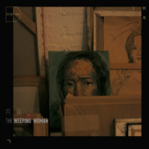
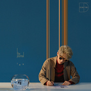

丁世光
============================

|  |  |
| :--: | :-- |
| [ 丁世光](https://i.xiami.com/deanting) | **播放数**: 2519463 **粉丝数**: 1911 **评论数**: 93 **地区**: China 中国大陆 **风格**: 节奏布鲁斯 R&B, 放克 Funk, 灵魂乐 Soul, 流行 Pop  |

## 档案

中文名：丁世光    外文名：Dean Ting    国籍：中国     民族：朝鲜族    星座：白羊座    出生地：黑龙江省哈尔滨市    出生日期：1981年4月18日    毕业院校：哈尔滨商业大学       中国内地男歌手、词曲创作人、音乐制作人。       2005年，为陶喆个人专辑《太平盛世》中的歌曲《Catherine》作曲，并正式开始个人音乐生涯。       2006年，为周笔畅个人专辑《谁动了我的琴弦》中的歌曲《毒蘑菇》作曲。       2007年，担任歌曲《相信爱情》的谱曲人，该歌曲由周笔畅演唱。       2008年，为林宥嘉创作歌曲《爱情是圆的》。       2009年，为林宥嘉演唱的歌曲《心酸》谱曲。       2010年，担任百威K歌之王争霸赛广东赛区、华南总决赛的评委； 5月，为赵慧仙、于朦胧演唱的歌曲《纵身一跃》作曲。       2012年11月16日，为SHE演唱的歌曲《亲爱的树洞》谱曲。       2017年12月1日，推出个人首张EP《Night & Day》，EP包含《爱在什么地方都有》和《神探》两首故事相连的单曲；12月8日，推出单曲《如果我们当时一起会怎么样》；12月12日，推出单曲《不散的筵席》；12月25日，推出首张个人音乐专辑《神经志》，收录了包括《Simon》、《神探》等在内的12首歌曲。       2018年11月，丁世光加盟太合音乐集团；12月24日，为尹毓恪谱曲的歌曲《虚言》发行。       2019年12月25日，推出第二张个人音乐专辑《实况电影》，收录了包括《起源》、《好的一天》等在内的11首歌曲。

## 专辑

| 名称 | 语种 | 唱片公司 | 发行时间 | 专辑类别 | 专辑风格 |
| :--: | :-- | :-- | :-- | :-- | :-- |
| [ The Same World](./albums/5020678810.md) | 国语 |  | 2020年05月22日 | EP, 单曲 | 流行 Pop |
| [ 实况电影THE SCRIPT OF DESTINY](./albums/2105631481.md) | 国语 | 太合麦田 | 2019年12月25日 | 录音室专辑 | 国语流行 Mandarin Pop |
| [ 月食The Weeping Woman](./albums/2104627672.md) | 国语 | 太合麦田 | 2018年12月25日 | EP, 单曲 | 国语流行 Mandarin Pop, 当代节奏布鲁斯 Contemporary R&B, 节奏布鲁斯 R&B |
| [ 神经志The Journal](./albums/2102975253.md) | 国语 | 索雅音乐 | 2017年12月25日 | 录音室专辑 | 华语唱作人 Chinese Singer-Songwriter, 国语流行 Mandarin Pop, 节奏布鲁斯 R&B |

## 评论

|  |  |  |  |
| :-- | :-- | :-- | :-- |
|  [虾米用户](https://emumo.xiami.com/u/319982687)  2020-10-29 23:06 赞(0) 踩(0) | 
陶喆co-sign认证 = 品质保证
 |
|  [虾米用户](https://emumo.xiami.com/u/432171538)  2020-08-19 21:29 赞(0) 踩(0) | 
赞
 |
|  [虾米用户](https://emumo.xiami.com/u/7010864)   2020-08-14 10:33 赞(0) 踩(0) | 
娃哈哈，你换头像了！
 |
|  [虾米用户](https://emumo.xiami.com/u/12876004) ` 2020-07-21 20:52 赞(1) 踩(0) | 
大都市Numero.
 |
|  [虾米用户](https://emumo.xiami.com/u/323733588)  2020-05-25 20:20 赞(0) 踩(0) | 
好棒
 |
|  [虾米用户](https://emumo.xiami.com/u/268180084)  2020-05-23 21:21 赞(2) 踩(0) | 
第一次听到丁世光的作品时，我没有听起来像哪位哪位歌手的感觉，我只是深感幸运能知道有这么位独特、阳光的歌手。毕竟好的作品和歌者凤毛麟角，经受了沉淀继续出好作品的都是真材实料的人。哈哈哈哈，我好能吹啊（害羞ing）加油啊，丁世光先生！ 
 |
|  [虾米用户](https://emumo.xiami.com/u/298892363) 空调度数不同 何以伴终身 2020-04-22 08:47 赞(0) 踩(0) | 
好听，冲鸭
 |
|  [虾米用户](https://emumo.xiami.com/u/39530099) 而我们应该长大 2020-04-14 19:10 赞(1) 踩(0) | 
就觉得这个名字很熟悉，点开歌手介绍，果然写了很多熟悉的歌！
 |
|  [虾米用户](https://emumo.xiami.com/u/44927748) 就算有一样的喜好又意味着... 2020-03-27 01:58 赞(0) 踩(0) | 
哇，是心酸的作曲诶！！厉害厉害
 |
|  [虾米用户](https://emumo.xiami.com/u/362083809) 尘归尘 2020-03-24 08:39 赞(1) 踩(0) | 
陶喆是我很喜欢的歌手，你也是，但是，除了有时候风格会有些类似，但是，为什么会有人说你跟他很像   
 |
|  [虾米用户](https://emumo.xiami.com/u/19774350)  2020-03-22 15:19 赞(0) 踩(0) | 
喜欢这张专辑 所以买了一张纪念 虽然我没有CD 机
 |
|  [虾米用户](https://emumo.xiami.com/u/35568339) weirdo 2020-02-12 00:21 赞(0) 踩(0) | 
讚
 |
|  [虾米用户](https://emumo.xiami.com/u/8714103) 习惯音乐带给的孤独 2019-12-26 13:22 赞(8) 踩(0) | 
原来他的专辑都是挑12月25日发布的诶！！
 |
|  [虾米用户](https://emumo.xiami.com/u/189284668) ^/(⌒-⌒; ) 没有... 2019-12-09 19:39 赞(0) 踩(0) | 
hi
 |
|  [虾米用户](https://emumo.xiami.com/u/2224703) goodluck 2019-11-07 21:05 赞(1) 踩(0) | 
好好捧捧吧。有机会拿新人王
 |
|  [虾米用户](https://emumo.xiami.com/u/2718383) 我还没想好要写什么... 2019-11-06 14:06 赞(1) 踩(0) | 
让我想到了陶喆
 |
|  [虾米用户](https://emumo.xiami.com/u/428439604)  2019-09-18 11:43 赞(0) 踩(0) | 
跟周杰伦、陶喆的某一首歌好像哦 
 |
|  [虾米用户](https://emumo.xiami.com/u/10828571) 我还没想好要写什么... 2019-08-13 20:09 赞(0) 踩(0) | 
厉害啦
 |
|  [虾米用户](https://emumo.xiami.com/u/58272288) 15107244914 2019-06-30 21:53 赞(0) 踩(0) | 
怀挺，你是光   
 |
|  [虾米用户](https://emumo.xiami.com/u/267459678)  2019-06-17 19:13 赞(0) 踩(0) | 
哎嘛 竟然生日一样唉
 |
|  [虾米用户](https://emumo.xiami.com/u/33922977)  2019-03-11 22:57 赞(0) 踩(0) | 
静候下一张新专辑  我会力挺到底 !
 |
|  [虾米用户](https://emumo.xiami.com/u/404669631) 喜欢鹿晗，没有理由…… 2019-02-24 17:57 赞(0) 踩(0) | 
好好听，加油
 |
|  [虾米用户](https://emumo.xiami.com/u/24322865) 我还没想好要写什么... 2019-02-23 18:56 赞(3) 踩(0) | 
我先去申请资料，到时候好了我弄上来
 |
|  [虾米用户](https://emumo.xiami.com/u/24322865) 我还没想好要写什么... 2019-02-23 18:54 赞(2) 踩(0) | 
我想上传《月食》
 |
|  [虾米用户](https://emumo.xiami.com/u/260341367)  2019-01-24 10:26 赞(0) 踩(0) | 
有才
 |
|  [虾米用户](https://emumo.xiami.com/u/4323514) 凡所有相，皆是虚妄 2019-01-15 21:38 赞(1) 踩(0) | 
新专辑的带你回家会上架吗？
 |
|  [虾米用户](https://emumo.xiami.com/u/346492287) 虾米不要离开我！ 2019-01-01 01:19 赞(1) 踩(0) | 
必红！
 |
|  [虾米用户](https://emumo.xiami.com/u/350119778)  2018-12-25 16:32 赞(1) 踩(0) | 
加油 
 |
|  [虾米用户](https://emumo.xiami.com/u/119207114)  2018-12-19 17:37 赞(1) 踩(0) | 
快点出新歌啦啦啦啦啦，我的耳朵要被饿死了
 |
|  [虾米用户](https://emumo.xiami.com/u/9103905) 五月天 周杰伦 Nell... 2018-12-18 23:41 赞(1) 踩(0) | 
一定会火的 加油
 |
| ⇒ |  [虾米用户](https://emumo.xiami.com/u/9103905) 五月天 周杰伦 Nell... 2020-03-08 02:40 赞(0) 踩(0) | 
时隔一年后 再来 宝藏男孩 加油
 |
|  [虾米用户](https://emumo.xiami.com/u/2163126) 且行好事，莫问前程。 2018-11-16 23:15 赞(0) 踩(0) | 
加油，丁世光。 
 |
|  [虾米用户](https://emumo.xiami.com/u/17864062)   2018-11-14 19:21 赞(3) 踩(0) | 
想起了李荣浩
 |
| ⇒ |  [虾米用户](https://emumo.xiami.com/u/18187394) 【AKG,Tomorro... 2020-04-13 07:38 赞(0) 踩(0) | 
???完全不是一回事
 |
|  [虾米用户](https://emumo.xiami.com/u/4208300) 微博/网易云：小田切尼  2018-10-24 12:14 赞(0) 踩(0) | 
会发光的
 |
|  [虾米用户](https://emumo.xiami.com/u/8226204) ≡ 2018-10-03 01:17 赞(0) 踩(0) | 
喜欢
 |
|  [虾米用户](https://emumo.xiami.com/u/119816888)   2018-09-27 14:18 赞(0) 踩(0) | 
这就是未来啊
 |
|  [虾米用户](https://emumo.xiami.com/u/45652562) see you 2018-09-27 00:14 赞(0) 踩(0) | 
.
 |
|  [虾米用户](https://emumo.xiami.com/u/322568125) 怀念. 2018-09-16 20:03 赞(2) 踩(0) | 
这种神人为什么以前没有发现！
 |
|  [虾米用户](https://emumo.xiami.com/u/245626497) ？ 2018-09-16 19:41 赞(0) 踩(0) | 

 |
|  [虾米用户](https://emumo.xiami.com/u/64634706) 尽管出走别折返 2018-08-08 17:47 赞(1) 踩(0) | 
金曲的新人都是宝藏男孩！
 |
| ⇒ |  [虾米用户](https://emumo.xiami.com/u/29688642)  2018-09-12 10:44 赞(0) 踩(0) | 
噗&amp;hellip;理解下宝藏男孩的意思，再来评价好咩？
 |
| ⇒ |  [虾米用户](https://emumo.xiami.com/u/64634706) 尽管出走别折返 2018-09-12 10:46 赞(0) 踩(0) | 
<q><b>贪心鬼二妮说：</b></q>
 |
| ⇒ |  [虾米用户](https://emumo.xiami.com/u/669483) ? 2018-10-10 09:47 赞(0) 踩(0) | 
<q><b>贪心鬼二妮说：</b></q>
 |
| ⇒ |  [虾米用户](https://emumo.xiami.com/u/29688642)  2018-10-10 10:32 赞(0) 踩(0) | 
<q><b>fis_ing说：</b></q>
 |
|  [虾米用户](https://emumo.xiami.com/u/11751010) 感謝 人生無常 這回事。 2018-08-04 13:13 赞(2) 踩(0) | 
才發現丁世光寫過很多很有名的歌欸！！真的很有才了
 |
|  [虾米用户](https://emumo.xiami.com/u/2356033)  2018-06-30 15:05 赞(0) 踩(0) | 
看到babyface和Boyz II Men就决定粉了
 |
|  [虾米用户](https://emumo.xiami.com/u/277133872)  2018-06-27 12:12 赞(0) 踩(0) | 
加油 
 |
|  [虾米用户](https://emumo.xiami.com/u/332824798) 萧敬腾/苏打绿/五月天/... 2018-06-26 11:10 赞(1) 踩(0) | 
金曲奖老萧开场过来，否则我都发现不了这么优秀的创作歌手，台湾到底还有多少优秀歌手啊，天哪，我错过太多了
 |
| ⇒ |  [虾米用户](https://emumo.xiami.com/u/332824798) 萧敬腾/苏打绿/五月天/... 2018-07-03 13:02 赞(0) 踩(0) | 
虽然他不是台湾人，但是好像在是台湾发展哦
 |
| ⇒ |  [虾米用户](https://emumo.xiami.com/u/102780578) 徘徊在似苦又甜之间，望不... 2018-07-06 20:42 赞(0) 踩(0) | 
他是大陆的
 |
| ⇒ |  [虾米用户](https://emumo.xiami.com/u/193256)  2018-08-17 15:02 赞(0) 踩(0) | 
哈尔滨朝鲜族人
 |
|  [虾米用户](https://emumo.xiami.com/u/48800185) 上得天堂，下得牢房。马中... 2018-06-24 15:17 赞(0) 踩(0) | 
恭喜恭喜！
 |
|  [虾米用户](https://emumo.xiami.com/u/3505925)   2018-06-24 11:27 赞(1) 踩(0) | 
金曲老萧唱的惊艳到了，火钳留名
 |
|  [虾米用户](https://emumo.xiami.com/u/12464012) 这个世界太疯狂 2018-06-20 22:34 赞(0) 踩(0) | 
立马就大红了！赶紧先留个爪
 |
|  [虾米用户](https://emumo.xiami.com/u/48077098) 雷猴哟，陌生人~ 2018-06-14 01:06 赞(0) 踩(0) | 
挖到宝+1
 |
|  [虾米用户](https://emumo.xiami.com/u/39575200) 又聒噪又自闭 2018-06-03 18:58 赞(0) 踩(0) | 
挖到宝了
 |
|  [虾米用户](https://emumo.xiami.com/u/15953686) 听到好听的歌曲能让忧郁的... 2018-05-19 21:09 赞(1) 踩(0) | 
每天都在循环一口  他的歌有魔力
 |
|  [虾米用户](https://emumo.xiami.com/u/42725114) ThistheshitI... 2018-05-17 13:17 赞(0) 踩(0) | 

 |
|  [虾米用户](https://emumo.xiami.com/u/32791554) 歌越浪漫人越理性 2018-05-03 17:39 赞(0) 踩(0) | 
好听的
 |
|  [虾米用户](https://emumo.xiami.com/u/314018)  2018-04-24 01:25 赞(2) 踩(0) | 
陶喆啊!
 |
|  [虾米用户](https://emumo.xiami.com/u/20177386) 感谢一切美好的遇见❤️ 2018-04-15 01:53 赞(0) 踩(0) | 

 |
|  [虾米用户](https://emumo.xiami.com/u/42810132) Aprés l'amou... 2018-04-14 09:43 赞(0) 踩(0) | 

 |
|  [虾米用户](https://emumo.xiami.com/u/8070377) 爱雾瑞性维欧腐漏 2018-03-27 01:20 赞(0) 踩(0) | 
创作型 油菜花 但是motown的标签你们都加?
 |
|  [虾米用户](https://emumo.xiami.com/u/262623137)  2018-03-17 08:54 赞(0) 踩(0) | 

 |
|  [虾米用户](https://emumo.xiami.com/u/1402431)  2018-02-09 09:52 赞(1) 踩(0) | 
什么时候出实体碟？2017年没买到你的CD有点遗憾(另一个遗憾是王诗安的《诗》)。
 |
| ⇒ |  [虾米用户](https://emumo.xiami.com/u/12719143) (钢琴物语)专辑演奏者，... 2018-07-26 14:06 赞(0) 踩(0) | 
已经出了
 |
|  [虾米用户](https://emumo.xiami.com/u/123246788) Music is my ... 2018-02-04 19:38 赞(0) 踩(0) | 
不错！
 |
|  [虾米用户](https://emumo.xiami.com/u/52567615) 这家伙很聪明什么也没留下... 2018-02-01 04:26 赞(0) 踩(0) | 
啊
 |
|  [虾米用户](https://emumo.xiami.com/u/321521681)  2018-01-31 22:29 赞(0) 踩(0) | 
陶喆？？
 |
|  [虾米用户](https://emumo.xiami.com/u/4187272) 多洗心灵少洗脑 2018-01-13 02:20 赞(1) 踩(0) | 
嗓音让我想起张智成
 |
|  [虾米用户](https://emumo.xiami.com/u/214219075) 嗯～可以 2018-01-12 20:16 赞(0) 踩(0) | 
我喜欢
 |
|  [虾米用户](https://emumo.xiami.com/u/2163126) 且行好事，莫问前程。 2018-01-12 00:51 赞(0) 踩(0) | 
加油。
 |
|  [虾米用户](https://emumo.xiami.com/u/90100756) 我还没想好要写什么... 2018-01-08 20:15 赞(0) 踩(0) | 
汪小敏的不枉听了几年都还是觉得很好听  
 |
|  [虾米用户](https://emumo.xiami.com/u/244069788)  2017-12-30 11:46 赞(2) 踩(0) | 
实话就是听了五六首，没有一首给我惊艳。无论歌词，旋律。
 |
|  [虾米用户](https://emumo.xiami.com/u/324020691)  2017-12-29 21:17 赞(0) 踩(0) | 

 |
|  [虾米用户](https://emumo.xiami.com/u/319072920) H型工口小鱼 2017-12-29 00:45 赞(0) 踩(0) | 
太喜欢你了 听了你的歌之后 我这样想
 |
|  [虾米用户](https://emumo.xiami.com/u/83147370)  2017-12-28 22:07 赞(3) 踩(0) | 
谢谢你这道温暖的丁世光   
 |
|  [虾米用户](https://emumo.xiami.com/u/223163388) 我还没想好要写什么... 2017-12-28 01:29 赞(1) 踩(0) | 
我姓丁 喜欢的女孩姓丁 喜欢的歌手也姓丁 这辈子可能和丁都脱不了干系了
 |
|  [虾米用户](https://emumo.xiami.com/u/319072920) H型工口小鱼 2017-12-28 00:21 赞(0) 踩(0) | 
可以的
 |
|  [虾米用户](https://emumo.xiami.com/u/7600561)  2017-12-27 17:22 赞(0) 踩(0) | 

 |
|  [虾米用户](https://emumo.xiami.com/u/38828400)   2017-12-27 09:38 赞(0) 踩(0) | 
声音我喜欢 曲调我喜欢
 |
|  [虾米用户](https://emumo.xiami.com/u/220848398)  2017-12-25 23:50 赞(0) 踩(0) | 
慢慢来
 |
|  [虾米用户](https://emumo.xiami.com/u/149647910) 生活的最佳状态是冷冷清清... 2017-12-25 20:58 赞(1) 踩(0) | 
丁世光 要看现场 慢慢等 追起来了
 |
|  [虾米用户](https://emumo.xiami.com/u/53590447) 梦归隐 2017-12-25 12:49 赞(0) 踩(0) | 
.
 |
|  [虾米用户](https://emumo.xiami.com/u/68147434) 眼睛大的像铜铃 2017-12-24 18:37 赞(0) 踩(0) | 
跟陶喆真的是很像啊 
 |
|  [虾米用户](https://emumo.xiami.com/u/46583488)  2017-12-18 21:36 赞(0) 踩(0) | 
可以(:
 |
|  [虾米用户](https://emumo.xiami.com/u/85148548)  2017-12-18 21:33 赞(0) 踩(0) | 
:)
 |
|  [虾米用户](https://emumo.xiami.com/u/72105600)  2017-12-16 15:12 赞(0) 踩(0) | 
本家呀
 |
|  [虾米用户](https://emumo.xiami.com/u/3140019) 天马行空 2017-12-15 14:19 赞(0) 踩(0) | 
嗲我喜欢
 |
|  [虾米用户](https://emumo.xiami.com/u/191145487) 哥是浮云~ 2017-12-08 23:24 赞(0) 踩(0) | 
丁丁丁~
 |
|  [虾米用户](https://emumo.xiami.com/u/264652162)  2017-12-08 12:23 赞(1) 踩(0) | 
加油
 |
|  [虾米用户](https://emumo.xiami.com/u/991341) 微信：jeans_rob... 2017-12-02 11:47 赞(3) 踩(0) | 
世光 你终于来了 
 |
