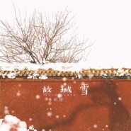

故城雪
============================

|  |  |
| :--: | :-- |
| [ 故城雪](https://emumo.xiami.com/album/2106073605) | **艺人**: [Ace组合](../index.md) **语种**: 国语 **唱片公司**: 厦门聆云文化传媒有限公司 **发行时间**: 2020年02月20日 **专辑类别**: EP, 单曲 **专辑风格**: 国语流行 Mandarin Pop **播放数**: 90301 **收藏数**: 4 **评论数**: 1  |

## 简介

他出征的时候，京城突然下了一场大雪。这一年的春天似乎来得格外晚。

 她挤在送行的队伍末端，手中捧着连夜缝好的棉衣，被人群拥攘得脚步踉跄。

 他远远瞧见了，眼中有些亮闪闪的东西。但他随着军列前进，竟是连嘱咐的话也没法留下一句。只能勉强牵起嘴角对她笑了笑，张口似乎说了些什么。

 她看得真切，他说：“别等我了。”

 不，天未破晓，月色晦暗，许是看错了。他说的一定是：“等我回来。”

 这一等，就是许多年。

 每一年初雪的时候，有换防的军人千里归乡。一开始，他还有些书信托人带回，再后来，音书断绝。

 京城的朱墙碧瓦，千年如昔。

 千年之后，又是一场大雪。

 少女踏着新雪，随着趁雪而来的大群游人，走在古城的城墙之下。

 雪悄悄地停了，周遭的喧杂突然静谧下来。

 她有一刹那的恍惚，看见前方人群的尽头，有个年轻的士兵回过头来，对她微微一笑。

 是千年的暌阔。

## 曲目

## 评论

|  |  |  |  |
| :-- | :-- | :-- | :-- |
|  [虾米用户](https://emumo.xiami.com/u/439919269)  2020-03-06 15:13 赞(0) 踩(0) | 
一一
 |
