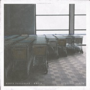

星离月会
============================

|  |  |
| :--: | :-- |
| [ 星离月会](https://emumo.xiami.com/album/5021125360) | **艺人**: [Nerve Passenger](../index.md) **语种**: 国语 **唱片公司**: 星团音乐 **发行时间**: 2020年07月24日 **专辑类别**: 录音室专辑 **专辑风格**: 独立摇滚 Indie Rock **播放数**: 67045 **收藏数**: 99 **评论数**: 29  |

## 简介

在夏夜里我反复品味你的若即若离，就像最后一瓶不舍得喝完的酒，一口一口地抿。

## 曲目

## 评论

|  |  |  |  |
| :-- | :-- | :-- | :-- |
|  [虾米用户](https://emumo.xiami.com/u/188196406) 喜歡獨單 2020-12-27 11:56 赞(1) 踩(0) | 
就像最后一瓶不舍得喝完的酒
 |
|  [虾米用户](https://emumo.xiami.com/u/185953480) balabala 2020-09-28 17:48 赞(1) 踩(0) | 

 |
|  [虾米用户](https://emumo.xiami.com/u/37862735) ：） 2020-07-27 00:26 赞(0) 踩(0) | 
我也只能打个十分了
 |
|  [虾米用户](https://emumo.xiami.com/u/433401305) 不美丽就是我的美丽 2020-07-26 22:07 赞(0) 踩(0) | 
真好
 |
|  [虾米用户](https://emumo.xiami.com/u/3295119) ∞ 2020-07-26 01:42 赞(1) 踩(0) | 
只有離沒有會。
 |
|  [虾米用户](https://emumo.xiami.com/u/344495614) 落阳深处的布鲁斯 2020-07-25 02:37 赞(0) 踩(0) | 
，
 |
|  [虾米用户](https://emumo.xiami.com/u/346492287) 虾米不要离开我！ 2020-07-25 00:00 赞(0) 踩(0) | 

 |
|  [虾米用户](https://emumo.xiami.com/u/44462926) 现在想好写什么了，虾米不... 2020-07-24 23:52 赞(0) 踩(0) | 
星离月会
 |
|  [虾米用户](https://emumo.xiami.com/u/44462926) 现在想好写什么了，虾米不... 2020-07-24 23:45 赞(0) 踩(0) | 
喜欢
 |
|  [虾米用户](https://emumo.xiami.com/u/252626203) 本來是個快樂的人 2020-07-24 23:31 赞(0) 踩(0) | 

 |
|  [虾米用户](https://emumo.xiami.com/u/42963872) 我还没想好要写什么... 2020-07-24 22:26 赞(0) 踩(0) | 
-
 |
|  [虾米用户](https://emumo.xiami.com/u/802712)  2020-07-24 21:23 赞(1) 踩(0) | 
我天我天我天，太好听了吧！这一整张！
 |
|  [虾米用户](https://emumo.xiami.com/u/346089809) 讓 我來 當  你的  ... 2020-07-24 20:58 赞(0) 踩(0) | 

 |
|  [虾米用户](https://emumo.xiami.com/u/3553665) We can be He... 2020-07-24 20:39 赞(0) 踩(0) | 
♡
 |
|  [虾米用户](https://emumo.xiami.com/u/427300236) End... 2020-07-24 20:34 赞(0) 踩(0) | 
❤❤
 |
|  [虾米用户](https://emumo.xiami.com/u/73740960)  2020-07-24 20:25 赞(0) 踩(0) | 
看心
 |
|  [虾米用户](https://emumo.xiami.com/u/245115833) ☁️ID:安那般那209 2020-07-24 20:25 赞(2) 踩(0) | 

 |
|  [虾米用户](https://emumo.xiami.com/u/9523997) 天地为炉 2020-07-24 19:38 赞(2) 踩(0) | 

 |
|  [虾米用户](https://emumo.xiami.com/u/8226204) ≡ 2020-07-24 19:24 赞(0) 踩(0) | 
好
 |
|  [虾米用户](https://emumo.xiami.com/u/223845151) _(:* ｣∠)_ 2020-07-24 19:23 赞(0) 踩(0) | 
&amp;hearts;
 |
|  [虾米用户](https://emumo.xiami.com/u/421578063) fox god 2020-07-24 18:35 赞(0) 踩(0) | 
呼呼呼
 |
|  [虾米用户](https://emumo.xiami.com/u/43875708)  遣词造句 穿山过水 他... 2020-07-24 18:27 赞(1) 踩(0) | 
哪首最好听？
 |
|  [虾米用户](https://emumo.xiami.com/u/410514678) 有且仅有 2020-07-24 18:18 赞(1) 踩(0) | 
来了来了来了来了来了
 |
|  [虾米用户](https://emumo.xiami.com/u/37089274) 间歇性踌躇满志，持续性混... 2020-07-24 18:09 赞(0) 踩(0) | 
奶泡牛逼！！！
 |
|  [虾米用户](https://emumo.xiami.com/u/1454034) 南无阿弥陀佛 2020-07-24 18:05 赞(0) 踩(0) | 
清
 |
|  [虾米用户](https://emumo.xiami.com/u/18185952) 低空盤旋 2020-07-24 18:04 赞(0) 踩(0) | 
来了
 |
|  [虾米用户](https://emumo.xiami.com/u/441730437)  2020-07-24 18:03 赞(0) 踩(0) | 
来了
 |
|  [虾米用户](https://emumo.xiami.com/u/274566062) Every Stars 2020-07-24 18:02 赞(0) 踩(0) | 
一年前
 |
|  [虾米用户](https://emumo.xiami.com/u/110088060) 作为报答、我吔给泥放点、... 2020-07-24 18:00 赞(0) 踩(0) | 
耶
 |
