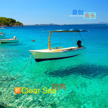

清澈的海 Clear sea
============================

|  |  |
| :--: | :-- |
| [ 清澈的海 Clear sea](https://emumo.xiami.com/album/2102971566) | **艺人**: [刘鸿](../index.md) **语种**: 纯音乐 **唱片公司**: 独立发行 **发行时间**: 2017年12月09日 **专辑类别**: 精选集 **专辑风格**: 电子 Electronic, 轻音乐 Easy Listening **播放数**: 4466 **收藏数**: 3 **评论数**: 0  |

## 简介

 Clear sea 清澈的海 

故乡的云
 

故乡的风
 

故乡那海边的白沙滩
 

远眺摇曳的小船
 

碧蓝的海
 

水天一线
 

浪花追逐着沙滩
 

 

## 曲目

## 评论

