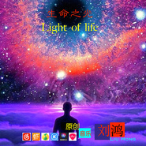

Light of life 生命之光
============================

|  |  |
| :--: | :-- |
| [ Light of life 生命之光](https://emumo.xiami.com/album/2102972015) | **艺人**: [刘鸿](../index.md) **语种**: 纯音乐 **唱片公司**: 独立发行 **发行时间**: 2017年12月10日 **专辑类别**: 精选集 **专辑风格**: 电子 Electronic, 轻音乐 Easy Listening, 电影原声 Film Score **播放数**: 1130 **收藏数**: 5 **评论数**: 0  |

## 简介

 2017.12.10 单曲首发Light of life 生命之光（生命之光交响曲）
 

也许，自从有了宇宙就有了光,在那每秒三十万公里的高速行进着的光影里，蕴藏着宇宙的神秘......当人类从混沌冥迷中醒来，灿烂而耀眼的阳光照亮了我们的眼晴，为之洗礼，夜晚皎洁的月光和闪耀的星光又照亮人们的梦境，我们和万物在光的抚爱中渐渐成长。地球上有了跳动的光芒，生命之光……  

## 曲目

## 评论

|  |  |  |  |
| :-- | :-- | :-- | :-- |
