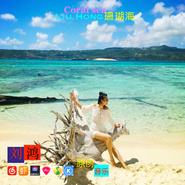

Coral sea 珊瑚海
============================

|  |  |
| :--: | :-- |
| [ Coral sea 珊瑚海](https://emumo.xiami.com/album/2102975737) | **艺人**: [刘鸿](../index.md) **语种**: 纯音乐 **唱片公司**: 独立发行 **发行时间**: 2017年12月16日 **专辑类别**: 精选集 **专辑风格**: 轻音乐 Easy Listening, 新世纪音乐 New Age **播放数**: 12999 **收藏数**: 1 **评论数**: 0  |

## 简介

 Coral sea 珊瑚海 Music by Liu Hong
 

唯美轻音乐
 

1.Rainbow 彩虹  
2.The sea of hometown 故乡的海
 

3.The surfing in summer 夏日冲浪  
4.Coral sea 珊瑚海
 

 

## 曲目

## 评论

