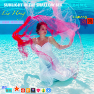

Sunlight in the shallow sea 浅海里的阳光（治愈系 — 唯美轻音乐）New Age 新世纪音乐
============================

|  |  |
| :--: | :-- |
| [ Sunlight in the shallow sea 浅海里的阳光（治愈系 — 唯美轻音乐）New Age 新世纪音乐](https://emumo.xiami.com/album/2103466567) | **艺人**: [刘鸿](../index.md) **语种**: 纯音乐 **唱片公司**: 独立发行 **发行时间**: 2018年01月02日 **专辑类别**: 精选集 **专辑风格**: 轻音乐 Easy Listening, 出神舞曲 Trance, 新世纪音乐 New Age **播放数**: 2181 **收藏数**: 3 **评论数**: 0  |

## 简介

 Sunlight in the shallow sea 浅海里的阳光
 

（治愈系 — 唯美轻音乐）
 

New Age 新世纪音乐<a title="删除风格" style="color: rgb(130, 173, 43); font-family: inherit; font-weight: bold; font-style: inherit; font-size: 11px; outline: 0px; padding: 0px 0px 0px 5px; margin: 0px; border: 0px;">x</a> 

 

 

## 曲目

## 评论

|  |  |  |  |
| :-- | :-- | :-- | :-- |
