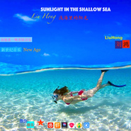

Aegean sea爱琴海（治愈系 — 唯美轻音乐） New Age 新世纪音乐
============================

|  |  |
| :--: | :-- |
| [ Aegean sea爱琴海（治愈系 — 唯美轻音乐） New Age 新世纪音乐](https://emumo.xiami.com/album/2103468479) | **艺人**: [刘鸿](../index.md) **语种**: 纯音乐 **唱片公司**: 独立发行 **发行时间**: 2018年01月05日 **专辑类别**: 精选集 **专辑风格**: 轻音乐 Easy Listening, 轻音乐流行 Light Pop, 电子 Electronic **播放数**: 213982 **收藏数**: 40 **评论数**: 5  |

## 简介

 治愈系 — 唯美轻音乐
 

抚平和治愈心灵创伤的轻音乐
 

New Age 新世纪音乐  

## 曲目

## 评论

|  |  |  |  |
| :-- | :-- | :-- | :-- |
|  [虾米用户](https://emumo.xiami.com/u/426022452)  2019-07-07 06:09 赞(3) 踩(0) | 
很喜欢！轻松，欢快。
 |
|  [虾米用户](https://emumo.xiami.com/u/351269164) 清乐六声 2019-04-19 21:02 赞(4) 踩(0) | 
跪拜老师！
 |
|  [虾米用户](https://emumo.xiami.com/u/6591114) 音乐是人类最美的语言 2019-04-13 19:33 赞(3) 踩(0) | 
真心不错，为中国人能写出这么好听的音乐而竖起大拇指！
 |
