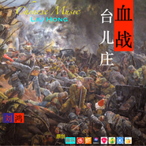

血战台儿庄（纪念为抗日战争献出生命的勇士）
============================

|  |  |
| :--: | :-- |
| [ 血战台儿庄（纪念为抗日战争献出生命的勇士）](https://emumo.xiami.com/album/2103721116) | **艺人**: [刘鸿](../index.md) **语种**: 国语 **唱片公司**: 独立发行 **发行时间**: 2018年05月28日 **专辑类别**: 精选集 **专辑风格**: 世界音乐 World Music, 新世纪音乐 New Age, 交响乐 Symphonic Music **播放数**: 5863 **收藏数**: 3 **评论数**: 0  |

## 简介

血战台儿庄 （纪念为抗日战争献出生命的勇士） 史诗般的英雄交响曲  台儿庄大捷，又称台儿庄战役、鲁南会战或血战台儿庄。1938年3月16日开始至4月15日，战役由滕县战斗、临沂附近战斗、台儿庄战斗和日军的溃退，中国军队的追击作战等部分组成。 在历时1个月的激战中，中国军队约29万人参战，日军参战人数约5万人。中方伤亡约5万余人，毙伤日军约2万余人 （日军自报伤亡11984人  ）。 它打击了日本侵略者的嚣张气焰，坚定了全国军民坚持抗战的信心。这次战役鼓舞了全民族的士气，改变了国际视听，消灭了日本侵略者的威风，歼灭了日军大量有生力量。此次大捷是中华民族全面抗战以来，继长城战役、平型关大捷等战役后，中国人民取得的又一次胜利，是抗日战争以来取得的最大胜利，也是徐州会战中国民革命军取得的一次重大胜利。 战役由民族英雄李宗仁、白崇禧、孙连仲、汤恩伯、张自忠、田镇南、关麟征、池峰城、王铭章等抗日将领指挥。战役期间，中国抗战最高统帅蒋介石曾三次赴徐州视察、督导、调配兵力，其中第一次，蒋介石在台儿庄战斗最激烈的时刻亲赴台儿庄南站观战，并亲自勉励池峰城，前线将士因而士气大振，大大增强了前线将士的战斗力 

## 曲目

## 评论

|  |  |  |  |
| :-- | :-- | :-- | :-- |
