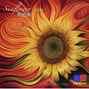

向日葵-EDMSunflower
============================

|  |  |
| :--: | :-- |
| [ 向日葵-EDMSunflower](https://emumo.xiami.com/album/2103900672) | **艺人**: [刘鸿](../index.md) **语种**: 国语 **唱片公司**: 独立发行 **发行时间**: 2018年08月05日 **专辑类别**: 精选集 **专辑风格**: 电子 Electronic, 电音流行 Electropop **播放数**: 2101 **收藏数**: 4 **评论数**: 0  |

## 简介

 向日葵-EDM
 

Sunflower
 

Sunflower is a kind of beautiful flower. It has golden color and a round face. It looks like the sun, that is why people call it sunflower. Besides, it looks like a warm smile, too. When you look at it, it seems smile to you. It can bring warm to people. So, I like sunflower very much. During the day, its face turns to the sun all the time.  

 

 

## 曲目

## 评论

