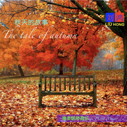

秋天的故事-唯美钢琴音乐The tale of autumn
============================

|  |  |
| :--: | :-- |
| [ 秋天的故事-唯美钢琴音乐The tale of autumn](https://emumo.xiami.com/album/2103921903) | **艺人**: [刘鸿](../index.md) **语种**: 国语 **唱片公司**: 独立发行 **发行时间**: 2018年08月13日 **专辑类别**: 录音室专辑 **专辑风格**: 轻音乐 Easy Listening, 新世纪音乐 New Age **播放数**: 2778 **收藏数**: 5 **评论数**: 2  |

## 简介

 秋天的故事-唯美钢琴音乐
 

The tale of autumn
 

 
 

You know summer is saying her final goodbye when the leaves turn from green to yellow and then others turn into orange,red or even purple.You breathe in the crisp air and notice the sweet aroma of summer has turned into the smell of autumn rain still trapped within the skin of clouds and lovers.One senses that this scent of dew will soon become the silent snowflake seeking refuge on your nose.Ah?Autumn has arrived and turns your head with her unmasking of a palette so bright as she begins to paint the landscape in hues unimaginable.As if waking from a languid dream you notice that life is in abundant change around you and preparing her creatures for the long cold days of winter.
 
  

Autumn is the perfect time for love.for the backdrop of a love play like Autumn.With Autumn comes the sense of urgency to get things done quickly before all becomes enveloped in the hush of winter white.
 
  

Walking through Autumn leaves with your love brings back a memory of a magic to time as a child when a pile of leaves was so much more than a nuisance.This is a wonderful opportunity to be that child again and play!Invite your sweetheart to hold you tight and just fall into those leaves together and you will find yourself falling in love,perhaps for the first time or the first time this Autumn.
 
  

Turn your head and everywhere couples are nestled into each other with soft whispers and their breaths captured in the icy air.Breathe in each other breath and become one.Slip your arms around each other and just take time to notice the days growing shorter and life being lived to the fullest.Harvest these fruits of Autumn and cherish the cycles of our seasons.
 
  

 

## 曲目

## 评论

|  |  |  |  |
| :-- | :-- | :-- | :-- |
|  [虾米用户](https://emumo.xiami.com/u/292793015) 乐海飘飘 2019-01-06 08:56 赞(1) 踩(0) | 
道一声《秋天的故事》里的你，感谢你的心灵之作。冒昧说你‘人老心不老’，初赏识你的美妙丽作，异常享受美感。我是一个不太通乐理的60后，每当缘遇到喜欢的音乐，我就快乐地像我孙子一样。我变得年轻了，我感觉在这个信息传播发达年代，很多美好都来不及迎接。偶遇的多了，便一定是必然。音乐是我生活一部分，很让人放不下。我们已经离不开音乐啦！喜欢有你这诗样的作品，永远焕发着灵魂至上最完美的追求、最有生命活力的青春光彩……
 |
| ⇒ |  [虾米用户](https://emumo.xiami.com/u/261645034) LiuHong 2019-01-07 13:28 赞(0) 踩(0) | 
非常感谢你至诚的评述，希望我的音乐带给你们最美好的祝福和快乐 
 |
