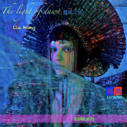

EDM黎明之光 LiuHong刘鸿The new voyage
============================

|  |  |
| :--: | :-- |
| [ EDM黎明之光 LiuHong刘鸿The new voyage](https://emumo.xiami.com/album/2104621612) | **艺人**: [刘鸿](../index.md) **语种**: 纯音乐 **唱片公司**: 独立发行 **发行时间**: 2019年02月26日 **专辑类别**: 录音室专辑 **专辑风格**: 电子舞曲 EDM / Electronic Dance Music, 氛围音乐 Ambient **播放数**: 2077 **收藏数**: 4 **评论数**: 1  |

## 简介

 EDM新航程 LiuHong刘鸿
 

The new voyage
 

I want the future to be better than the past.  
我希望未来比过去更加美好。 
 

 

## 曲目

## 评论

|  |  |  |
| :-- | :-- | :-- |
|  [虾米用户](https://emumo.xiami.com/u/402499396) 要么读书，要么旅行，身体... 2019-02-27 19:59 赞(1) 踩(0) | 
真的很美，音乐的意境是来自音乐人世界观和价值观的表现，感谢您刘鸿，衷心的希望刘鸿有更多更唯美的作品。
 |
