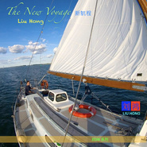

EDM新航程The new voyage
============================

|  |  |
| :--: | :-- |
| [ EDM新航程The new voyage](https://emumo.xiami.com/album/2104632557) | **艺人**: [刘鸿](../index.md) **语种**: 纯音乐 **唱片公司**:  **发行时间**: 2019年02月26日 **专辑类别**: EP, 单曲 **专辑风格**: 电子舞曲 EDM / Electronic Dance Music **播放数**: 201 **收藏数**: 2 **评论数**: 0  |

## 简介

EDM新航程 LiuHong刘鸿  
  
The new voyage  
The past is gone and static. Nothing we can do will change it. The future is before us and dynamic. Everything we do will affect it. Each day brings with it new frontiers, in our homes and in our business, if we only recognize them. We are just at the beginning of the progress in every field of human endeavor.I want the future to be better than the past.  
往昔已逝，静如止水；我们无法再作改变。而前方的未来正生机勃勃；我们所做的每一件事都将会影响着它。无论是在家中还是在工作，每天我们的面前都会展现出新的天地。在人类致力开拓的每一片领域上，我们正站在进步的起跑点,我希望未来比过去更加美好。

## 曲目

## 评论

|  |  |  |  |
| :-- | :-- | :-- | :-- |
